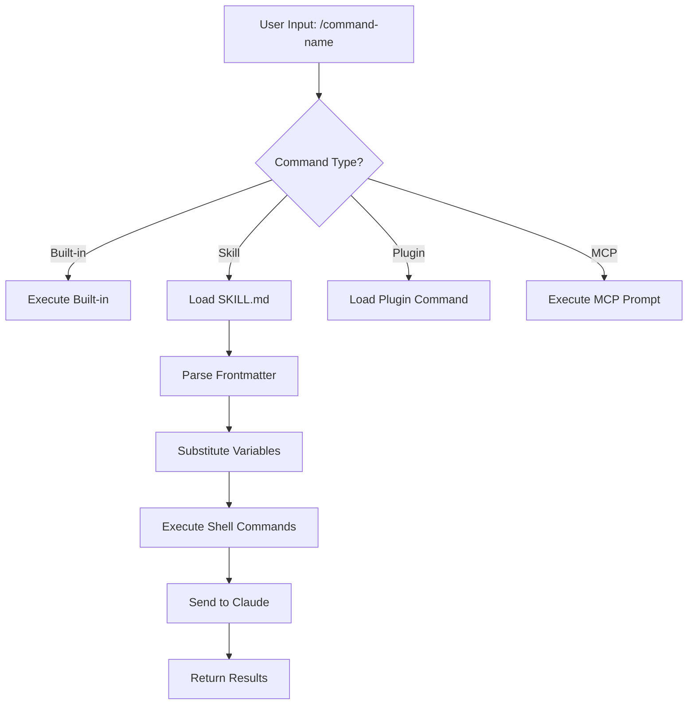
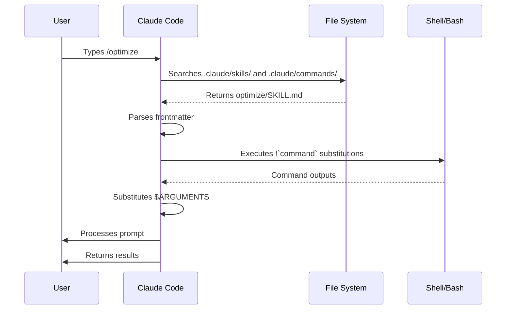

<picture>
  <source media="(prefers-color-scheme: dark)" srcset="../resources/logos/claude-howto-logo-dark.svg">
  
</picture>

# Slash Commands

## Обзор

Slash-команды — это ярлыки, которые управляют поведением Claude во время интерактивной сессии. Они бывают нескольких типов:

- **Built-in commands**: встроенные команды Claude Code (`/help`, `/clear`, `/model`)
- **Skills**: пользовательские команды, оформленные как файлы `SKILL.md` (`/optimize`, `/pr`)
- **Plugin commands**: команды из установленных plugins (`/frontend-design:frontend-design`)
- **MCP prompts**: команды от MCP-серверов (`/mcp__github__list_prs`)

> **Note**: Пользовательские slash-команды были объединены со skills. Файлы в `.claude/commands/` всё ещё работают, но skills (`.claude/skills/`) теперь рекомендуемый подход. Оба варианта создают ярлыки `/command-name`. См. [Skills Guide](../03-skills/) для полной справки.

## Справка по встроенным командам

Встроенные команды — это ярлыки для частых действий. Доступно **55+ built-in commands** и **5 bundled skills**. Введите `/` в Claude Code, чтобы увидеть полный список, или `/` и любые буквы, чтобы отфильтровать его.

| Command | Purpose |
|---------|---------|
| `/add-dir <path>` | Добавить рабочий каталог |
| `/agents` | Управлять конфигурациями агентов |
| `/branch [name]` | Ветвить разговор в новую сессию (alias: `/fork`). Note: `/fork` renamed to `/branch` in v2.1.77 |
| `/btw <question>` | Задать побочный вопрос без добавления в историю |
| `/chrome` | Настроить интеграцию с браузером Chrome |
| `/clear` | Очистить разговор (aliases: `/reset`, `/new`) |
| `/color [color\|default]` | Установить цвет prompt bar |
| `/compact [instructions]` | Сжать разговор с опциональными инструкциями по фокусу |
| `/config` | Открыть Settings (alias: `/settings`) |
| `/context` | Визуализировать использование контекста в виде цветной сетки |
| `/copy [N]` | Скопировать ответ ассистента в буфер обмена; `w` writes to file |
| `/cost` | Показать статистику использования токенов |
| `/desktop` | Продолжить в Desktop app (alias: `/app`) |
| `/diff` | Интерактивный diff viewer для незакоммиченных изменений |
| `/doctor` | Диагностировать состояние установки |
| `/effort [low\|medium\|high\|max\|auto]` | Установить уровень effort. `max` requires Opus 4.6 |
| `/exit` | Выйти из REPL (alias: `/quit`) |
| `/export [filename]` | Экспортировать текущий разговор в файл или clipboard |
| `/extra-usage` | Настроить дополнительное использование для rate limits |
| `/fast [on\|off]` | Переключить fast mode |
| `/feedback` | Отправить отзыв (alias: `/bug`) |
| `/help` | Показать help |
| `/hooks` | Просмотреть конфигурации hooks |
| `/ide` | Управлять интеграциями IDE |
| `/init` | Инициализировать `CLAUDE.md`. Set `CLAUDE_CODE_NEW_INIT=true` for interactive flow |
| `/insights` | Сгенерировать session analysis report |
| `/install-github-app` | Настроить GitHub Actions app |
| `/install-slack-app` | Установить Slack app |
| `/keybindings` | Открыть конфигурацию keybindings |
| `/login` | Переключить Anthropic аккаунты |
| `/logout` | Выйти из Anthropic аккаунта |
| `/mcp` | Управлять MCP-серверами и OAuth |
| `/memory` | Редактировать `CLAUDE.md`, переключать auto-memory |
| `/mobile` | QR code для mobile app (aliases: `/ios`, `/android`) |
| `/model [model]` | Выбрать модель с помощью стрелок влево/вправо для effort |
| `/passes` | Поделиться бесплатной неделей Claude Code |
| `/permissions` | Просмотреть/обновить permissions (alias: `/allowed-tools`) |
| `/plan [description]` | Войти в plan mode |
| `/plugin` | Управлять plugins |
| `/pr-comments [PR]` | Получить комментарии GitHub PR |
| `/privacy-settings` | Настройки приватности (Pro/Max only) |
| `/release-notes` | Посмотреть changelog |
| `/reload-plugins` | Перезагрузить активные plugins |
| `/remote-control` | Remote control from claude.ai (alias: `/rc`) |
| `/remote-env` | Настроить default remote environment |
| `/rename [name]` | Переименовать сессию |
| `/resume [session]` | Возобновить разговор (alias: `/continue`) |
| `/review` | **Deprecated** — install the `code-review` plugin instead |
| `/rewind` | Отмотать разговор и/или код назад (alias: `/checkpoint`) |
| `/sandbox` | Переключить sandbox mode |
| `/schedule [description]` | Создать/управлять scheduled tasks |
| `/security-review` | Проанализировать branch на уязвимости безопасности |
| `/skills` | Показать доступные skills |
| `/stats` | Визуализировать daily usage, sessions, streaks |
| `/status` | Показать version, model, account |
| `/statusline` | Настроить status line |
| `/tasks` | Список/управление background tasks |
| `/terminal-setup` | Настроить terminal keybindings |
| `/theme` | Изменить color theme |
| `/vim` | Переключить Vim/Normal modes |
| `/voice` | Переключить push-to-talk voice dictation |

### Bundled Skills

Эти skills поставляются вместе с Claude Code и вызываются как slash-команды:

| Skill | Purpose |
|-------|---------|
| `/batch <instruction>` | Организовать крупные параллельные изменения с помощью worktrees |
| `/claude-api` | Загрузить Claude API reference для языка проекта |
| `/debug [description]` | Включить debug logging |
| `/loop [interval] <prompt>` | Запускать prompt повторно с указанным интервалом |
| `/simplify [focus]` | Проверить изменённые файлы на качество кода |

### Deprecated Commands

| Command | Status |
|---------|--------|
| `/review` | Deprecated — replaced by `code-review` plugin |
| `/output-style` | Deprecated since v2.1.73 |
| `/fork` | Renamed to `/branch` (alias still works, v2.1.77) |

### Recent Changes

- `/fork` renamed to `/branch` with `/fork` kept as alias (v2.1.77)
- `/output-style` deprecated (v2.1.73)
- `/review` deprecated in favor of the `code-review` plugin
- `/effort` command added with `max` level requiring Opus 4.6
- `/voice` command added for push-to-talk voice dictation
- `/schedule` command added for creating/managing scheduled tasks
- `/color` command added for prompt bar customization
- `/model` picker now shows human-readable labels (e.g., "Sonnet 4.6") instead of raw model IDs
- `/resume` supports `/continue` alias
- MCP prompts are available as `/mcp__<server>__<prompt>` commands (see [MCP Prompts as Commands](#mcp-prompts-as-commands))

## Custom Commands (Now Skills)

Пользовательские slash-команды были **объединены со skills**. Оба подхода создают команды, которые можно вызвать через `/command-name`:

| Approach | Location | Status |
|----------|----------|--------|
| **Skills (Recommended)** | `.claude/skills/<name>/SKILL.md` | Current standard |
| **Legacy Commands** | `.claude/commands/<name>.md` | Still works |

Если skill и command имеют одно имя, **приоритет у skill**. Например, когда существуют и `.claude/commands/review.md`, и `.claude/skills/review/SKILL.md`, используется версия skill.

### Migration Path

Ваши существующие файлы `.claude/commands/` продолжают работать без изменений. Чтобы мигрировать на skills:

**Before (Command):**
```
.claude/commands/optimize.md
```

**After (Skill):**
```
.claude/skills/optimize/SKILL.md
```

### Why Skills?

Skills дают дополнительные возможности по сравнению с legacy commands:

- **Directory structure**: объединяйте скрипты, шаблоны и reference files
- **Auto-invocation**: Claude может запускать skills автоматически, когда это уместно
- **Invocation control**: выбирайте, кто может вызывать — пользователь, Claude или оба
- **Subagent execution**: запускайте skills в изолированных контекстах с `context: fork`
- **Progressive disclosure**: загружайте дополнительные файлы только по необходимости

### Creating a Custom Command as a Skill

Создайте каталог с файлом `SKILL.md`:

```bash
mkdir -p .claude/skills/my-command
```

**File:** `.claude/skills/my-command/SKILL.md`

```yaml
---
name: my-command
description: What this command does and when to use it
---

# My Command

Instructions for Claude to follow when this command is invoked.

1. First step
2. Second step
3. Third step
```

### Frontmatter Reference

| Field | Purpose | Default |
|-------|---------|---------|
| `name` | Command name (becomes `/name`) | Directory name |
| `description` | Brief description (helps Claude know when to use it) | First paragraph |
| `argument-hint` | Expected arguments for auto-completion | None |
| `allowed-tools` | Tools the command can use without permission | Inherits |
| `model` | Specific model to use | Inherits |
| `disable-model-invocation` | If `true`, only user can invoke (not Claude) | `false` |
| `user-invocable` | If `false`, hide from `/` menu | `true` |
| `context` | Set to `fork` to run in isolated subagent | None |
| `agent` | Agent type when using `context: fork` | `general-purpose` |
| `hooks` | Skill-scoped hooks (PreToolUse, PostToolUse, Stop) | None |

### Arguments

Commands can receive arguments:

**All arguments with `$ARGUMENTS`:**

```yaml
---
name: fix-issue
description: Fix a GitHub issue by number
---

Fix issue #$ARGUMENTS following our coding standards
```

Usage: `/fix-issue 123` → `$ARGUMENTS` becomes "123"

**Individual arguments with `$0`, `$1`, etc.:**

```yaml
---
name: review-pr
description: Review a PR with priority
---

Review PR #$0 with priority $1
```

Usage: `/review-pr 456 high` → `$0`="456", `$1`="high"

### Dynamic Context with Shell Commands

Выполняйте bash-команды перед prompt с помощью `!`command``:

```yaml
---
name: commit
description: Create a git commit with context
allowed-tools: Bash(git *)
---

## Context

- Current git status: !`git status`
- Current git diff: !`git diff HEAD`
- Current branch: !`git branch --show-current`
- Recent commits: !`git log --oneline -5`

## Your task

Based on the above changes, create a single git commit.
```

### File References

Подключайте содержимое файлов с помощью `@`:

```markdown
Review the implementation in @src/utils/helpers.js
Compare @src/old-version.js with @src/new-version.js
```

## Plugin Commands

Plugins can provide custom commands:

```
/plugin-name:command-name
```

Или просто `/command-name`, если нет конфликта имён.

**Examples:**
```bash
/frontend-design:frontend-design
/commit-commands:commit
```

## MCP Prompts as Commands

MCP servers can expose prompts as slash commands:

```
/mcp__<server-name>__<prompt-name> [arguments]
```

**Examples:**
```bash
/mcp__github__list_prs
/mcp__github__pr_review 456
/mcp__jira__create_issue "Bug title" high
```

### MCP Permission Syntax

Управляйте доступом к MCP-серверам через permissions:

- `mcp__github` - Access entire GitHub MCP server
- `mcp__github__*` - Wildcard access to all tools
- `mcp__github__get_issue` - Specific tool access

## Command Architecture



## Command Lifecycle



## Available Commands in This Folder

Эти example-команды можно установить как skills или legacy commands.

### 1. `/optimize` - Code Optimization

Анализирует код на проблемы производительности, memory leaks и возможности оптимизации.

**Usage:**
```
/optimize
[Paste your code]
```

### 2. `/pr` - Pull Request Preparation

Проводит через checklist подготовки PR, включая linting, testing и форматирование commit.

**Usage:**
```
/pr
```

**Screenshot:**


### 3. `/generate-api-docs` - API Documentation Generator

Генерирует полную API-документацию из исходного кода.

**Usage:**
```
/generate-api-docs
```

### 4. `/commit` - Git Commit with Context

Создаёт git commit с динамическим контекстом из репозитория.

**Usage:**
```
/commit [optional message]
```

### 5. `/push-all` - Stage, Commit, and Push

Ставит все изменения, создаёт commit и отправляет в remote с проверками безопасности.

**Usage:**
```
/push-all
```

**Safety Checks:**
- Secrets: `.env*`, `*.key`, `*.pem`, `credentials.json`
- API Keys: Detects real keys vs. placeholders
- Large files: `>10MB` without Git LFS
- Build artifacts: `node_modules/`, `dist/`, `__pycache__/`

### 6. `/doc-refactor` - Documentation Restructuring

Перестраивает документацию проекта для большей ясности и доступности.

**Usage:**
```
/doc-refactor
```

### 7. `/setup-ci-cd` - CI/CD Pipeline Setup

Реализует pre-commit hooks и GitHub Actions для контроля качества.

**Usage:**
```
/setup-ci-cd
```

### 8. `/unit-test-expand` - Test Coverage Expansion

Увеличивает покрытие тестами, находя непокрытые ветки и edge cases.

**Usage:**
```
/unit-test-expand
```

## Installation

### As Skills (Recommended)

Скопируйте в каталог skills:

```bash
# Create skills directory
mkdir -p .claude/skills

# For each command file, create a skill directory
for cmd in optimize pr commit; do
  mkdir -p .claude/skills/$cmd
  cp 01-slash-commands/$cmd.md .claude/skills/$cmd/SKILL.md
done
```

### As Legacy Commands

Скопируйте в каталог commands:

```bash
# Project-wide (team)
mkdir -p .claude/commands
cp 01-slash-commands/*.md .claude/commands/

# Personal use
mkdir -p ~/.claude/commands
cp 01-slash-commands/*.md ~/.claude/commands/
```

## Creating Your Own Commands

### Skill Template (Recommended)

Создайте `.claude/skills/my-command/SKILL.md`:

```yaml
---
name: my-command
description: What this command does. Use when [trigger conditions].
argument-hint: [optional-args]
allowed-tools: Bash(npm *), Read, Grep
---

# Command Title

## Context

- Current branch: !`git branch --show-current`
- Related files: @package.json

## Instructions

1. First step
2. Second step with argument: $ARGUMENTS
3. Third step

## Output Format

- How to format the response
- What to include
```

### User-Only Command (No Auto-Invocation)

Для команд с побочными эффектами, которые Claude не должен запускать автоматически:

```yaml
---
name: deploy
description: Deploy to production
disable-model-invocation: true
allowed-tools: Bash(npm *), Bash(git *)
---

Deploy the application to production:

1. Run tests
2. Build application
3. Push to deployment target
4. Verify deployment
```

## Best Practices

| Do | Don't |
|------|---------|
| Используйте ясные, action-oriented названия | Создавайте команды для одноразовых задач |
| Добавляйте `description` с trigger conditions | Встраивайте сложную логику в команды |
| Держите команды сфокусированными на одной задаче | Хардкодьте чувствительную информацию |
| Используйте `disable-model-invocation` для side effects | Пропускайте поле description |
| Используйте префикс `!` для динамического контекста | Предполагайте, что Claude знает текущее состояние |
| Организуйте связанные файлы в skill directories | Складывайте всё в один файл |

## Troubleshooting

### Command Not Found

**Solutions:**
- Проверьте, что файл находится в `.claude/skills/<name>/SKILL.md` или `.claude/commands/<name>.md`
- Убедитесь, что поле `name` в frontmatter соответствует ожидаемому имени команды
- Перезапустите сессию Claude Code
- Запустите `/help`, чтобы увидеть доступные команды

### Command Not Executing as Expected

**Solutions:**
- Добавьте более конкретные инструкции
- Включите примеры в skill-файл
- Проверьте `allowed-tools`, если используете bash-команды
- Сначала протестируйте на простых input

### Skill vs Command Conflict

Если оба варианта имеют одно имя, **приоритет у skill**. Удалите один из них или переименуйте.

## Related Guides

- **[Skills](../03-skills/)** - Полная справка по skills (auto-invoked capabilities)
- **[Memory](../02-memory/)** - Persistent context с CLAUDE.md
- **[Subagents](../04-subagents/)** - Делегированные AI-агенты
- **[Plugins](../07-plugins/)** - Сборники команд
- **[Hooks](../06-hooks/)** - Event-driven automation

## Additional Resources

- [Official Interactive Mode Documentation](https://code.claude.com/docs/en/interactive-mode) - Built-in commands reference
- [Official Skills Documentation](https://code.claude.com/docs/en/skills) - Complete skills reference
- [CLI Reference](https://code.claude.com/docs/en/cli-reference) - Command-line options

---

*Часть серии [Claude How To](../) guide series*
