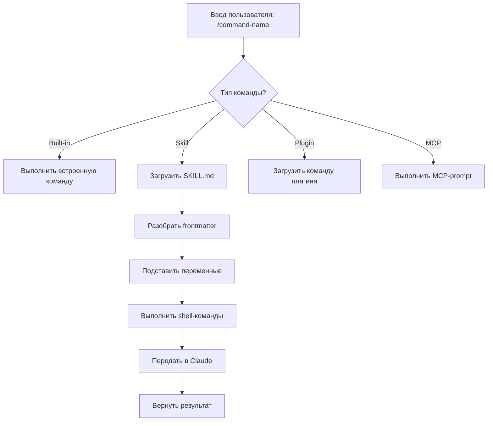
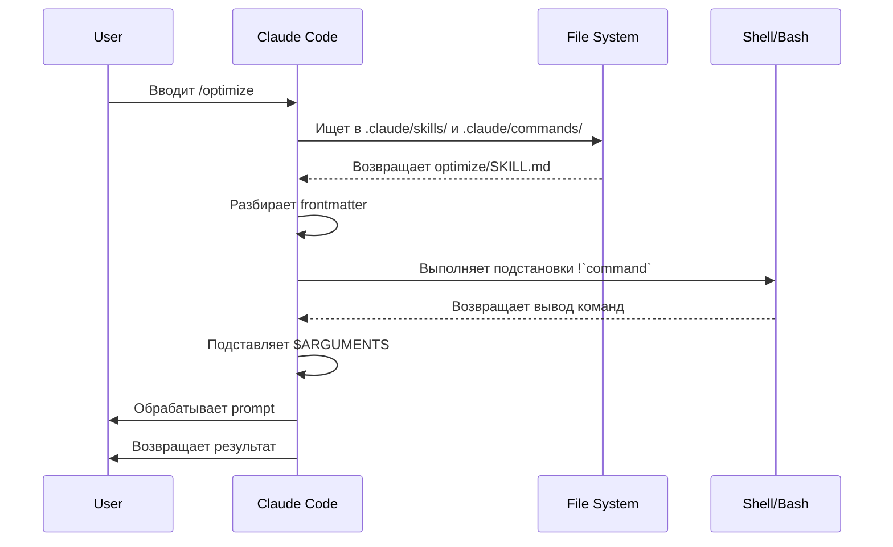

<picture>
  <source media="(prefers-color-scheme: dark)" srcset="../resources/logos/claude-howto-logo-dark.svg">
  
</picture>

# Slash-команды

## Обзор

Slash-команды — это ярлыки, которые управляют поведением Claude во время интерактивной сессии. Они бывают нескольких типов:

- **Встроенные команды**: встроенные команды Claude Code (`/help`, `/clear`, `/model`)
- **Skills**: пользовательские команды, оформленные как файлы `SKILL.md` (`/optimize`, `/pr`)
- **Команды плагинов**: команды из установленных plugins (`/frontend-design:frontend-design`)
- **MCP-prompts**: команды от MCP-серверов (`/mcp__github__list_prs`)

> **Примечание**: пользовательские slash-команды были объединены со skills. Файлы в `.claude/commands/` всё ещё работают, но skills (`.claude/skills/`) теперь рекомендуемый подход. Оба варианта создают ярлыки `/command-name`. См. [руководство по Skills](../03-skills/) для полной справки.

## Справка по встроенным командам

Встроенные команды — это ярлыки для частых действий. Доступно **55+ встроенных команд** и **5 встроенных skills**. Введите `/` в Claude Code, чтобы увидеть полный список, или `/` и любые буквы, чтобы отфильтровать его.

| Команда | Назначение |
|---------|---------|
| `/add-dir <path>` | Добавить рабочий каталог |
| `/agents` | Управлять конфигурациями агентов |
| `/branch [name]` | Ветвить разговор в новую сессию (`alias`: `/fork`). Примечание: `/fork` был переименован в `/branch` в v2.1.77 |
| `/btw <question>` | Задать побочный вопрос без добавления в историю |
| `/chrome` | Настроить интеграцию с браузером Chrome |
| `/clear` | Очистить разговор (`aliases`: `/reset`, `/new`) |
| `/color [color\|default]` | Установить цвет prompt bar |
| `/compact [instructions]` | Сжать разговор с опциональными инструкциями по фокусу |
| `/config` | Открыть настройки (`alias`: `/settings`) |
| `/context` | Визуализировать использование контекста в виде цветной сетки |
| `/copy [N]` | Скопировать ответ ассистента в буфер обмена; `w` записывает в файл |
| `/cost` | Показать статистику использования токенов |
| `/desktop` | Продолжить в Desktop app (`alias`: `/app`) |
| `/diff` | Интерактивный diff viewer для незакоммиченных изменений |
| `/doctor` | Диагностировать состояние установки |
| `/effort [low\|medium\|high\|max\|auto]` | Установить уровень effort. `max` requires Opus 4.6 |
| `/exit` | Выйти из REPL (`alias`: `/quit`) |
| `/export [filename]` | Экспортировать текущий разговор в файл или clipboard |
| `/extra-usage` | Настроить дополнительное использование для rate limits |
| `/fast [on\|off]` | Переключить fast mode |
| `/feedback` | Отправить отзыв (alias: `/bug`) |
| `/help` | Показать справку |
| `/hooks` | Просмотреть конфигурации hooks |
| `/ide` | Управлять интеграциями IDE |
| `/init` | Инициализировать `CLAUDE.md`. Установите `CLAUDE_CODE_NEW_INIT=true`, чтобы включить интерактивный сценарий |
| `/insights` | Сгенерировать session analysis report |
| `/install-github-app` | Настроить GitHub Actions app |
| `/install-slack-app` | Установить Slack app |
| `/keybindings` | Открыть конфигурацию keybindings |
| `/login` | Переключить Anthropic аккаунты |
| `/logout` | Выйти из Anthropic аккаунта |
| `/mcp` | Управлять MCP-серверами и OAuth |
| `/memory` | Редактировать `CLAUDE.md`, переключать auto-memory |
| `/mobile` | QR-код для мобильного приложения (`aliases`: `/ios`, `/android`) |
| `/model [model]` | Выбрать модель с помощью стрелок влево/вправо для effort |
| `/passes` | Поделиться бесплатной неделей Claude Code |
| `/permissions` | Просмотреть/обновить permissions (`alias`: `/allowed-tools`) |
| `/plan [description]` | Войти в plan mode |
| `/plugin` | Управлять plugins |
| `/pr-comments [PR]` | Получить комментарии GitHub PR |
| `/privacy-settings` | Настройки приватности (Pro/Max only) |
| `/release-notes` | Посмотреть changelog |
| `/reload-plugins` | Перезагрузить активные plugins |
| `/remote-control` | Remote control from claude.ai (alias: `/rc`) |
| `/remote-env` | Настроить default remote environment |
| `/rename [name]` | Переименовать сессию |
| `/resume [session]` | Возобновить разговор (alias: `/continue`) |
| `/review` | **Deprecated** — вместо этого установите плагин `code-review` |
| `/rewind` | Отмотать разговор и/или код назад (alias: `/checkpoint`) |
| `/sandbox` | Переключить sandbox mode |
| `/schedule [description]` | Создать/управлять scheduled tasks |
| `/security-review` | Проанализировать branch на уязвимости безопасности |
| `/skills` | Показать доступные skills |
| `/stats` | Визуализировать daily usage, sessions, streaks |
| `/status` | Показать version, model, account |
| `/statusline` | Настроить status line |
| `/tasks` | Список/управление background tasks |
| `/terminal-setup` | Настроить terminal keybindings |
| `/theme` | Изменить color theme |
| `/vim` | Переключить Vim/Normal modes |
| `/voice` | Переключить push-to-talk voice dictation |

### Встроенные Skills

Эти skills поставляются вместе с Claude Code и вызываются как slash-команды:

| Skill | Назначение |
|-------|---------|
| `/batch <instruction>` | Организовать крупные параллельные изменения с помощью worktrees |
| `/claude-api` | Загрузить Claude API reference для языка проекта |
| `/debug [description]` | Включить debug logging |
| `/loop [interval] <prompt>` | Запускать prompt повторно с указанным интервалом |
| `/simplify [focus]` | Проверить изменённые файлы на качество кода |

### Устаревшие команды

| Команда | Статус |
|---------|--------|
| `/review` | Deprecated — заменена плагином `code-review` |
| `/output-style` | Deprecated начиная с v2.1.73 |
| `/fork` | Переименована в `/branch` (`alias` всё ещё работает, v2.1.77) |

### Последние изменения

- `/fork` переименована в `/branch`, при этом `/fork` сохранена как alias (v2.1.77)
- `/output-style` помечена как deprecated (v2.1.73)
- `/review` помечена как deprecated в пользу плагина `code-review`
- добавлена команда `/effort`, где уровень `max` требует Opus 4.6
- добавлена команда `/voice` для push-to-talk voice dictation
- добавлена команда `/schedule` для создания и управления scheduled tasks
- добавлена команда `/color` для настройки prompt bar
- picker у `/model` теперь показывает читаемые названия (например, `"Sonnet 4.6"`), а не сырые ID моделей
- `/resume` поддерживает alias `/continue`
- MCP-prompts доступны как команды `/mcp__<server>__<prompt>` (см. [MCP-prompts как команды](#mcp-prompts-как-команды))

## Пользовательские команды (теперь Skills)

Пользовательские slash-команды были **объединены со skills**. Оба подхода создают команды, которые можно вызвать через `/command-name`:

| Подход | Расположение | Статус |
|----------|----------|--------|
| **Skills (рекомендуется)** | `.claude/skills/<name>/SKILL.md` | Текущий стандарт |
| **Legacy Commands** | `.claude/commands/<name>.md` | Всё ещё работают |

Если skill и command имеют одно имя, **приоритет у skill**. Например, когда существуют и `.claude/commands/review.md`, и `.claude/skills/review/SKILL.md`, используется версия skill.

### Путь миграции

Ваши существующие файлы `.claude/commands/` продолжают работать без изменений. Чтобы мигрировать на skills:

**Было (command):**
```
.claude/commands/optimize.md
```

**Стало (skill):**
```
.claude/skills/optimize/SKILL.md
```

### Почему Skills

Skills дают дополнительные возможности по сравнению с legacy commands:

- **Структура каталогов**: объединяйте скрипты, шаблоны и reference files
- **Автовызов**: Claude может запускать skills автоматически, когда это уместно
- **Управление вызовом**: выбирайте, кто может запускать skill — пользователь, Claude или оба
- **Выполнение через subagent**: запускайте skills в изолированных контекстах с `context: fork`
- **Постепенное раскрытие**: загружайте дополнительные файлы только по необходимости

### Создание пользовательской команды как Skill

Создайте каталог с файлом `SKILL.md`:

```bash
mkdir -p .claude/skills/my-command
```

**Файл:** `.claude/skills/my-command/SKILL.md`

```yaml
---
name: my-command
description: Что делает эта команда и когда её использовать
---

# My Command

Инструкции для Claude, которым нужно следовать при вызове этой команды.

1. Первый шаг
2. Второй шаг
3. Третий шаг
```

### Справка по frontmatter

| Поле | Назначение | По умолчанию |
|-------|---------|---------|
| `name` | Имя команды, которое становится `/name` | Имя каталога |
| `description` | Краткое описание, помогающее Claude понять, когда использовать команду | Первый абзац |
| `argument-hint` | Ожидаемые аргументы для автодополнения | Нет |
| `allowed-tools` | Инструменты, которые команда может использовать без запроса разрешения | Наследуется |
| `model` | Конкретная модель для использования | Наследуется |
| `disable-model-invocation` | Если `true`, запускать может только пользователь, но не Claude | `false` |
| `user-invocable` | Если `false`, команда скрыта из меню `/` | `true` |
| `context` | Значение `fork` запускает команду в изолированном subagent | Нет |
| `agent` | Тип агента при использовании `context: fork` | `general-purpose` |
| `hooks` | Hooks, привязанные к этому skill (`PreToolUse`, `PostToolUse`, `Stop`) | Нет |

### Аргументы

Команды могут принимать аргументы:

**Все аргументы через `$ARGUMENTS`:**

```yaml
---
name: fix-issue
description: Исправить GitHub issue по номеру
---

Исправь issue #$ARGUMENTS в соответствии с нашими стандартами кодирования
```

Использование: `/fix-issue 123` → `$ARGUMENTS` станет `"123"`

**Отдельные аргументы через `$0`, `$1` и т. д.:**

```yaml
---
name: review-pr
description: Выполнить review PR с указанием приоритета
---

Проведи review PR #$0 с приоритетом $1
```

Использование: `/review-pr 456 high` → `$0`=`"456"`, `$1`=`"high"`

### Динамический контекст через shell-команды

Выполняйте bash-команды перед prompt с помощью `!`command``:

```yaml
---
name: commit
description: Создать git commit с контекстом
allowed-tools: Bash(git *)
---

## Контекст

- Текущий git status: !`git status`
- Текущий git diff: !`git diff HEAD`
- Текущая ветка: !`git branch --show-current`
- Последние коммиты: !`git log --oneline -5`

## Ваша задача

На основе изменений выше создай один git commit.
```

### Ссылки на файлы

Подключайте содержимое файлов с помощью `@`:

```markdown
Review the implementation in @src/utils/helpers.js
Compare @src/old-version.js with @src/new-version.js
```

## Команды плагинов

Плагины могут предоставлять пользовательские команды:

```
/plugin-name:command-name
```

Или просто `/command-name`, если нет конфликта имён.

**Примеры:**
```bash
/frontend-design:frontend-design
/commit-commands:commit
```

## MCP-prompts как команды

MCP-серверы могут публиковать prompts как slash-команды:

```
/mcp__<server-name>__<prompt-name> [arguments]
```

**Примеры:**
```bash
/mcp__github__list_prs
/mcp__github__pr_review 456
/mcp__jira__create_issue "Bug title" high
```

### Синтаксис разрешений MCP

Управляйте доступом к MCP-серверам через permissions:

- `mcp__github` - доступ ко всему GitHub MCP server
- `mcp__github__*` - wildcard-доступ ко всем инструментам
- `mcp__github__get_issue` - доступ к конкретному инструменту

## Архитектура команд



## Жизненный цикл команды



## Доступные команды в этой папке

Эти example-команды можно установить как skills или legacy commands.

### 1. `/optimize` - Оптимизация кода

Анализирует код на проблемы производительности, memory leaks и возможности оптимизации.

**Использование:**
```
/optimize
[Вставьте свой код]
```

### 2. `/pr` - Подготовка pull request

Проводит через checklist подготовки PR, включая linting, testing и форматирование commit.

**Использование:**
```
/pr
```

**Скриншот:**


### 3. `/generate-api-docs` - Генератор API-документации

Генерирует полную API-документацию из исходного кода.

**Использование:**
```
/generate-api-docs
```

### 4. `/commit` - Git commit с контекстом

Создаёт git commit с динамическим контекстом из репозитория.

**Использование:**
```
/commit [необязательное сообщение]
```

### 5. `/push-all` - Индексировать, закоммитить и отправить

Ставит все изменения, создаёт commit и отправляет в remote с проверками безопасности.

**Использование:**
```
/push-all
```

**Проверки безопасности:**
- Секреты: `.env*`, `*.key`, `*.pem`, `credentials.json`
- API-ключи: отличает реальные ключи от плейсхолдеров
- Крупные файлы: `>10MB` без Git LFS
- Артефакты сборки: `node_modules/`, `dist/`, `__pycache__/`

### 6. `/doc-refactor` - Реструктуризация документации

Перестраивает документацию проекта для большей ясности и доступности.

**Использование:**
```
/doc-refactor
```

### 7. `/setup-ci-cd` - Настройка CI/CD-пайплайна

Реализует pre-commit hooks и GitHub Actions для контроля качества.

**Использование:**
```
/setup-ci-cd
```

### 8. `/unit-test-expand` - Расширение покрытия тестами

Увеличивает покрытие тестами, находя непокрытые ветки и edge cases.

**Использование:**
```
/unit-test-expand
```

## Установка

### Как Skills (рекомендуется)

Скопируйте в каталог skills:

```bash
# Создать каталог skills
mkdir -p .claude/skills

# Для каждого файла команды создать каталог skill
for cmd in optimize pr commit; do
  mkdir -p .claude/skills/$cmd
  cp 01-slash-commands/$cmd.md .claude/skills/$cmd/SKILL.md
done
```

### Как Legacy Commands

Скопируйте в каталог commands:

```bash
# На уровне проекта (для команды)
mkdir -p .claude/commands
cp 01-slash-commands/*.md .claude/commands/

# Для личного использования
mkdir -p ~/.claude/commands
cp 01-slash-commands/*.md ~/.claude/commands/
```

## Создание собственных команд

### Шаблон Skill (рекомендуется)

Создайте `.claude/skills/my-command/SKILL.md`:

```yaml
---
name: my-command
description: Что делает эта команда. Используйте, когда [условия срабатывания].
argument-hint: [optional-args]
allowed-tools: Bash(npm *), Read, Grep
---

# Название команды

## Контекст

- Текущая ветка: !`git branch --show-current`
- Связанные файлы: @package.json

## Инструкции

1. Первый шаг
2. Второй шаг с аргументом: $ARGUMENTS
3. Третий шаг

## Формат вывода

- Как оформить ответ
- Что включить
```

### Команда только для пользователя (без автовызова)

Для команд с побочными эффектами, которые Claude не должен запускать автоматически:

```yaml
---
name: deploy
description: Развернуть в production
disable-model-invocation: true
allowed-tools: Bash(npm *), Bash(git *)
---

Разверните приложение в production:

1. Запустите тесты
2. Соберите приложение
3. Отправьте в среду развёртывания
4. Проверьте результат развёртывания
```

## Лучшие практики

| Делайте | Не делайте |
|------|---------|
| Используйте ясные, ориентированные на действие названия | Создавайте команды для одноразовых задач |
| Добавляйте `description` с условиями срабатывания | Встраивайте сложную логику в команды |
| Держите команды сфокусированными на одной задаче | Хардкодьте чувствительную информацию |
| Используйте `disable-model-invocation` для side effects | Пропускайте поле description |
| Используйте префикс `!` для динамического контекста | Предполагайте, что Claude знает текущее состояние |
| Организуйте связанные файлы в каталогах skills | Складывайте всё в один файл |

## Устранение неполадок

### Команда не найдена

**Что проверить:**
- Проверьте, что файл находится в `.claude/skills/<name>/SKILL.md` или `.claude/commands/<name>.md`
- Убедитесь, что поле `name` в frontmatter соответствует ожидаемому имени команды
- Перезапустите сессию Claude Code
- Запустите `/help`, чтобы увидеть доступные команды

### Команда работает не так, как ожидалось

**Что проверить:**
- Добавьте более конкретные инструкции
- Включите примеры в skill-файл
- Проверьте `allowed-tools`, если используете bash-команды
- Сначала протестируйте на простых входных данных

### Конфликт Skill и Command

Если оба варианта имеют одно имя, **приоритет у skill**. Удалите один из них или переименуйте.

## Связанные руководства

- **[Skills](../03-skills/)** - Полная справка по skills с автоактивацией
- **[Memory](../02-memory/)** - Постоянный контекст через CLAUDE.md
- **[Subagents](../04-subagents/)** - Делегированные AI-агенты
- **[Plugins](../07-plugins/)** - Сборники команд
- **[Hooks](../06-hooks/)** - Автоматизация по событиям

## Дополнительные материалы

- [Official Interactive Mode Documentation](https://code.claude.com/docs/en/interactive-mode) - справка по встроенным командам
- [Official Skills Documentation](https://code.claude.com/docs/en/skills) - полная справка по skills
- [CLI Reference](https://code.claude.com/docs/en/cli-reference) - опции командной строки

---

*Часть серии руководств [Claude How To](../)*
