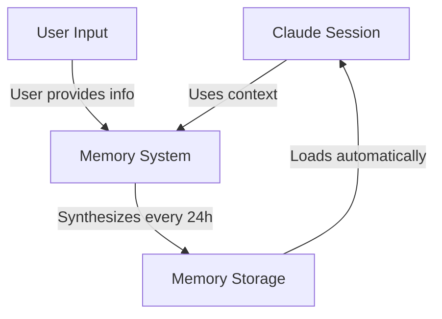
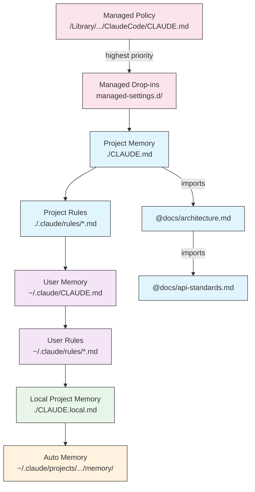
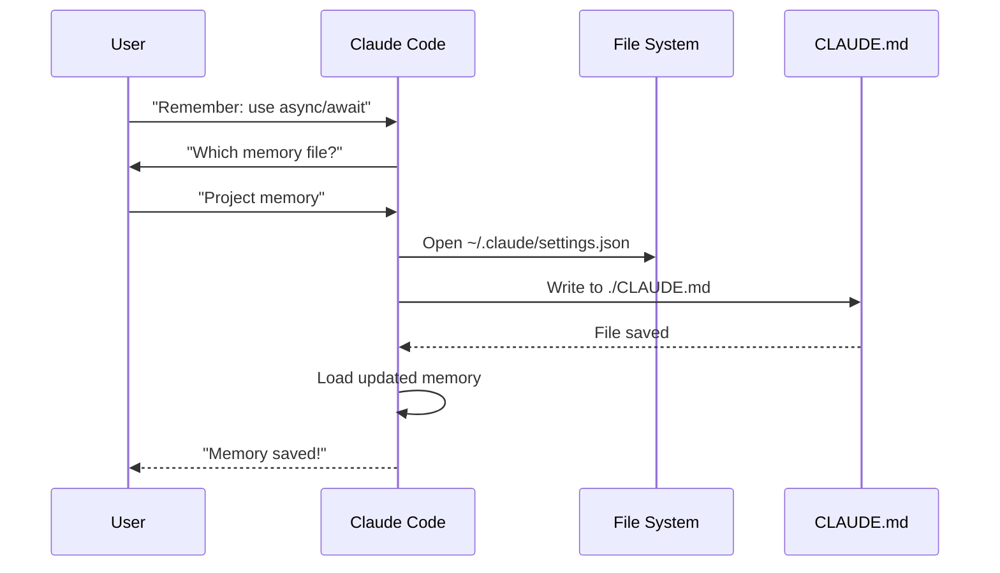
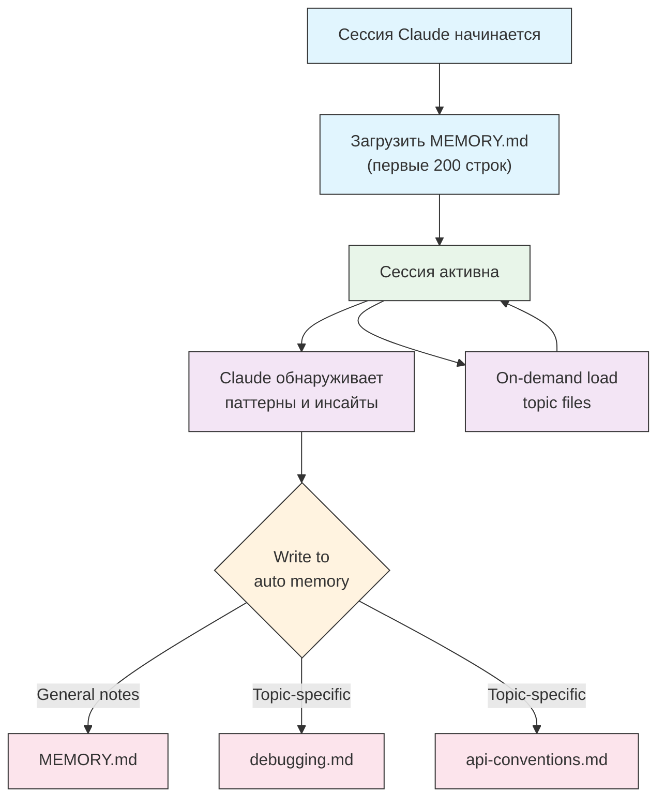

<picture>
  <source media="(prefers-color-scheme: dark)" srcset="../resources/logos/claude-howto-logo-dark.svg">
  
</picture>

# Руководство по Memory

Memory позволяет Claude сохранять контекст между сессиями и разговорами. В Claude Code это реализовано в двух формах: автоматическая синтезация в claude.ai и файловый `CLAUDE.md` в Claude Code.

## Обзор

Memory в Claude Code даёт постоянный контекст, который переносится между несколькими сессиями и разговорами. В отличие от временного окна контекста, memory-файлы позволяют:

- Делить стандарты проекта внутри команды
- Хранить личные предпочтения разработки
- Поддерживать правила и конфигурации для конкретных каталогов
- Подключать внешнюю документацию
- Хранить memory под версионным контролем как часть проекта

Система memory работает на нескольких уровнях: от глобальных личных предпочтений до конкретных подкаталогов, что даёт тонкий контроль над тем, что Claude запоминает и как применяет эти знания.

## Краткая справка по командам Memory

| Command | Purpose | Usage | When to Use |
|---------|---------|-------|-------------|
| `/init` | Инициализировать project memory | `/init` | Новый проект, первая настройка `CLAUDE.md` |
| `/memory` | Редактировать memory-файлы в редакторе | `/memory` | Большие изменения, реорганизация, проверка содержимого |
| `#` prefix | Быстро добавить однострочное правило | `# Your rule here` | Быстрые правила по ходу разговора |
| `# new rule into memory` | Явное добавление memory | `# new rule into memory<br/>Your detailed rule` | Сложные многострочные правила |
| `# remember this` | Добавление memory на естественном языке | `# remember this<br/>Your instruction` | Разговорные обновления memory |
| `@path/to/file` | Подключить внешний контент | `@README.md` or `@docs/api.md` | Ссылка на существующую документацию в `CLAUDE.md` |

## Быстрый старт: Инициализация Memory

### Команда `/init`

Команда `/init` — самый быстрый способ настроить project memory в Claude Code. Она создаёт файл `CLAUDE.md` с базовой документацией проекта.

**Usage:**

```bash
/init
```

**Что делает:**

- Создаёт новый файл `CLAUDE.md` в проекте (обычно `./CLAUDE.md` или `./.claude/CLAUDE.md`)
- Фиксирует конвенции и рекомендации проекта
- Создаёт основу для постоянства контекста между сессиями
- Даёт шаблон для описания стандартов проекта

**Улучшенный интерактивный режим:** установите `CLAUDE_CODE_NEW_INIT=true`, чтобы включить многошаговый интерактивный flow, который проведёт по настройке проекта шаг за шагом:

```bash
CLAUDE_CODE_NEW_INIT=true claude
/init
```

**Когда использовать `/init`:**

- При запуске нового проекта с Claude Code
- При фиксации стандартов и соглашений команды
- При создании документации о структуре codebase
- При настройке иерархии memory для совместной разработки

**Пример workflow:**

```markdown
# В каталоге проекта
/init

# Claude создаёт CLAUDE.md со структурой вроде:
# Project Configuration
## Project Overview
- Name: Your Project
- Tech Stack: [Your technologies]
- Team Size: [Number of developers]

## Development Standards
- Code style preferences
- Testing requirements
- Git workflow conventions
```

### Быстрые обновления Memory через `#`

Вы можете быстро добавить информацию в memory во время разговора, начав сообщение с `#`:

**Syntax:**

```markdown
# Your memory rule or instruction here
```

**Примеры:**

```markdown
# Always use TypeScript strict mode in this project

# Prefer async/await over promise chains

# Run npm test before every commit

# Use kebab-case for file names
```

**Как это работает:**

1. Начните сообщение с `#` и своего правила
2. Claude распознает это как запрос на обновление memory
3. Claude спросит, какой memory-файл обновить (project или personal)
4. Правило будет добавлено в соответствующий `CLAUDE.md`
5. В будущих сессиях этот контекст будет загружаться автоматически

**Альтернативные шаблоны:**

```markdown
# new rule into memory
Always validate user input with Zod schemas

# remember this
Use semantic versioning for all releases

# add to memory
Database migrations must be reversible
```

### Команда `/memory`

Команда `/memory` даёт прямой доступ к редактированию файлов `CLAUDE.md` в сессиях Claude Code. Она открывает memory-файлы в системном редакторе для полноценного редактирования.

**Usage:**

```bash
/memory
```

**Что делает:**

- Открывает memory-файлы в стандартном редакторе системы
- Позволяет вносить большие дополнения, изменения и перестройку структуры
- Даёт доступ ко всем memory-файлам в иерархии
- Помогает управлять постоянным контекстом между сессиями

**Когда использовать `/memory`:**

- При проверке существующего memory-контента
- При больших обновлениях стандартов проекта
- При реорганизации структуры memory
- При добавлении подробной документации или рекомендаций
- При сопровождении и обновлении memory по мере развития проекта

**Сравнение: `/memory` vs `/init`**

| Aspect | `/memory` | `/init` |
|--------|-----------|---------|
| **Purpose** | Редактировать существующие memory-файлы | Инициализировать новый `CLAUDE.md` |
| **When to use** | Обновлять/менять контекст проекта | Начинать новый проект |
| **Action** | Открывает редактор для изменений | Генерирует стартовый шаблон |
| **Workflow** | Постоянное сопровождение | Разовая настройка |

**Пример workflow:**

```markdown
# Открыть memory для редактирования
/memory

# Claude показывает варианты:
# 1. Managed Policy Memory
# 2. Project Memory (./CLAUDE.md)
# 3. User Memory (~/.claude/CLAUDE.md)
# 4. Local Project Memory

# Выберите вариант 2 (Project Memory)
# Ваш редактор откроет ./CLAUDE.md

# Внесите изменения, сохраните и закройте редактор
# Claude автоматически перечитает обновлённую memory
```

**Использование Memory Imports:**

Файлы `CLAUDE.md` поддерживают синтаксис `@path/to/file`, чтобы подключать внешний контент:

```markdown
# Project Documentation
See @README.md for project overview
See @package.json for available npm commands
See @docs/architecture.md for system design

# Import from home directory using absolute path
@~/.claude/my-project-instructions.md
```

**Особенности import:**

- Поддерживаются относительные и абсолютные пути (например, `@docs/api.md` или `@~/.claude/my-project-instructions.md`)
- Поддерживаются рекурсивные импорты с максимальной глубиной 5
- Первый импорт из внешних мест запускает approval dialog из соображений безопасности
- Директивы импорта не вычисляются внутри markdown code spans или code blocks, поэтому их безопасно документировать в примерах
- Помогает избегать дублирования, ссылаясь на существующую документацию
- Автоматически добавляет подключённый контент в контекст Claude

## Архитектура Memory

Memory в Claude Code использует иерархическую систему, где разные scopes выполняют разные роли:



## Иерархия Memory в Claude Code

Claude Code использует многоуровневую иерархию memory. Memory-файлы загружаются автоматически при старте Claude Code, а файлы более высокого уровня имеют приоритет.

**Полная иерархия Memory (в порядке приоритета):**

1. **Managed Policy** - инструкции на уровне организации
   - macOS: `/Library/Application Support/ClaudeCode/CLAUDE.md`
   - Linux/WSL: `/etc/claude-code/CLAUDE.md`
   - Windows: `C:\Program Files\ClaudeCode\CLAUDE.md`

2. **Managed Drop-ins** - alphabetically merged policy files (v2.1.83+)
   - каталог `managed-settings.d/` рядом с managed policy `CLAUDE.md`
   - файлы объединяются в алфавитном порядке для модульного управления политиками

3. **Project Memory** - общий для команды контекст (version controlled)
   - `./.claude/CLAUDE.md` или `./CLAUDE.md` (в корне репозитория)

4. **Project Rules** - модульные, тематические инструкции проекта
   - `./.claude/rules/*.md`

5. **User Memory** - личные предпочтения (для всех проектов)
   - `~/.claude/CLAUDE.md`

6. **User-Level Rules** - личные правила (для всех проектов)
   - `~/.claude/rules/*.md`

7. **Local Project Memory** - личные настройки для конкретного проекта
   - `./CLAUDE.local.md`

> **Note**: `CLAUDE.local.md` не упоминается в [official documentation](https://code.claude.com/docs/en/memory) по состоянию на March 2026. Возможно, это всё ещё работает как legacy feature. Для новых проектов лучше использовать `~/.claude/CLAUDE.md` (user-level) или `.claude/rules/` (project-level, path-scoped).

8. **Auto Memory** - автоматические заметки и выводы Claude
   - `~/.claude/projects/<project>/memory/`

**Поведение обнаружения Memory:**

Claude ищет memory-файлы в таком порядке, при этом более ранние пути имеют приоритет:



## Исключение `CLAUDE.md` через `claudeMdExcludes`

В больших monorepo некоторые `CLAUDE.md` могут быть не нужны для текущей работы. Настройка `claudeMdExcludes` позволяет исключить конкретные файлы `CLAUDE.md`, чтобы они не загружались в контекст:

```jsonc
// In ~/.claude/settings.json or .claude/settings.json
{
  "claudeMdExcludes": [
    "packages/legacy-app/CLAUDE.md",
    "vendors/**/CLAUDE.md"
  ]
}
```

Шаблоны сопоставляются с путями относительно корня проекта. Это особенно полезно для:

- Monorepo с множеством подпроектов, где актуальны лишь некоторые
- Репозиториев, содержащих vendored или third-party `CLAUDE.md`
- Снижения шума в окне контекста Claude за счёт исключения устаревших или нерелевантных инструкций

## Иерархия settings-файлов

Claude Code settings (включая `autoMemoryDirectory`, `claudeMdExcludes` и другие настройки) разрешаются из пятиуровневой иерархии, где более высокие уровни имеют приоритет:

| Level | Location | Scope |
|-------|----------|-------|
| 1 (Highest) | Managed policy (system-level) | Organization-wide enforcement |
| 2 | `managed-settings.d/` (v2.1.83+) | Modular policy drop-ins, merged alphabetically |
| 3 | `~/.claude/settings.json` | User preferences |
| 4 | `.claude/settings.json` | Project-level (committed to git) |
| 5 (Lowest) | `.claude/settings.local.json` | Local overrides (git-ignored) |

**Platform-specific configuration (v2.1.51+):**

Настройки также можно задавать через:
- **macOS**: Property list (plist) files
- **Windows**: Windows Registry

Эти механизмы платформы читаются вместе с JSON-настройками и подчиняются тем же правилам приоритета.

## Модульная система Rules

Создавайте организованные правила по путям с помощью структуры каталога `.claude/rules/`. Правила можно определять как на уровне проекта, так и на уровне пользователя:

```
your-project/
├── .claude/
│   ├── CLAUDE.md
│   └── rules/
│       ├── code-style.md
│       ├── testing.md
│       ├── security.md
│       └── api/                  # Subdirectories supported
│           ├── conventions.md
│           └── validation.md

~/.claude/
├── CLAUDE.md
└── rules/                        # User-level rules (all projects)
    ├── personal-style.md
    └── preferred-patterns.md
```

Правила ищутся рекурсивно внутри `rules/`, включая подкаталоги. User-level rules из `~/.claude/rules/` загружаются раньше project-level rules, что позволяет задавать личные defaults, которые проект может переопределить.

### Правила для конкретных путей через YAML frontmatter

Определяйте правила, которые применяются только к конкретным путям файлов:

```markdown
---
paths: src/api/**/*.ts
---

# API Development Rules

- All API endpoints must include input validation
- Use Zod for schema validation
- Document all parameters and response types
- Include error handling for all operations
```

**Примеры Glob Pattern:**

- `**/*.ts` - All TypeScript files
- `src/**/*` - All files under src/
- `src/**/*.{ts,tsx}` - Multiple extensions
- `{src,lib}/**/*.ts, tests/**/*.test.ts` - Multiple patterns

### Подкаталоги и Symlinks

Правила в `.claude/rules/` поддерживают две организационные возможности:

- **Подкаталоги**: правила ищутся рекурсивно, поэтому можно группировать их по темам (например, `rules/api/`, `rules/testing/`, `rules/security/`)
- **Symlinks**: можно шарить правила между несколькими проектами через symlink из центрального места в каталог `.claude/rules/` каждого проекта

## Таблица расположений Memory

| Location | Scope | Priority | Shared | Access | Best For |
|----------|-------|----------|--------|--------|----------|
| `/Library/Application Support/ClaudeCode/CLAUDE.md` (macOS) | Managed Policy | 1 (Highest) | Organization | System | Company-wide policies |
| `/etc/claude-code/CLAUDE.md` (Linux/WSL) | Managed Policy | 1 (Highest) | Organization | System | Organization standards |
| `C:\Program Files\ClaudeCode\CLAUDE.md` (Windows) | Managed Policy | 1 (Highest) | Organization | System | Corporate guidelines |
| `managed-settings.d/*.md` (alongside policy) | Managed Drop-ins | 1.5 | Organization | System | Modular policy files (v2.1.83+) |
| `./CLAUDE.md` or `./.claude/CLAUDE.md` | Project Memory | 2 | Team | Git | Team standards, shared architecture |
| `./.claude/rules/*.md` | Project Rules | 3 | Team | Git | Path-specific, modular rules |
| `~/.claude/CLAUDE.md` | User Memory | 4 | Individual | Filesystem | Personal preferences (all projects) |
| `~/.claude/rules/*.md` | User Rules | 5 | Individual | Filesystem | Personal rules (all projects) |
| `./CLAUDE.local.md` | Project Local | 6 | Individual | Git (ignored) | Personal project-specific preferences |
| `~/.claude/projects/<project>/memory/` | Auto Memory | 7 (Lowest) | Individual | Filesystem | Claude's automatic notes and learnings |

## Жизненный цикл обновления Memory

Вот как обновления memory проходят через ваши сессии Claude Code:



## Auto Memory

Auto memory — это постоянный каталог, куда Claude автоматически записывает выводы, паттерны и инсайты по мере работы с проектом. В отличие от файлов `CLAUDE.md`, которые вы пишете и поддерживаете вручную, auto memory записывается самим Claude в ходе сессий.

### Как работает Auto Memory

- **Location**: `~/.claude/projects/<project>/memory/`
- **Entrypoint**: `MEMORY.md` — основной файл в каталоге auto memory
- **Тематические файлы**: дополнительные необязательные файлы для отдельных тем (например, `debugging.md`, `api-conventions.md`)
- **Поведение загрузки**: первые 200 строк `MEMORY.md` загружаются в system prompt при старте сессии. Тематические файлы подгружаются по запросу, а не на старте.
- **Read/write**: Claude читает и пишет memory-файлы в ходе сессий, по мере обнаружения паттернов и знаний о проекте

### Архитектура Auto Memory



### Структура каталога Auto Memory

```
~/.claude/projects/<project>/memory/
├── MEMORY.md              # Entrypoint (first 200 lines loaded at startup)
├── debugging.md           # Topic file (loaded on demand)
├── api-conventions.md     # Topic file (loaded on demand)
└── testing-patterns.md    # Topic file (loaded on demand)
```

### Требование к версии

Auto memory требует **Claude Code v2.1.59 или новее**. Если у вас более старая версия, сначала обновитесь:

```bash
npm install -g @anthropic-ai/claude-code@latest
```

### Пользовательский каталог Auto Memory

По умолчанию auto memory хранится в `~/.claude/projects/<project>/memory/`. Вы можете изменить это расположение с помощью настройки `autoMemoryDirectory` (доступна с **v2.1.74**):

```jsonc
// In ~/.claude/settings.json or .claude/settings.local.json (user/local settings only)
{
  "autoMemoryDirectory": "/path/to/custom/memory/directory"
}
```

> **Note**: `autoMemoryDirectory` можно задавать только в user-level (`~/.claude/settings.json`) или local settings (`.claude/settings.local.json`), но не в project или managed policy settings.

Это полезно, когда вы хотите:

- Хранить auto memory в общей или синхронизируемой локации
- Отделить auto memory от стандартного каталога конфигурации Claude
- Использовать путь, специфичный для проекта, вне стандартной иерархии

### Общий доступ для worktree и репозиториев

Все worktree и подкаталоги внутри одного git-репозитория используют один и тот же каталог auto memory. Это значит, что при переключении между worktree или работе в разных подкаталогах одного репо будут читаться и записываться одни и те же memory-файлы.

### Memory для subagents

Subagents (запущенные через инструменты вроде Task или parallel execution) могут иметь собственный memory context. Используйте поле `memory` в frontmatter определения subagent, чтобы указать, какие scopes memory загружать:

```yaml
memory: user      # Load user-level memory only
memory: project   # Load project-level memory only
memory: local     # Load local memory only
```

Это позволяет subagents работать с более сфокусированным контекстом, а не наследовать всю иерархию memory.

### Управление Auto Memory

Auto memory можно управлять через переменную окружения `CLAUDE_CODE_DISABLE_AUTO_MEMORY`:

| Value | Behavior |
|-------|----------|
| `0` | Force auto memory **on** |
| `1` | Force auto memory **off** |
| *(unset)* | Default behavior (auto memory enabled) |

```bash
# Disable auto memory for a session
CLAUDE_CODE_DISABLE_AUTO_MEMORY=1 claude

# Force auto memory on explicitly
CLAUDE_CODE_DISABLE_AUTO_MEMORY=0 claude
```

## Дополнительные директории через `--add-dir`

Флаг `--add-dir` позволяет Claude Code загружать `CLAUDE.md` из дополнительных директорий за пределами текущего рабочего каталога. Это полезно для monorepo или multi-project setup, где важен контекст из других каталогов.

Чтобы включить эту возможность, задайте переменную окружения:

```bash
CLAUDE_CODE_ADDITIONAL_DIRECTORIES_CLAUDE_MD=1
```

Затем запустите Claude Code с флагом:

```bash
claude --add-dir /path/to/other/project
```

Claude загрузит `CLAUDE.md` из указанной дополнительной директории вместе с memory-файлами из текущего рабочего каталога.

## Практические примеры

### Пример 1: Структура Project Memory

**File:** `./CLAUDE.md`

```markdown
# Project Configuration

## Project Overview
- **Name**: E-commerce Platform
- **Tech Stack**: Node.js, PostgreSQL, React 18, Docker
- **Team Size**: 5 developers
- **Deadline**: Q4 2025

## Architecture
@docs/architecture.md
@docs/api-standards.md
@docs/database-schema.md

## Development Standards

### Code Style
- Use Prettier for formatting
- Use ESLint with airbnb config
- Maximum line length: 100 characters
- Use 2-space indentation

### Naming Conventions
- **Files**: kebab-case (user-controller.js)
- **Classes**: PascalCase (UserService)
- **Functions/Variables**: camelCase (getUserById)
- **Constants**: UPPER_SNAKE_CASE (API_BASE_URL)
- **Database Tables**: snake_case (user_accounts)

### Git Workflow
- Branch names: `feature/description` or `fix/description`
- Commit messages: Follow conventional commits
- PR required before merge
- All CI/CD checks must pass
- Minimum 1 approval required

### Testing Requirements
- Minimum 80% code coverage
- All critical paths must have tests
- Use Jest for unit tests
- Use Cypress for E2E tests
- Test filenames: `*.test.ts` or `*.spec.ts`

### API Standards
- RESTful endpoints only
- JSON request/response
- Use HTTP status codes correctly
- Version API endpoints: `/api/v1/`
- Document all endpoints with examples

### Database
- Use migrations for schema changes
- Never hardcode credentials
- Use connection pooling
- Enable query logging in development
- Regular backups required

### Deployment
- Docker-based deployment
- Kubernetes orchestration
- Blue-green deployment strategy
- Automatic rollback on failure
- Database migrations run before deploy

## Common Commands

| Command | Purpose |
|---------|---------|
| `npm run dev` | Start development server |
| `npm test` | Run test suite |
| `npm run lint` | Check code style |
| `npm run build` | Build for production |
| `npm run migrate` | Run database migrations |

## Team Contacts
- Tech Lead: Sarah Chen (@sarah.chen)
- Product Manager: Mike Johnson (@mike.j)
- DevOps: Alex Kim (@alex.k)

## Known Issues & Workarounds
- PostgreSQL connection pooling limited to 20 during peak hours
- Workaround: Implement query queuing
- Safari 14 compatibility issues with async generators
- Workaround: Use Babel transpiler

## Related Projects
- Analytics Dashboard: `/projects/analytics`
- Mobile App: `/projects/mobile`
- Admin Panel: `/projects/admin`
```

### Пример 2: Memory для конкретного каталога

**File:** `./src/api/CLAUDE.md`

```markdown
# API Module Standards

This file overrides root CLAUDE.md for everything in /src/api/

## API-Specific Standards

### Request Validation
- Use Zod for schema validation
- Always validate input
- Return 400 with validation errors
- Include field-level error details

### Authentication
- All endpoints require JWT token
- Token in Authorization header
- Token expires after 24 hours
- Implement refresh token mechanism

### Response Format

All responses must follow this structure:

```json
{
  "success": true,
  "data": { /* actual data */ },
  "timestamp": "2025-11-06T10:30:00Z",
  "version": "1.0"
}
```

Error responses:
```json
{
  "success": false,
  "error": {
    "code": "VALIDATION_ERROR",
    "message": "User message",
    "details": { /* field errors */ }
  },
  "timestamp": "2025-11-06T10:30:00Z"
}
```

### Pagination
- Use cursor-based pagination (not offset)
- Include `hasMore` boolean
- Limit max page size to 100
- Default page size: 20

### Rate Limiting
- 1000 requests per hour for authenticated users
- 100 requests per hour for public endpoints
- Return 429 when exceeded
- Include retry-after header

### Caching
- Use Redis for session caching
- Cache duration: 5 minutes default
- Invalidate on write operations
- Tag cache keys with resource type
```

### Пример 3: Personal Memory

**File:** `~/.claude/CLAUDE.md`

```markdown
# My Development Preferences

## About Me
- **Experience Level**: 8 years full-stack development
- **Preferred Languages**: TypeScript, Python
- **Communication Style**: Direct, with examples
- **Learning Style**: Visual diagrams with code

## Code Preferences

### Error Handling
I prefer explicit error handling with try-catch blocks and meaningful error messages.
Avoid generic errors. Always log errors for debugging.

### Comments
Use comments for WHY, not WHAT. Code should be self-documenting.
Comments should explain business logic or non-obvious decisions.

### Testing
I prefer TDD (test-driven development).
Write tests first, then implementation.
Focus on behavior, not implementation details.

### Architecture
I prefer modular, loosely-coupled design.
Use dependency injection for testability.
Separate concerns (Controllers, Services, Repositories).

## Debugging Preferences
- Use console.log with prefix: `[DEBUG]`
- Include context: function name, relevant variables
- Use stack traces when available
- Always include timestamps in logs

## Communication
- Explain complex concepts with diagrams
- Show concrete examples before explaining theory
- Include before/after code snippets
- Summarize key points at the end

## Project Organization
I organize my projects as:

   project/
   ├── src/
   │   ├── api/
   │   ├── services/
   │   ├── models/
   │   └── utils/
   ├── tests/
   ├── docs/
   └── docker/

## Tooling
- **IDE**: VS Code with vim keybindings
- **Terminal**: Zsh with Oh-My-Zsh
- **Format**: Prettier (100 char line length)
- **Linter**: ESLint with airbnb config
- **Test Framework**: Jest with React Testing Library
```

_My Test_
Ask Claude to save a new rule


Claude has not save the rule because I did not have any `Claude.md` file anywhere. Then asked Claude to confirm the location.


### Example 4: Memory Update During Session

You can add new rules to memory during an active Claude Code session. There are two ways to do this:

#### Method 1: Direct Request

```markdown
User: Remember that I prefer using React hooks instead of class components
     for all new components.

Claude: I'm adding that to your memory. Which memory file should this go in?
        1. Project memory (./CLAUDE.md)
        2. Personal memory (~/.claude/CLAUDE.md)

User: Project memory

Claude: ✅ Memory saved!

Added to ./CLAUDE.md:
---

### Component Development
- Use functional components with React Hooks
- Prefer hooks over class components
- Custom hooks for reusable logic
- Use useCallback for event handlers
- Use useMemo for expensive computations
```

#### Method 2: Using "# new rule into memory" Pattern

Вы также можете использовать явный шаблон "# new rule into memory", чтобы запускать обновление memory:

```markdown
User: # new rule into memory
      Always validate user input with Zod schemas before processing.

Claude: I'm saving this rule to memory. Which memory file should I use?
        1. Project memory (./CLAUDE.md)
        2. Personal memory (~/.claude/CLAUDE.md)

User: Project memory

Claude: ✅ Memory saved!

Added to ./CLAUDE.md:
---

### Input Validation
- Always validate user input with Zod schemas before processing
- Define schemas at the top of each API handler file
- Return 400 status with validation errors
```

#### Советы по добавлению Memory

- Формулируйте правила конкретно и действенно
- Группируйте связанные правила под одним заголовком
- Обновляйте существующие разделы, а не дублируйте контент
- Выбирайте подходящий scope memory (project vs. personal)

## Сравнение функций Memory

| Feature | Claude Web/Desktop | Claude Code (CLAUDE.md) |
|---------|-------------------|------------------------|
| Auto-synthesis | ✅ Every 24h | ❌ Manual |
| Cross-project | ✅ Shared | ❌ Project-specific |
| Team access | ✅ Shared projects | ✅ Git-tracked |
| Searchable | ✅ Built-in | ✅ Through `/memory` |
| Editable | ✅ In-chat | ✅ Direct file edit |
| Import/Export | ✅ Yes | ✅ Copy/paste |
| Persistent | ✅ 24h+ | ✅ Indefinite |

### Memory в Claude Web/Desktop

#### Таймлайн синтеза Memory


**Пример summary memory:**

```markdown
## Claude's Memory of User

### Professional Background
- Senior full-stack developer with 8 years experience
- Focus on TypeScript/Node.js backends and React frontends
- Active open source contributor
- Interested in AI and machine learning

### Project Context
- Currently building e-commerce platform
- Tech stack: Node.js, PostgreSQL, React 18, Docker
- Working with team of 5 developers
- Using CI/CD and blue-green deployments

### Communication Preferences
- Prefers direct, concise explanations
- Likes visual diagrams and examples
- Appreciates code snippets
- Explains business logic in comments

### Current Goals
- Improve API performance
- Increase test coverage to 90%
- Implement caching strategy
- Document architecture
```

## Best Practices

### Do's - What To Include

- **Be specific and detailed**: Используйте чёткие, подробные инструкции вместо расплывчатых
  - ✅ Good: "Use 2-space indentation for all JavaScript files"
  - ❌ Avoid: "Follow best practices"

- **Keep organized**: Структурируйте memory-файлы с понятными markdown-разделами и заголовками

- **Use appropriate hierarchy levels**:
  - **Managed policy**: Company-wide policies, security standards, compliance requirements
  - **Project memory**: Team standards, architecture, coding conventions (commit to git)
  - **User memory**: Personal preferences, communication style, tooling choices
  - **Directory memory**: Module-specific rules and overrides

- **Leverage imports**: Используйте `@path/to/file` для ссылки на существующую документацию
  - Поддерживается до 5 уровней рекурсивного вложения
  - Это уменьшает дублирование между memory-файлами
  - Example: `See @README.md for project overview`

- **Document frequent commands**: Добавляйте команды, которые вы запускаете часто, чтобы экономить время

- **Version control project memory**: Коммитьте project-level `CLAUDE.md` в git для пользы команды

- **Review periodically**: Регулярно обновляйте memory по мере изменения проекта и требований

- **Provide concrete examples**: Добавляйте code snippets и конкретные сценарии

### Don'ts - What To Avoid

- **Don't store secrets**: Никогда не храните API keys, passwords, tokens или credentials

- **Don't include sensitive data**: Никаких PII, личных данных или proprietary secrets

- **Don't duplicate content**: Используйте imports (`@path`) вместо копирования существующей документации

- **Don't be vague**: Избегайте общих фраз вроде "follow best practices" или "write good code"

- **Don't make it too long**: Держите отдельные memory-файлы сфокусированными и меньше 500 строк

- **Don't over-organize**: Используйте иерархию разумно; не создавайте слишком много переопределений по подкаталогам

- **Don't forget to update**: Устаревшая memory вызывает путаницу и неправильные практики

- **Don't exceed nesting limits**: Импорт memory поддерживает максимум 5 уровней вложенности

### Советы по управлению Memory

**Выбирайте правильный уровень memory:**

| Use Case | Memory Level | Rationale |
|----------|--------------|-----------|
| Company security policy | Managed Policy | Applies to all projects organization-wide |
| Team code style guide | Project | Shared with team via git |
| Your preferred editor shortcuts | User | Personal preference, not shared |
| API module standards | Directory | Specific to that module only |

**Быстрый workflow обновления:**

1. Для одиночных правил: используйте префикс `#` в разговоре
2. Для нескольких изменений: используйте `/memory`, чтобы открыть редактор
3. Для начальной настройки: используйте `/init`, чтобы создать шаблон

**Лучшие практики для import:**

```markdown
# Good: Reference existing docs
@README.md
@docs/architecture.md
@package.json

# Avoid: Copying content that exists elsewhere
# Instead of copying README content into CLAUDE.md, just import it
```

## Инструкции по установке

### Настройка Project Memory

#### Method 1: Using `/init` Command (Recommended)

Самый быстрый способ настроить project memory:

1. **Перейдите в каталог проекта:**
   ```bash
   cd /path/to/your/project
   ```

2. **Запустите команду init в Claude Code:**
   ```bash
   /init
   ```

3. **Claude создаст и заполнит CLAUDE.md** шаблоном структуры

4. **Настройте сгенерированный файл** под потребности проекта

5. **Закоммитьте в git:**
   ```bash
   git add CLAUDE.md
   git commit -m "Initialize project memory with /init"
   ```

#### Method 2: Manual Creation

Если предпочитаете ручную настройку:

1. **Создайте CLAUDE.md в корне проекта:**
   ```bash
   cd /path/to/your/project
   touch CLAUDE.md
   ```

2. **Добавьте стандарты проекта:**
   ```bash
   cat > CLAUDE.md << 'EOF'
   # Project Configuration

   ## Project Overview
   - **Name**: Your Project Name
   - **Tech Stack**: List your technologies
   - **Team Size**: Number of developers

   ## Development Standards
   - Your coding standards
   - Naming conventions
   - Testing requirements
   EOF
   ```

3. **Commit to git:**
   ```bash
   git add CLAUDE.md
   git commit -m "Add project memory configuration"
   ```

#### Method 3: Quick Updates with `#`

Когда `CLAUDE.md` уже существует, можно быстро добавлять правила прямо во время разговора:

```markdown
# Use semantic versioning for all releases

# Always run tests before committing

# Prefer composition over inheritance
```

Claude предложит выбрать, какой memory-файл обновить.

### Настройка Personal Memory

1. **Создайте каталог `~/.claude`:**
   ```bash
   mkdir -p ~/.claude
   ```

2. **Создайте personal `CLAUDE.md`:**
   ```bash
   touch ~/.claude/CLAUDE.md
   ```

3. **Добавьте свои предпочтения:**
   ```bash
   cat > ~/.claude/CLAUDE.md << 'EOF'
   # My Development Preferences

   ## About Me
   - Experience Level: [Your level]
   - Preferred Languages: [Your languages]
   - Communication Style: [Your style]

   ## Code Preferences
   - [Your preferences]
   EOF
   ```

### Настройка Directory-Specific Memory

1. **Создайте memory для конкретных каталогов:**
   ```bash
   mkdir -p /path/to/directory/.claude
   touch /path/to/directory/CLAUDE.md
   ```

2. **Добавьте directory-specific правила:**
   ```bash
   cat > /path/to/directory/CLAUDE.md << 'EOF'
   # [Directory Name] Standards

   This file overrides root CLAUDE.md for this directory.

   ## [Specific Standards]
   EOF
   ```

3. **Закоммитьте в version control:**
   ```bash
   git add /path/to/directory/CLAUDE.md
   git commit -m "Add [directory] memory configuration"
   ```

### Проверка настройки

1. **Проверьте расположение memory:**
   ```bash
   # Project root memory
   ls -la ./CLAUDE.md

   # Personal memory
   ls -la ~/.claude/CLAUDE.md
   ```

2. **Claude Code автоматически загрузит** эти файлы при запуске сессии

3. **Проверьте в Claude Code**, запустив новую сессию в проекте

## Официальная документация

Для самой актуальной информации смотрите официальную документацию Claude Code:

- **[Memory Documentation](https://code.claude.com/docs/en/memory)** - Полная справка по memory-системе
- **[Slash Commands Reference](https://code.claude.com/docs/en/interactive-mode)** - Все встроенные команды, включая `/init` и `/memory`
- **[CLI Reference](https://code.claude.com/docs/en/cli-reference)** - Документация по командной строке

### Ключевые технические детали из официальных docs

**Загрузка Memory:**

- Все memory-файлы загружаются автоматически при запуске Claude Code
- Claude идёт вверх по дереву каталогов от текущего рабочего каталога, чтобы найти `CLAUDE.md`
- Файлы поддеревьев обнаруживаются и загружаются по контексту при доступе к этим каталогам

**Синтаксис Import:**

- Используйте `@path/to/file` для подключения внешнего контента (например, `@~/.claude/my-project-instructions.md`)
- Поддерживаются относительные и абсолютные пути
- Поддерживаются рекурсивные импорты с максимальной глубиной 5
- Первый внешний импорт запускает диалог подтверждения
- Не вычисляется внутри markdown code spans или code blocks
- Автоматически добавляет подключённый контент в контекст Claude

**Приоритет иерархии Memory:**

1. Managed Policy (highest precedence)
2. Managed Drop-ins (`managed-settings.d/`, v2.1.83+)
3. Project Memory
4. Project Rules (`.claude/rules/`)
5. User Memory
6. User-Level Rules (`~/.claude/rules/`)
7. Local Project Memory
8. Auto Memory (lowest precedence)

## Ссылки на связанные понятия

### Точки интеграции
- [MCP Protocol](../05-mcp/) - Live data access alongside memory
- [Slash Commands](../01-slash-commands/) - Session-specific shortcuts
- [Skills](../03-skills/) - Automated workflows with memory context

### Связанные возможности Claude
- [Claude Web Memory](https://claude.ai) - Automatic synthesis
- [Official Memory Docs](https://code.claude.com/docs/en/memory) - Anthropic documentation
