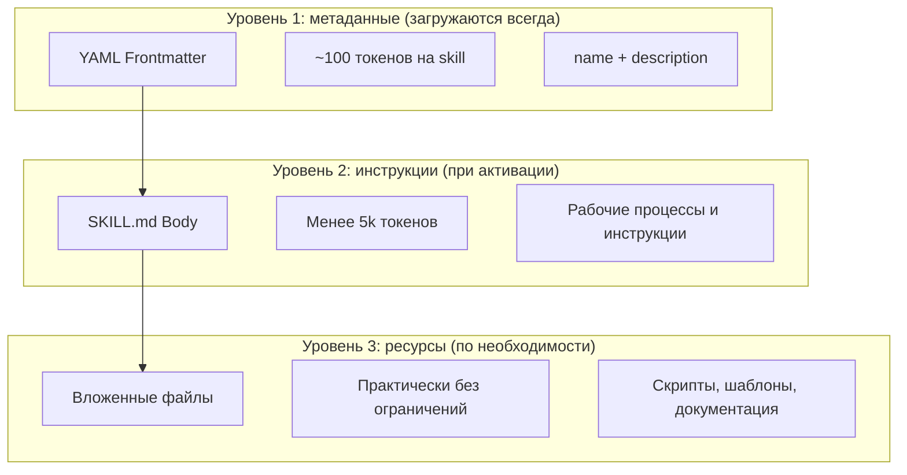
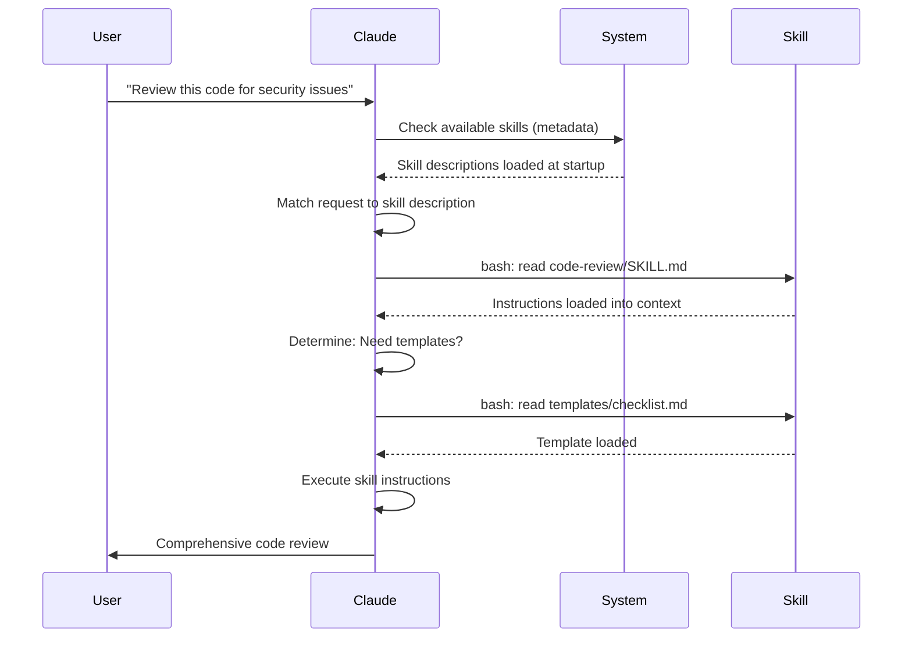

<picture>
  <source media="(prefers-color-scheme: dark)" srcset="../resources/logos/claude-howto-logo-dark.svg">
  
</picture>

# Руководство по Agent Skills

Agent Skills — это переиспользуемые возможности на уровне файловой системы, которые расширяют функциональность Claude. Они упаковывают предметную экспертизу, workflows и лучшие практики в обнаруживаемые компоненты, которые Claude автоматически использует, когда это уместно.

## Обзор

**Agent Skills** — это модульные возможности, которые превращают универсального агента в специалиста. В отличие от промптов, которые задают инструкции на уровне одной беседы, skills загружаются по запросу и убирают необходимость повторять одни и те же указания в разных диалогах.

### Ключевые преимущества

- **Специализация Claude**: настраивайте возможности под конкретные задачи
- **Меньше повторов**: создайте один раз, используйте автоматически в разных беседах
- **Композиция возможностей**: комбинируйте Skills для сложных workflows
- **Масштабирование workflows**: переиспользуйте skills в нескольких проектах и командах
- **Поддержание качества**: встраивайте лучшие практики прямо в рабочий процесс

Skills следуют открытому стандарту [Agent Skills](https://agentskills.io), который работает во многих AI-инструментах. Claude Code расширяет стандарт дополнительными возможностями, такими как управление активацией, выполнение через subagent и динамическая подстановка контекста.

> **Примечание**: пользовательские slash-команды были объединены в skills. Файлы `.claude/commands/` по-прежнему работают и поддерживают те же поля frontmatter. Для новых проектов рекомендуется использовать skills. Если оба варианта существуют в одном месте (например, `.claude/commands/review.md` и `.claude/skills/review/SKILL.md`), приоритет у skill.

## Как работают Skills: постепенное раскрытие

Skills используют архитектуру **progressive disclosure** — Claude загружает информацию поэтапно по мере необходимости, а не съедает весь контекст заранее. Это даёт эффективное управление контекстом при практически неограниченном масштабировании.

### Три уровня загрузки



| Уровень | Когда загружается | Стоимость в токенах | Содержимое |
|-------|------------|------------|---------|
| **Уровень 1: метаданные** | Всегда, при старте | ~100 токенов на Skill | `name` и `description` из YAML frontmatter |
| **Уровень 2: инструкции** | Когда skill активируется | Меньше 5k токенов | Тело `SKILL.md` с инструкциями и пояснениями |
| **Уровень 3+: ресурсы** | По необходимости | Практически неограниченно | Вложенные файлы, которые выполняются через bash без загрузки содержимого в контекст |

Это означает, что вы можете установить много Skills без штрафа за контекст: Claude знает только о существовании каждого Skill и о том, когда его использовать, пока он не будет реально активирован.

## Процесс загрузки Skill



## Типы и расположение Skills

| Тип | Расположение | Область | Общий доступ | Лучше всего подходит для |
|------|----------|-------|--------|----------|
| **Enterprise** | Управляемые настройки | Все пользователи организации | Да | Стандартов на уровне всей организации |
| **Personal** | `~/.claude/skills/<skill-name>/SKILL.md` | Отдельного пользователя | Нет | Личных workflows |
| **Project** | `.claude/skills/<skill-name>/SKILL.md` | Команды | Да, через git | Стандартов команды |
| **Plugin** | `<plugin>/skills/<skill-name>/SKILL.md` | Там, где включён | Зависит | Пакетов внутри plugins |

Если skills имеют одинаковое имя на разных уровнях, приоритет у более высокого уровня: **enterprise > personal > project**. Plugin skills используют namespace `plugin-name:skill-name`, поэтому не конфликтуют.

### Автоматическое обнаружение

**Вложенные каталоги**: когда вы работаете с файлами в подкаталогах, Claude Code автоматически находит skills во вложенных `.claude/skills/` директориях. Например, если вы редактируете файл в `packages/frontend/`, Claude Code также ищет skills в `packages/frontend/.claude/skills/`. Это поддерживает monorepo, где у пакетов есть собственные skills.

**Каталоги из `--add-dir`**: skills из директорий, добавленных через `--add-dir`, загружаются автоматически с отслеживанием изменений. Любые правки skill-файлов в этих директориях применяются сразу без перезапуска Claude Code.

**Бюджет описаний**: описания skills (metadata уровня 1) ограничены **2% окна контекста** (fallback: **16,000 символов**). Если у вас установлено много skills, часть может быть исключена. Запустите `/context`, чтобы проверить предупреждения. Порог можно переопределить через переменную окружения `SLASH_COMMAND_TOOL_CHAR_BUDGET`.

## Создание собственных Skills

### Базовая структура каталога

```
my-skill/
├── SKILL.md           # Основные инструкции (обязательно)
├── template.md        # Шаблон, который Claude будет заполнять
├── examples/
│   └── sample.md      # Пример результата в ожидаемом формате
└── scripts/
    └── validate.sh    # Скрипт, который Claude может выполнить
```

### Формат `SKILL.md`

```yaml
---
name: your-skill-name
description: Кратко опишите, что делает этот skill и когда его использовать
---

# Название вашего skill

## Инструкции
Дайте Claude понятные пошаговые инструкции.

## Примеры
Покажите конкретные примеры использования этого Skill.
```

### Обязательные поля

- **name**: только строчные буквы, цифры и дефисы (макс. 64 символа). Не может содержать "anthropic" или "claude".
- **description**: что делает Skill И когда его использовать (макс. 1024 символа). Это критично для того, чтобы Claude понимал, когда активировать skill.

### Необязательные поля frontmatter

```yaml
---
name: my-skill
description: Что делает этот skill и когда его использовать
argument-hint: "[filename] [format]"        # Hint for autocomplete
disable-model-invocation: true              # Only user can invoke
user-invocable: false                       # Hide from slash menu
allowed-tools: Read, Grep, Glob             # Restrict tool access
model: opus                                 # Specific model to use
effort: high                                # Effort level override (low, medium, high, max)
context: fork                               # Run in isolated subagent
agent: Explore                              # Which agent type (with context: fork)
shell: bash                                 # Shell for commands: bash (default) or powershell
hooks:                                      # Skill-scoped hooks
  PreToolUse:
    - matcher: "Bash"
      hooks:
        - type: command
          command: "./scripts/validate.sh"
---
```

| Поле | Описание |
|-------|-------------|
| `name` | Только строчные буквы, цифры и дефисы (макс. 64 символа). Не может содержать "anthropic" или "claude". |
| `description` | Что делает Skill И когда его использовать (макс. 1024 символа). Критично для автоактивации. |
| `argument-hint` | Подсказка в меню автодополнения `/` (например, `"[filename] [format]"`). |
| `disable-model-invocation` | `true` = только пользователь может запускать через `/name`. Claude никогда не будет запускать автоматически. |
| `user-invocable` | `false` = скрыт из меню `/`. Запускать может только Claude автоматически. |
| `allowed-tools` | Список инструментов через запятую, которые skill может использовать без запросов на разрешение. |
| `model` | Переопределение модели, пока skill активен (например, `opus`, `sonnet`). |
| `effort` | Переопределение уровня effort, пока skill активен: `low`, `medium`, `high` или `max`. |
| `context` | `fork`, чтобы запускать skill в форкнутом subagent-контексте с собственным окном контекста. |
| `agent` | Тип subagent при `context: fork` (например, `Explore`, `Plan`, `general-purpose`). |
| `shell` | Shell для подстановок `!`command`` и скриптов: `bash` (по умолчанию) или `powershell`. |
| `hooks` | Hooks, привязанные к жизненному циклу этого skill (тот же формат, что и у глобальных hooks). |

## Типы содержимого Skill

Skills могут содержать два типа контента, каждый для своих задач:

### Справочный контент

Добавляет знания, которые Claude применяет к текущей работе: соглашения, паттерны, style guides, предметную область. Используется прямо в контексте беседы.

```yaml
---
name: api-conventions
description: API design patterns for this codebase
---

When writing API endpoints:
- Use RESTful naming conventions
- Return consistent error formats
- Include request validation
```

### Контент задач

Пошаговые инструкции для конкретных действий. Часто вызываются напрямую через `/skill-name`.

```yaml
---
name: deploy
description: Deploy the application to production
context: fork
disable-model-invocation: true
---

Deploy the application:
1. Run the test suite
2. Build the application
3. Push to the deployment target
```

## Управление активацией Skill

По умолчанию и вы, и Claude можете запускать любой skill. Два поля frontmatter управляют тремя режимами активации:

| Frontmatter | Вы можете вызвать | Claude может вызвать |
|---|---|---|
| (default) | Да | Да |
| `disable-model-invocation: true` | Да | Нет |
| `user-invocable: false` | Нет | Да |

**Используйте `disable-model-invocation: true`** для workflows с побочными эффектами: `/commit`, `/deploy`, `/send-slack-message`. Claude не должен сам решать, что пора выкатывать код только потому, что он выглядит готовым.

**Используйте `user-invocable: false`** для фоновых знаний, которые не являются осмысленной командой. Например, skill `legacy-system-context` объясняет, как устроена старая система: это полезно для Claude, но не является действием для пользователя.

## Подстановки строк

Skills поддерживают динамические значения, которые вычисляются до того, как содержимое skill попадёт к Claude:

| Переменная | Описание |
|----------|-------------|
| `$ARGUMENTS` | Все аргументы, переданные при запуске skill |
| `$ARGUMENTS[N]` or `$N` | Доступ к конкретному аргументу по индексу (начиная с 0) |
| `${CLAUDE_SESSION_ID}` | Текущий ID сессии |
| `${CLAUDE_SKILL_DIR}` | Каталог, содержащий файл `SKILL.md` этого skill |
| `` !`command` `` | Динамическая подстановка контекста — запускает shell-команду и подставляет её вывод |

**Пример:**

```yaml
---
name: fix-issue
description: Fix a GitHub issue
---

Fix GitHub issue $ARGUMENTS following our coding standards.
1. Read the issue description
2. Implement the fix
3. Write tests
4. Create a commit
```

Запуск `/fix-issue 123` заменяет `$ARGUMENTS` на `123`.

## Подстановка динамического контекста

Синтаксис `!`command`` запускает shell-команды до того, как содержимое skill будет отправлено Claude:

```yaml
---
name: pr-summary
description: Суммировать изменения в pull request
context: fork
agent: Explore
---

## Контекст pull request
- Diff PR: !`gh pr diff`
- Комментарии PR: !`gh pr view --comments`
- Изменённые файлы: !`gh pr diff --name-only`

## Ваша задача
Суммируйте этот pull request...
```

Команды выполняются сразу; Claude видит только итоговый вывод. По умолчанию команды запускаются в `bash`. Укажите `shell: powershell` в frontmatter, чтобы использовать PowerShell.

## Запуск Skills в Subagents

Добавьте `context: fork`, чтобы запускать skill в изолированном subagent-контексте. Содержимое skill становится задачей для отдельного subagent с собственным окном контекста, а основная беседа остаётся чистой.

Поле `agent` определяет, какой тип agent использовать:

| Тип agent | Лучше всего подходит для |
|---|---|
| `Explore` | Исследований только для чтения, анализа кодовой базы |
| `Plan` | Подготовки планов реализации |
| `general-purpose` | Широких задач, где нужны все инструменты |
| Custom agents | Специализированных агентов, определённых в вашей конфигурации |

**Пример frontmatter:**

```yaml
---
context: fork
agent: Explore
---
```

**Полный пример skill:**

```yaml
---
name: deep-research
description: Тщательно исследовать тему
context: fork
agent: Explore
---

Тщательно исследуйте $ARGUMENTS:
1. Найдите релевантные файлы с помощью Glob и Grep
2. Прочитайте и проанализируйте код
3. Суммируйте выводы с конкретными ссылками на файлы
```

## Практические примеры

### Пример 1: Skill для code review

**Структура каталога:**

```
~/.claude/skills/code-review/
├── SKILL.md
├── templates/
│   ├── review-checklist.md
│   └── finding-template.md
└── scripts/
    ├── analyze-metrics.py
    └── compare-complexity.py
```

**Файл:** `~/.claude/skills/code-review/SKILL.md`

```yaml
---
name: code-review-specialist
description: Полный code review с анализом безопасности, производительности и качества. Используйте, когда пользователь просит провести review кода, оценить его качество, проверить pull request или упоминает анализ безопасности либо оптимизацию производительности.
---

# Skill для code review

Этот skill даёт полноценные возможности для code review с акцентом на:

1. **Анализ безопасности**
   - Ошибки аутентификации/авторизации
   - Риски утечки данных
   - Уязвимости инъекций
   - Криптографические слабые места

2. **Проверка производительности**
   - Эффективность алгоритмов (анализ Big O)
   - Оптимизация памяти
   - Оптимизация запросов к базе данных
   - Возможности кэширования

3. **Качество кода**
   - Принципы SOLID
   - Паттерны проектирования
   - Соглашения об именовании
   - Покрытие тестами

4. **Поддерживаемость**
   - Читаемость кода
   - Размер функций (желательно < 50 строк)
   - Цикломатическая сложность
   - Безопасность типов

## Шаблон review

Для каждого рассмотренного фрагмента кода укажите:

### Краткая сводка
- Общая оценка качества (1-5)
- Количество ключевых замечаний
- Рекомендуемые приоритетные области

### Критические проблемы (если есть)
- **Проблема**: чёткое описание
- **Местоположение**: файл и номер строки
- **Влияние**: почему это важно
- **Серьёзность**: Critical/High/Medium
- **Исправление**: пример кода

Для подробных чеклистов см. [templates/review-checklist.md](templates/review-checklist.md).
```

### Пример 2: Skill для визуализации кодовой базы

Skill, который генерирует интерактивные HTML-визуализации:

**Структура каталога:**

```
~/.claude/skills/codebase-visualizer/
├── SKILL.md
└── scripts/
    └── visualize.py
```

**Файл:** `~/.claude/skills/codebase-visualizer/SKILL.md`

```yaml
---
name: codebase-visualizer
description: Generate an interactive collapsible tree visualization of your codebase. Use when exploring a new repo, understanding project structure, or identifying large files.
allowed-tools: Bash(python *)
---

# Визуализатор кодовой базы

Генерирует интерактивное HTML-дерево, показывающее структуру файлов проекта.

## Использование

Запустите скрипт визуализации из корня проекта:

```bash
python ~/.claude/skills/codebase-visualizer/scripts/visualize.py .
```

Это создаст `codebase-map.html` и откроет его в браузере по умолчанию.

## Что показывает визуализация

- **Сворачиваемые каталоги**: кликайте по папкам, чтобы раскрывать или сворачивать их
- **Размеры файлов**: отображаются рядом с каждым файлом
- **Цвета**: разные цвета для разных типов файлов
- **Итоги по каталогу**: показывает суммарный размер каждой папки
```

Встроенный Python-скрипт делает основную работу, а Claude занимается orchestration.

### Пример 3: Skill для deploy (только пользовательский запуск)

```yaml
---
name: deploy
description: Deploy the application to production
disable-model-invocation: true
allowed-tools: Bash(npm *), Bash(git *)
---

Deploy $ARGUMENTS to production:

1. Run the test suite: `npm test`
2. Build the application: `npm run build`
3. Push to the deployment target
4. Verify the deployment succeeded
5. Report deployment status
```

### Пример 4: Skill brand voice (фоновое знание)

```yaml
---
name: brand-voice
description: Ensure all communication matches brand voice and tone guidelines. Use when creating marketing copy, customer communications, or public-facing content.
user-invocable: false
---

## Tone of Voice
- **Friendly but professional** - approachable without being casual
- **Clear and concise** - avoid jargon
- **Confident** - we know what we're doing
- **Empathetic** - understand user needs

## Writing Guidelines
- Use "you" when addressing readers
- Use active voice
- Keep sentences under 20 words
- Start with value proposition

For templates, see [templates/](templates/).
```

### Пример 5: Skill для генерации `CLAUDE.md`

```yaml
---
name: claude-md
description: Create or update CLAUDE.md files following best practices for optimal AI agent onboarding. Use when users mention CLAUDE.md, project documentation, or AI onboarding.
---

## Основные принципы

**LLM stateless**: `CLAUDE.md` — это единственный файл, который автоматически включается в каждую беседу.

### Золотые правила

1. **Меньше — лучше**: держите файл в пределах 300 строк, а лучше меньше 100
2. **Универсальность**: включайте только информацию, актуальную для КАЖДОЙ сессии
3. **Не используйте Claude как линтер**: используйте детерминированные инструменты
4. **Никогда не генерируйте автоматически**: делайте файл вручную и обдуманно

## Обязательные разделы

- **Project Name**: краткое описание в одну строку
- **Tech Stack**: основной язык, фреймворки, база данных
- **Development Commands**: команды установки, тестов и сборки
- **Critical Conventions**: только неочевидные, но важные соглашения
- **Known Issues / Gotchas**: то, что сбивает разработчиков
```

### Пример 6: Skill для рефакторинга со скриптами

**Структура каталога:**

```
refactor/
├── SKILL.md
├── references/
│   ├── code-smells.md
│   └── refactoring-catalog.md
├── templates/
│   └── refactoring-plan.md
└── scripts/
    ├── analyze-complexity.py
    └── detect-smells.py
```

**Файл:** `refactor/SKILL.md`

```yaml
---
name: code-refactor
description: Systematic code refactoring based on Martin Fowler's methodology. Use when users ask to refactor code, improve code structure, reduce technical debt, or eliminate code smells.
---

# Skill для code refactoring

Поэтапный подход с упором на безопасные, постепенные изменения, подтверждённые тестами.

## Workflow

Phase 1: Research & Analysis → Phase 2: Test Coverage Assessment →
Phase 3: Code Smell Identification → Phase 4: Refactoring Plan Creation →
Phase 5: Incremental Implementation → Phase 6: Review & Iteration

## Основные принципы

1. **Сохранение поведения**: внешнее поведение не должно меняться
2. **Маленькие шаги**: делайте крошечные, проверяемые изменения
3. **Test-Driven**: тесты — это страховка
4. **Непрерывность**: рефакторинг — это постоянная практика, а не разовая акция

Для каталога code smells см. [references/code-smells.md](references/code-smells.md).
Для техник рефакторинга см. [references/refactoring-catalog.md](references/refactoring-catalog.md).
```

## Поддерживающие файлы

Skills могут включать в каталоге несколько файлов помимо `SKILL.md`. Эти поддерживающие файлы — шаблоны, примеры, скрипты и reference-документы — помогают держать основной skill-файл сфокусированным, при этом давая Claude дополнительные ресурсы, которые он может подгружать по необходимости.

```
my-skill/
├── SKILL.md              # Main instructions (required, keep under 500 lines)
├── templates/            # Templates for Claude to fill in
│   └── output-format.md
├── examples/             # Example outputs showing expected format
│   └── sample-output.md
├── references/           # Domain knowledge and specifications
│   └── api-spec.md
└── scripts/              # Scripts Claude can execute
    └── validate.sh
```

Рекомендации для поддерживающих файлов:

- Держите `SKILL.md` меньше **500 строк**. Детальные reference-материалы, крупные примеры и спецификации выносите в отдельные файлы.
- Ссылайтесь на дополнительные файлы из `SKILL.md` через **relative paths** (например, `[API reference](references/api-spec.md)`).
- Поддерживающие файлы загружаются на уровне 3, по мере необходимости, поэтому не расходуют контекст, пока Claude их реально не откроет.

## Управление Skills

### Просмотр доступных Skills

Спросите Claude напрямую:
```
What Skills are available?
```

Или проверьте файловую систему:
```bash
# List personal Skills
ls ~/.claude/skills/

# List project Skills
ls .claude/skills/
```

### Проверка Skill

Есть два способа проверить:

**Позвольте Claude вызвать его автоматически**, задав запрос, который соответствует описанию:
```
Can you help me review this code for security issues?
```

**Или вызовите напрямую** по имени skill:
```
/code-review src/auth/login.ts
```

### Обновление Skill

Редактируйте файл `SKILL.md` напрямую. Изменения вступают в силу при следующем запуске Claude Code.

```bash
# Personal Skill
code ~/.claude/skills/my-skill/SKILL.md

# Project Skill
code .claude/skills/my-skill/SKILL.md
```

### Ограничение доступа Claude к Skills

Есть три способа контролировать, какие skills Claude может запускать:

**Отключить все skills** в `/permissions`:
```
# Add to deny rules:
Skill
```

**Разрешить или запретить конкретные skills**:
```
# Allow only specific skills
Skill(commit)
Skill(review-pr *)

# Deny specific skills
Skill(deploy *)
```

**Скрыть отдельные skills** можно, добавив `disable-model-invocation: true` в их frontmatter.

## Лучшие практики

### 1. Делайте описания конкретными

- **Плохо (размыто)**: "Помогает с документами"
- **Хорошо (конкретно)**: "Извлекает текст и таблицы из PDF, заполняет формы, объединяет документы. Используйте при работе с PDF-файлами или когда пользователь упоминает PDF, формы или извлечение документов."

### 2. Держите Skills сфокусированными

- Один Skill = одна возможность
- ✅ "Заполнение PDF-форм"
- ❌ "Обработка документов" (слишком широко)

### 3. Добавляйте trigger terms

Добавляйте ключевые слова в описания, которые совпадают с запросами пользователей:
```yaml
description: Анализировать Excel-таблицы, строить сводные таблицы и создавать графики. Используйте при работе с Excel-файлами, spreadsheets или файлами .xlsx.
```

### 4. Держите `SKILL.md` меньше 500 строк

Выносите детальный reference-материал в отдельные файлы, которые Claude подгружает по необходимости.

### 5. Ссылайтесь на поддерживающие файлы

```markdown
## Дополнительные ресурсы

- Полные детали API см. в [reference.md](reference.md)
- Примеры использования см. в [examples.md](examples.md)
```

### Что делать

- Используйте понятные и описательные имена
- Добавляйте исчерпывающие инструкции
- Приводите конкретные примеры
- Собирайте связанные скрипты и шаблоны вместе
- Проверяйте на реальных сценариях
- Документируйте зависимости

### Чего не делать

- Не создавайте skills для одноразовых задач
- Не дублируйте уже существующую функциональность
- Не делайте skills слишком широкими
- Не пропускайте поле description
- Не устанавливайте skills из недоверенных источников без проверки

## Устранение неполадок

### Краткая памятка

| Проблема | Решение |
|-------|----------|
| Claude не использует Skill | Сделайте описание более конкретным и добавьте trigger terms |
| Файл skill не найден | Проверьте путь: `~/.claude/skills/name/SKILL.md` |
| Ошибки YAML | Проверьте `---`, отступы и отсутствие табов |
| Skills конфликтуют | Используйте разные trigger terms в описаниях |
| Скрипты не запускаются | Проверьте права: `chmod +x scripts/*.py` |
| Claude не видит все skills | Слишком много skills; проверьте `/context` на предупреждения |

### Skill не срабатывает

Если Claude не использует ваш skill, когда это ожидается:

1. Проверьте, что в `description` есть ключевые слова, которые пользователь реально употребляет
2. Убедитесь, что skill появляется при вопросе `"What skills are available?"`
3. Попробуйте переформулировать запрос так, чтобы он совпадал с описанием
4. Для проверки вызовите skill напрямую через `/skill-name`

### Skill срабатывает слишком часто

Если Claude использует skill, когда вам это не нужно:

1. Сделайте описание более конкретным
2. Добавьте `disable-model-invocation: true`, если skill должен вызываться только вручную

### Claude не видит все Skills

Описания skills загружаются на уровне **2% окна контекста** (fallback: **16,000 символов**). Запустите `/context`, чтобы проверить предупреждения об исключённых skills. Порог можно переопределить через переменную окружения `SLASH_COMMAND_TOOL_CHAR_BUDGET`.

## Соображения безопасности

**Используйте только Skills из доверенных источников.** Skills дают Claude возможности через инструкции и код, и вредоносный Skill может заставить Claude запускать инструменты или выполнять код опасным образом.

**Ключевые меры безопасности:**

- **Проверяйте тщательно**: просматривайте все файлы в каталоге Skill
- **Внешние источники рискованны**: Skills, которые тянут данные из внешних URL, могут быть скомпрометированы
- **Злоупотребление инструментами**: вредоносные Skills могут запускать инструменты опасным образом
- **Относитесь как к установке ПО**: используйте Skills только из доверенных источников

## Skills vs другие возможности

| Возможность | Способ запуска | Лучше всего подходит для |
|---------|------------|----------|
| **Skills** | Авто или `/name` | Переиспользуемой экспертизы и workflows |
| **Slash Commands** | Пользовательский запуск `/name` | Быстрых ярлыков (объединены в skills) |
| **Subagents** | Автоделегирование | Изолированного выполнения задач |
| **Memory (CLAUDE.md)** | Загружается всегда | Постоянного контекста проекта |
| **MCP** | В реальном времени | Доступа к внешним данным и сервисам |
| **Hooks** | По событию | Автоматизированных побочных эффектов |

## Встроенные Skills

Claude Code поставляется с несколькими встроенными skills, которые всегда доступны без установки:

| Skill | Описание |
|-------|-------------|
| `/simplify` | Проверяет изменённые файлы на повторное использование, качество и эффективность; запускает 3 параллельных review-агента |
| `/batch <instruction>` | Координирует крупные параллельные изменения в кодовой базе с помощью git worktrees |
| `/debug [description]` | Помогает разобраться с текущей сессией, читая debug-log |
| `/loop [interval] <prompt>` | Запускает prompt по таймеру повторно (например, `/loop 5m check the deploy`) |
| `/claude-api` | Загружает reference по Claude API/SDK; автоматически активируется при импортах `anthropic`/`@anthropic-ai/sdk` |

Эти skills доступны сразу и не требуют установки или настройки. Они используют тот же формат `SKILL.md`, что и пользовательские skills.

## Распространение Skills

### Project Skills (совместное использование в команде)

1. Создайте Skill в `.claude/skills/`
2. Закоммитьте в git
3. Участники команды подтягивают изменения — Skills становятся доступны сразу

### Личные Skills

```bash
# Copy to personal directory
cp -r my-skill ~/.claude/skills/

# Make scripts executable
chmod +x ~/.claude/skills/my-skill/scripts/*.py
```

### Распространение через Plugin

Пакуйте skills в каталог `skills/` внутри plugin, если нужен более широкий способ распространения.

## Дальше: коллекция Skills и менеджер Skills

Когда вы начнёте серьёзно заниматься skills, станут необходимы две вещи: библиотека проверенных skills и инструмент для их управления.

**[luongnv89/skills](https://github.com/luongnv89/skills)** — Коллекция skills, которые я использую каждый день почти во всех проектах. Среди них `logo-designer` (генерирует логотипы проекта на лету) и `ollama-optimizer` (настраивает производительность локальных LLM под ваше железо). Хорошая отправная точка, если вам нужны готовые к использованию skills.

**[luongnv89/asm](https://github.com/luongnv89/asm)** — Agent Skill Manager. Он занимается разработкой skills, поиском дубликатов и тестированием. Команда `asm link` позволяет проверять skill в любом проекте, не копируя файлы туда-сюда — это становится особенно важно, когда у вас уже не один-два skill.

## Дополнительные ресурсы

- [Официальная документация по Skills](https://code.claude.com/docs/en/skills)
- [Блог про архитектуру Agent Skills](https://claude.com/blog/equipping-agents-for-the-real-world-with-agent-skills)
- [Skills Repository](https://github.com/luongnv89/skills) - Коллекция готовых skills
- [Slash Commands Guide](../01-slash-commands/) - Команды, запускаемые пользователем
- [Subagents Guide](../04-subagents/) - Делегированные AI-агенты
- [Memory Guide](../02-memory/) - Постоянный контекст
- [MCP (Model Context Protocol)](../05-mcp/) - Доступ к внешним данным в реальном времени
- [Hooks Guide](../06-hooks/) - Автоматизация по событиям
