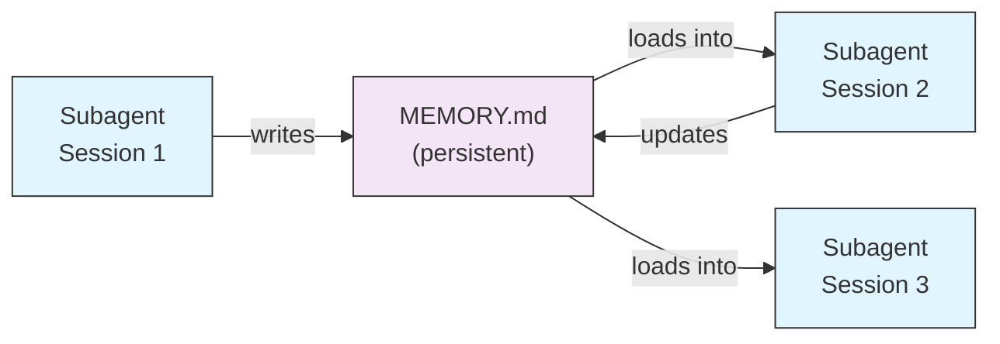
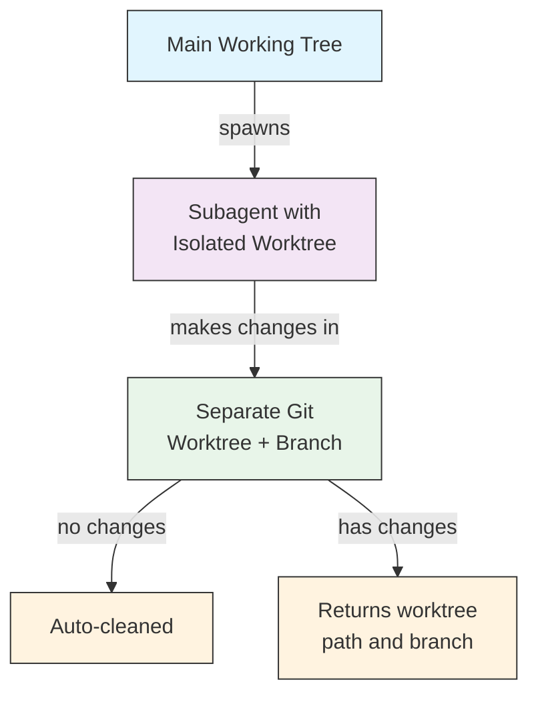
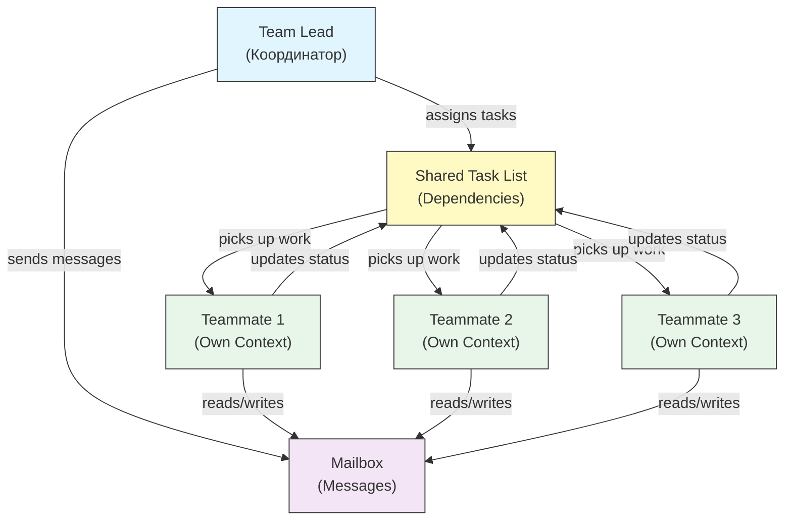
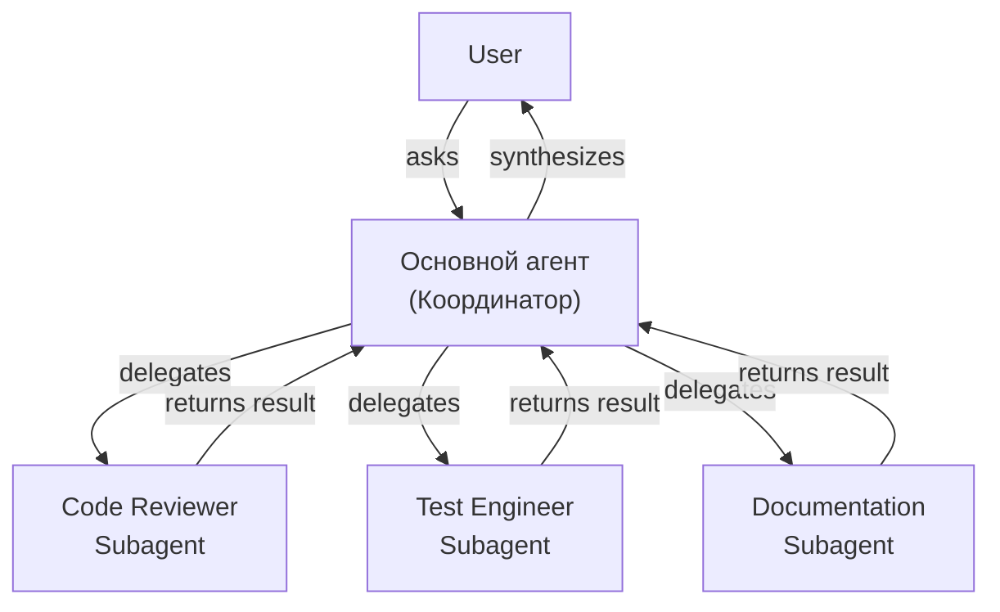
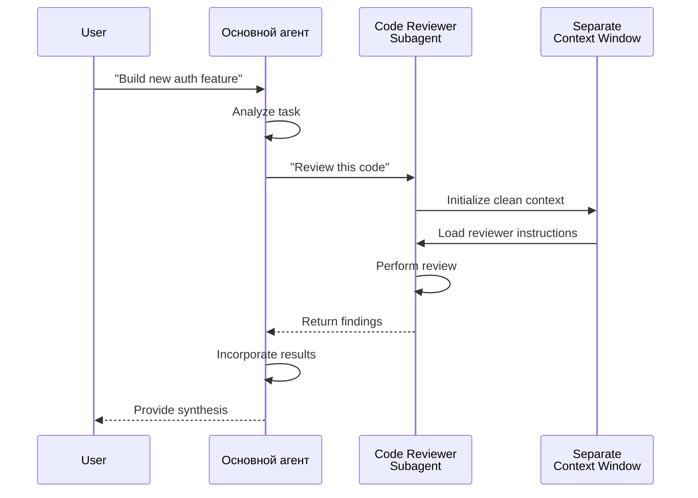
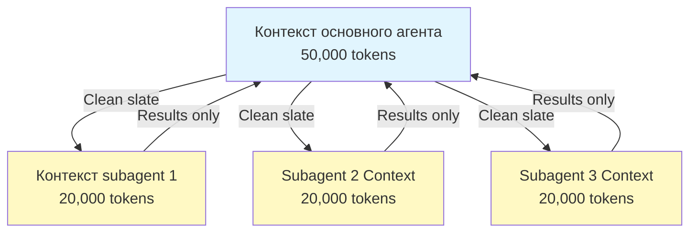
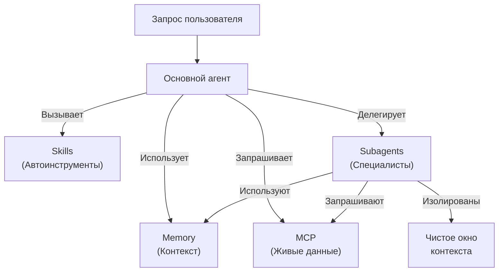

<picture>
  <source media="(prefers-color-scheme: dark)" srcset="../resources/logos/claude-howto-logo-dark.svg">
  
</picture>

# Subagents - Полное справочное руководство

<a id="overview"></a>

Subagents - это специализированные AI-ассистенты, которым Claude Code может делегировать задачи. У каждого subagent есть своё назначение, собственное окно контекста, отделённое от основного разговора, и его можно настроить с конкретными инструментами и кастомным system prompt.

## Содержание

1. [Обзор](#overview)
2. [Ключевые преимущества](#key-benefits)
3. [Расположение файлов](#file-locations)
4. [Конфигурация](#configuration)
5. [Встроенные Subagents](#built-in-subagents)
6. [Управление Subagents](#managing-subagents)
7. [Использование Subagents](#using-subagents)
8. [Возобновляемые агенты](#resumable-agents)
9. [Цепочки Subagents](#chaining-subagents)
10. [Постоянная память для Subagents](#persistent-memory-for-subagents)
11. [Фоновые Subagents](#background-subagents)
12. [Изоляция worktree](#worktree-isolation)
13. [Ограничение spawnable Subagents](#restrict-spawnable-subagents)
14. [Команда CLI `claude agents`](#claude-agents-cli-command)
15. [Команды команд (экспериментально)](#agent-teams-experimental)
16. [Безопасность plugin subagent](#plugin-subagent-security)
17. [Архитектура](#architecture)
18. [Управление контекстом](#context-management)
19. [Когда использовать Subagents](#when-to-use-subagents)
20. [Лучшие практики](#best-practices)
21. [Примеры Subagents в этой папке](#example-subagents-in-this-folder)
22. [Инструкции по установке](#installation-instructions)
23. [Связанные концепции](#related-concepts)

---

<a id="key-benefits"></a>
## Обзор

Subagents позволяют делегировать выполнение задач в Claude Code за счёт:

- создания **изолированных AI-ассистентов** с отдельными окнами контекста
- предоставления **настроенных system prompt** для узкой экспертизы
- применения **контроля доступа к инструментам** для ограничения возможностей
- предотвращения **загрязнения контекста** сложными задачами
- возможности **параллельного выполнения** нескольких специализированных задач

Каждый subagent работает независимо и «с чистого листа», получает только тот контекст, который нужен для его задачи, а затем возвращает результат основному agent для объединения.

**Быстрый старт**: используйте команду `/agents`, чтобы интерактивно создавать, просматривать, редактировать и управлять subagent.

<a id="file-locations"></a>
---

## Ключевые преимущества

| Преимущество | Описание |
|---------|-------------|
| **Сохранение контекста** | Работает в отдельном контексте и не загрязняет основной разговор |
| **Специализированная экспертиза** | Настроен под конкретные области и даёт более высокий процент успеха |
| **Повторное использование** | Можно применять в разных проектах и делиться с командами |
| **Гибкие разрешения** | Разные уровни доступа к инструментам для разных типов subagent |
| **Масштабируемость** | Несколько agent работают над разными аспектами одновременно |

---

## Расположение файлов

Файлы subagent можно хранить в нескольких местах с разными областями действия:

| Приоритет | Тип | Расположение | Область действия |
|----------|------|----------|-------|
| 1 (highest) | **Определённые через CLI** | Через флаг `--agents` (JSON) | Только текущая сессия |
| 2 | **Проектные subagent** | `.claude/agents/` | Текущий проект |
| 3 | **Пользовательские subagent** | `~/.claude/agents/` | Все проекты |
| 4 (lowest) | **Plugin agents** | Директория `agents/` плагина | Через plugins |

Если имена совпадают, приоритет всегда у источника с более высоким уровнем.

---

<a id="configuration"></a>
## Конфигурация

### Формат файла

Subagent задаются через YAML frontmatter, а затем следует system prompt в Markdown:

```yaml
---
name: your-sub-agent-name
description: Description of when this subagent should be invoked
tools: tool1, tool2, tool3  # Optional - inherits all tools if omitted
disallowedTools: tool4  # Optional - explicitly disallowed tools
model: sonnet  # Optional - sonnet, opus, haiku, or inherit
permissionMode: default  # Optional - permission mode
maxTurns: 20  # Optional - limit agentic turns
skills: skill1, skill2  # Optional - skills to preload into context
mcpServers: server1  # Optional - MCP servers to make available
memory: user  # Optional - persistent memory scope (user, project, local)
background: false  # Optional - run as background task
effort: high  # Optional - reasoning effort (low, medium, high, max)
isolation: worktree  # Optional - git worktree isolation
initialPrompt: "Start by analyzing the codebase"  # Optional - auto-submitted first turn
hooks:  # Optional - component-scoped hooks
  PreToolUse:
    - matcher: "Bash"
      hooks:
        - type: command
          command: "./scripts/security-check.sh"
---

Здесь размещается system prompt вашего subagent. Он может состоять из нескольких абзацев
и должен чётко определять роль subagent, его возможности и подход
к решению задач.
```

### Поля конфигурации

| Поле | Обязательно | Описание |
|-------|----------|-------------|
| `name` | Yes | Уникальный идентификатор (строчные буквы и дефисы) |
| `description` | Yes | Описание назначения на естественном языке. Добавьте "use PROACTIVELY", чтобы стимулировать автоматический запуск |
| `tools` | No | Список конкретных инструментов через запятую. Если не указан, наследуются все инструменты. Поддерживает синтаксис `Agent(agent_name)` для ограничения spawnable subagents |
| `disallowedTools` | No | Список инструментов через запятую, которые subagent не должен использовать |
| `model` | No | Модель для использования: `sonnet`, `opus`, `haiku`, полный model ID или `inherit`. По умолчанию используется настроенная модель subagent |
| `permissionMode` | No | `default`, `acceptEdits`, `dontAsk`, `bypassPermissions`, `plan` |
| `maxTurns` | No | Максимальное число agentic turns, которое может сделать subagent |
| `skills` | No | Список skills через запятую для предварительной загрузки. Полностью внедряет содержимое skill в контекст subagent при старте |
| `mcpServers` | No | MCP servers, доступные subagent |
| `hooks` | No | Hooks уровня компонента (PreToolUse, PostToolUse, Stop) |
| `memory` | No | Область постоянной памяти: `user`, `project` или `local` |
| `background` | No | Установите `true`, чтобы всегда запускать этот subagent как background task |
| `effort` | No | Уровень reasoning effort: `low`, `medium`, `high` или `max` |
| `isolation` | No | Установите `worktree`, чтобы дать subagent собственный git worktree |
| `initialPrompt` | No | Первый автоматически отправляемый turn, когда subagent запускается как основной agent |

### Варианты конфигурации инструментов

**Вариант 1: наследовать все инструменты (поле не указывать)**
```yaml
---
name: full-access-agent
description: Agent with all available tools
---
```

**Вариант 2: указать отдельные инструменты**
```yaml
---
name: limited-agent
description: Agent with specific tools only
tools: Read, Grep, Glob, Bash
---
```

**Вариант 3: условный доступ к инструментам**
```yaml
---
name: conditional-agent
description: Agent with filtered tool access
tools: Read, Bash(npm:*), Bash(test:*)
---
```

### Конфигурация через CLI

Определяйте subagents для одной сессии с помощью флага `--agents` в формате JSON:

```bash
claude --agents '{
  "code-reviewer": {
    "description": "Expert code reviewer. Use proactively after code changes.",
    "prompt": "You are a senior code reviewer. Focus on code quality, security, and best practices.",
    "tools": ["Read", "Grep", "Glob", "Bash"],
    "model": "sonnet"
  }
}'
```

**Формат JSON для флага `--agents`:**

```json
{
  "agent-name": {
    "description": "Required: when to invoke this agent",
    "prompt": "Required: system prompt for the agent",
    "tools": ["Optional", "array", "of", "tools"],
    "model": "optional: sonnet|opus|haiku"
  }
}
```

**Приоритет определений агентов:**

Определения агентов загружаются в таком порядке приоритета (первое совпадение выигрывает):
1. **CLI-defined** - `--agents` flag (session only, JSON)
2. **Project-level** - `.claude/agents/` (current project)
3. **User-level** - `~/.claude/agents/` (all projects)
4. **Plugin-level** - Plugin `agents/` directory

Это позволяет CLI-определениям переопределять все остальные источники в рамках одной сессии.

---

## Встроенные Subagents

Claude Code включает несколько встроенных subagents, которые всегда доступны:

| Агент | Модель | Назначение |
|-------|-------|-------------|
| **general-purpose** | Наследуется | Сложные многошаговые задачи |
| **Plan** | Наследуется | Исследование для plan mode |
| **Explore** | Haiku | Только чтение, исследование кодовой базы (quick/medium/very thorough) |
| **Bash** | Наследуется | Выполнение команд терминала в отдельном контексте |
| **statusline-setup** | Sonnet | Настройка status line |
| **Claude Code Guide** | Haiku | Ответы на вопросы о возможностях Claude Code |

### Subagent общего назначения

| Property | Value |
|----------|-------|
| **Model** | Inherits from parent |
| **Tools** | All tools |
| **Purpose** | Сложные исследовательские задачи, многошаговые операции, изменения кода |

**Когда используется**: задачи, где нужны и исследование, и изменение кода, с нетривиальным reasoning.

### Subagent Plan

| Property | Value |
|----------|-------|
| **Model** | Inherits from parent |
| **Tools** | Read, Glob, Grep, Bash |
| **Purpose** | Автоматически используется в plan mode для исследования кодовой базы |

**Когда используется**: когда Claude должен понять кодовую базу до того, как показать план.

### Subagent Explore

| Property | Value |
|----------|-------|
| **Model** | Haiku (fast, low-latency) |
| **Mode** | Strictly read-only |
| **Tools** | Glob, Grep, Read, Bash (read-only commands only) |
| **Purpose** | Быстрый поиск и анализ кодовой базы |

**Когда используется**: когда нужно искать и понимать код без внесения изменений.

**Уровни тщательности** - задают глубину исследования:
- **"quick"** - быстрый поиск с минимальным исследованием, хорошо для поиска конкретных паттернов
- **"medium"** - умеренное исследование, баланс скорости и полноты, значение по умолчанию
- **"very thorough"** - всесторонний анализ по нескольким местам и соглашениям именования, может занять больше времени

### Subagent Bash

| Property | Value |
|----------|-------|
| **Model** | Inherits from parent |
| **Tools** | Bash |
| **Purpose** | Выполнять команды терминала в отдельном окне контекста |

**Когда используется**: когда shell-команды выигрывают от изолированного контекста.

### Subagent настройки status line

| Property | Value |
|----------|-------|
| **Model** | Sonnet |
| **Tools** | Read, Write, Bash |
| **Purpose** | Настраивать отображение status line в Claude Code |

**Когда используется**: при настройке или кастомизации status line.

### Subagent справки по Claude Code

| Property | Value |
|----------|-------|
| **Model** | Haiku (fast, low-latency) |
| **Tools** | Read-only |
| **Purpose** | Отвечать на вопросы о возможностях Claude Code и его использовании |

**Когда используется**: когда пользователи спрашивают, как работает Claude Code или как использовать конкретные функции.

---

## Управление Subagents

### Использование команды `/agents` (рекомендуется)

```bash
/agents
```

Это открывает интерактивное меню, где можно:
- просматривать все доступные subagents (встроенные, пользовательские и проектные)
- создавать новые subagents с пошаговой настройкой
- редактировать существующие кастомные subagents и доступ к инструментам
- удалять кастомные subagents
- видеть, какие subagents активны при наличии дубликатов

### Прямое управление файлами

```bash
# Создать project subagent
mkdir -p .claude/agents
cat > .claude/agents/test-runner.md << 'EOF'
---
name: test-runner
description: Use proactively to run tests and fix failures
---

You are a test automation expert. When you see code changes, proactively
run the appropriate tests. If tests fail, analyze the failures and fix
them while preserving the original test intent.
EOF

# Создать user subagent (доступен во всех проектах)
mkdir -p ~/.claude/agents
```

---

## Использование Subagents

### Автоматическое делегирование

Claude proactively делегирует задачи на основе:
- описания задачи в вашем запросе
- поля `description` в конфигурации subagent
- текущего контекста и доступных инструментов

Чтобы стимулировать проактивное использование, добавьте `"use PROACTIVELY"` или `"MUST BE USED"` в поле `description`:

```yaml
---
name: code-reviewer
description: Expert code review specialist. Use PROACTIVELY after writing or modifying code.
---
```

### Явный вызов

You can explicitly request a specific subagent:

```
> Use the test-runner subagent to fix failing tests
> Have the code-reviewer subagent look at my recent changes
> Ask the debugger subagent to investigate this error
```

### Вызов через @-упоминание

Используйте префикс `@`, чтобы гарантированно вызвать конкретный subagent (обходит эвристику автоматического делегирования):

```
> @"code-reviewer (agent)" review the auth module
```

### Агент на всю сессию

Run an entire session using a specific agent as the main agent:

```bash
# Via CLI flag
claude --agent code-reviewer

# Via settings.json
{
  "agent": "code-reviewer"
}
```

### Просмотр доступных агентов

Use the `claude agents` command to list all configured agents from all sources:

```bash
claude agents
```

---

## Возобновляемые агенты

Subagents могут продолжать предыдущие разговоры с сохранением полного контекста:

```bash
# Initial invocation
> Use the code-analyzer agent to start reviewing the authentication module
# Returns agentId: "abc123"

# Resume the agent later
> Resume agent abc123 and now analyze the authorization logic as well
```

**Сценарии использования**:
- долгие исследования через несколько сессий
- итеративная доработка без потери контекста
- многошаговые рабочие процессы с сохранением контекста

---

## Цепочки Subagents

Запускайте несколько subagents последовательно:

```bash
> First use the code-analyzer subagent to find performance issues,
  then use the optimizer subagent to fix them
```

Это позволяет строить сложные workflows, где результат одного subagent используется другим.

---

## Постоянная память для Subagents

Поле `memory` даёт subagents постоянный каталог, который переживает разговоры. Это позволяет subagent накапливать знания со временем, сохраняя заметки, находки и контекст между сессиями.

### Области памяти

| Область | Каталог | Сценарий использования |
|-------|-----------|----------------------|
| `user` | `~/.claude/agent-memory/<name>/` | Личные заметки и предпочтения для всех проектов |
| `project` | `.claude/agent-memory/<name>/` | Знания, специфичные для проекта, общие для команды |
| `local` | `.claude/agent-memory-local/<name>/` | Локальные знания проекта, не попадающие в version control |

### Как это работает

- Первые 200 строк `MEMORY.md` в каталоге памяти автоматически загружаются в system prompt subagent
- Инструменты `Read`, `Write` и `Edit` автоматически доступны subagent для управления файлами памяти
- При необходимости subagent может создавать дополнительные файлы в своём каталоге памяти

### Example Configuration

```yaml
---
name: researcher
memory: user
---

You are a research assistant. Use your memory directory to store findings,
track progress across sessions, and build up knowledge over time.

Check your MEMORY.md file at the start of each session to recall previous context.
```



---

## Фоновые Subagents

Subagents могут работать в фоне, освобождая основной разговор для других задач.

### Конфигурация

Set `background: true` in the frontmatter to always run the subagent as a background task:

```yaml
---
name: long-runner
background: true
description: Performs long-running analysis tasks in the background
---
```

### Горячие клавиши

| Сочетание | Действие |
|----------|--------|
| `Ctrl+B` | Перевести текущую задачу subagent в фон |
| `Ctrl+F` | Завершить все фоновые агенты (нажмите дважды для подтверждения) |

### Отключение фоновых задач

Set the environment variable to disable background task support entirely:

```bash
export CLAUDE_CODE_DISABLE_BACKGROUND_TASKS=1
```

---

## Изоляция worktree

Параметр `isolation: worktree` даёт subagent собственный git worktree, позволяя ему вносить изменения независимо, не затрагивая основное рабочее дерево.

### Конфигурация

```yaml
---
name: feature-builder
isolation: worktree
description: Implements features in an isolated git worktree
tools: Read, Write, Edit, Bash, Grep, Glob
---
```

### Как это работает



- Subagent работает в собственном git worktree на отдельной ветке
- Если subagent не вносит изменений, worktree автоматически очищается
- Если изменения есть, путь к worktree и имя ветки возвращаются основному agent для ревью или merge

---

## Ограничение spawnable Subagents

Вы можете контролировать, каких subagents разрешено создавать данному subagent, используя синтаксис `Agent(agent_type)` в поле `tools`. Это позволяет формировать allowlist для делегирования.

> **Примечание**: в v2.1.63 инструмент `Task` был переименован в `Agent`. Существующие ссылки вида `Task(...)` по-прежнему работают как алиасы.

### Пример

```yaml
---
name: coordinator
description: Coordinates work between specialized agents
tools: Agent(worker, researcher), Read, Bash
---

You are a coordinator agent. You can delegate work to the "worker" and
"researcher" subagents only. Use Read and Bash for your own exploration.
```

In this example, the `coordinator` subagent can only spawn the `worker` and `researcher` subagents. It cannot spawn any other subagents, even if they are defined elsewhere.

---

## CLI-команда `claude agents`

Команда `claude agents` выводит все настроенные агенты, сгруппированные по источнику (built-in, user-level, project-level):

```bash
claude agents
```

Эта команда:
- показывает всех доступных агентов из всех источников
- группирует агентов по месту происхождения
- показывает **override**-ы, когда агент с более высоким приоритетом перекрывает агент с более низким приоритетом (например, project-level agent с тем же именем, что и user-level agent)

---

## Команды агентов (экспериментально)

Agent Teams координируют несколько экземпляров Claude Code, работающих вместе над сложными задачами. В отличие от subagents, которые получают делегированные подзадачи и возвращают результат, teammates работают независимо, со своим контекстом, и общаются напрямую через общую mailbox-систему.

> **Примечание**: Agent Teams находится в экспериментальном статусе и требует Claude Code v2.1.32+. Включите его перед использованием.

### Subagents против Agent Teams

| Aspect | Subagents | Agent Teams |
|--------|-----------|-------------|
| **Модель делегирования** | Parent выдаёт подзадачу и ждёт результат | Team lead назначает работу, teammates выполняют её независимо |
| **Контекст** | Свежий контекст на каждую подзадачу, результаты сводятся обратно | Каждый teammate хранит собственный постоянный контекст |
| **Координация** | Последовательная или параллельная, управляется parent | Общий список задач с автоматическим управлением зависимостями |
| **Коммуникация** | Только возвращаемые значения | Межагентные сообщения через mailbox |
| **Возобновление сессии** | Поддерживается | Не поддерживается для in-process teammates |
| **Лучше всего подходит для** | Сфокусированных, чётко определённых подзадач | Больших многофайловых проектов, требующих параллельной работы |

### Включение Agent Teams

Set the environment variable or add it to your `settings.json`:

```bash
export CLAUDE_CODE_EXPERIMENTAL_AGENT_TEAMS=1
```

Or in `settings.json`:

```json
{
  "env": {
    "CLAUDE_CODE_EXPERIMENTAL_AGENT_TEAMS": "1"
  }
}
```

### Запуск команды

Once enabled, ask Claude to work with teammates in your prompt:

```
User: Build the authentication module. Use a team — one teammate for the API endpoints,
      one for the database schema, and one for the test suite.
```

Claude will create the team, assign tasks, and coordinate the work automatically.

### Режимы отображения

Управляйте тем, как отображается активность teammates:

| Режим | Флаг | Описание |
|------|------|-------------|
| **Auto** | `--teammate-mode auto` | Автоматически выбирает лучший режим отображения для вашего терминала |
| **In-process** | `--teammate-mode in-process` | Показывает вывод teammates прямо в текущем терминале (по умолчанию) |
| **Split-panes** | `--teammate-mode tmux` | Открывает каждого teammate в отдельной панели tmux или iTerm2 |

```bash
claude --teammate-mode tmux
```

Также можно задать режим отображения в `settings.json`:

```json
{
  "teammateMode": "tmux"
}
```

> **Примечание**: режим split-pane требует tmux или iTerm2. Он недоступен в терминале VS Code, Windows Terminal или Ghostty.

### Навигация

Используйте `Shift+Down`, чтобы переключаться между teammates в режиме split-pane.

### Конфигурация команды

Конфигурации команд хранятся в `~/.claude/teams/{team-name}/config.json`.

### Архитектура



**Ключевые компоненты**:

- **Team Lead**: основная сессия Claude Code, которая создаёт команду, назначает задачи и координирует работу
- **Shared Task List**: синхронизированный список задач с автоматическим отслеживанием зависимостей
- **Mailbox**: система межагентных сообщений, через которую teammates передают статус и координируют действия
- **Teammates**: независимые экземпляры Claude Code, у каждого своё окно контекста

### Назначение задач и обмен сообщениями

Team lead разбивает работу на задачи и назначает их teammates. Общий список задач обеспечивает:

- **Автоматическое управление зависимостями** — задачи ждут завершения своих зависимостей
- **Отслеживание статуса** — teammates обновляют статус по мере работы
- **Межагентные сообщения** — teammates отправляют сообщения через mailbox для координации (например, "Схема базы готова, можно начинать писать запросы")

### Процесс утверждения плана

Для сложных задач team lead создаёт план выполнения до того, как teammates начнут работу. Пользователь просматривает и утверждает план, чтобы подход команды соответствовал ожиданиям до внесения каких-либо изменений в код.

### Hook-события для команд

Agent Teams добавляют два дополнительных [hook-события](../06-hooks/):

| Событие | Срабатывает когда | Сценарий использования |
|-------|------------------|----------------------|
| `TeammateIdle` | teammate завершает текущую задачу и у него нет ожидающей работы | запускать уведомления, назначать последующие задачи |
| `TaskCompleted` | задача в общем списке помечена как завершённая | запускать проверку, обновлять dashboards, цеплять зависимую работу |

### Лучшие практики

- **Размер команды**: держите команды в пределах 3-5 teammates для оптимальной координации
- **Размер задач**: разбивайте работу на задачи по 5-15 минут каждая — достаточно мелкие для параллелизации, но достаточно содержательные
- **Избегайте конфликтов файлов**: назначайте разные файлы или каталоги разным teammates, чтобы не создавать merge conflicts
- **Начинайте просто**: для первой команды используйте in-process mode; на split-panes переходите, когда будете готовы
- **Чёткие описания задач**: давайте конкретные, выполнимые описания, чтобы teammates могли работать независимо

### Ограничения

- **Экспериментально**: поведение функции может измениться в будущих релизах
- **Без возобновления сессии**: in-process teammates нельзя возобновить после завершения сессии
- **Одна команда на сессию**: нельзя создавать вложенные команды или несколько команд в одной сессии
- **Фиксированное лидерство**: роль team lead нельзя передать teammate
- **Ограничения split-pane**: требуется tmux/iTerm2; недоступно в терминале VS Code, Windows Terminal или Ghostty
- **Без команд между сессиями**: teammates существуют только в рамках текущей сессии

> **Предупреждение**: Agent Teams находится в экспериментальном статусе. Сначала тестируйте на некритичной работе и следите за координацией teammates на случай неожиданного поведения.

---

## Безопасность plugin subagent

У subagents, предоставляемых plugin, ограничены возможности frontmatter ради безопасности. В определениях plugin subagent **не допускаются** следующие поля:

- `hooks` - Нельзя определять lifecycle hooks
- `mcpServers` - Нельзя настраивать MCP servers
- `permissionMode` - Нельзя переопределять настройки разрешений

Это не позволяет plugins повышать привилегии или выполнять произвольные команды через hooks subagent.

---

## Архитектура

### Архитектура верхнего уровня



### Жизненный цикл Subagent



---

## Управление контекстом



### Ключевые моменты

- Каждый subagent получает **свежее окно контекста** без истории основного разговора
- В subagent передаётся только **релевантный контекст** для его задачи
- Результаты **сводятся** обратно в основной agent
- Это предотвращает **исчерпание token-ов контекста** на длинных проектах

### Соображения по производительности

- **Эффективность контекста** - agents сохраняют основной контекст, позволяя проводить более долгие сессии
- **Задержка** - subagents начинают с чистого листа и могут добавлять задержку на сбор начального контекста

### Ключевое поведение

- **Без вложенного spawn** - subagents не могут создавать другие subagents
- **Разрешения в фоне** - фоновые subagents автоматически отклоняют любые разрешения, которые не были заранее одобрены
- **Перевод в фон** - нажмите `Ctrl+B`, чтобы отправить текущую задачу в фон
- **Транскрипты** - транскрипты subagent хранятся в `~/.claude/projects/{project}/{sessionId}/subagents/agent-{agentId}.jsonl`
- **Автокомпактация** - контекст subagent автоматически компактизируется примерно при 95% заполнении (можно переопределить через переменную окружения `CLAUDE_AUTOCOMPACT_PCT_OVERRIDE`)

---

## Когда использовать Subagents

| Сценарий | Использовать Subagent | Почему |
|----------|---------------------|--------|
| Сложная функция с множеством шагов | Да | Разделяет ответственность, предотвращает загрязнение контекста |
| Быстрый code review | Нет | Лишний overhead |
| Параллельное выполнение задач | Да | У каждого subagent свой контекст |
| Нужна узкая экспертиза | Да | Кастомные system prompt |
| Долгий анализ | Да | Не даёт основному контексту исчерпаться |
| Одна задача | Нет | Лишняя задержка |

---

## Лучшие практики

### Принципы проектирования

**Делайте:**
- Начинайте с сгенерированных Claude agents - сначала создайте базовый subagent через Claude, потом дорабатывайте
- Проектируйте сфокусированные subagents - одна понятная ответственность, а не попытка делать всё
- Пишите подробные prompt-ы - включайте конкретные инструкции, примеры и ограничения
- Ограничивайте доступ к инструментам - выдавайте только то, что нужно для задачи subagent
- Храните в version control - добавляйте project subagents в репозиторий для совместной работы

**Не делайте:**
- создавайте пересекающиеся subagents с одинаковыми ролями
- давайте subagents лишний доступ к инструментам
- используйте subagents для простых одношаговых задач
- смешивайте разные ответственности в одном prompt subagent
- забывайте передать нужный контекст

### Лучшие практики для system prompt

1. **Чётко определяйте роль**
   ```
   You are an expert code reviewer specializing in [specific areas]
   ```

2. **Ясно задавайте приоритеты**
   ```
   Review priorities (in order):
   1. Security Issues
   2. Performance Problems
   3. Code Quality
   ```

3. **Указывайте формат вывода**
   ```
   For each issue provide: Severity, Category, Location, Description, Fix, Impact
   ```

4. **Включайте шаги действий**
   ```
   When invoked:
   1. Run git diff to see recent changes
   2. Focus on modified files
   3. Begin review immediately
   ```

### Стратегия доступа к инструментам

1. **Начинайте с ограничений**: стартуйте только с необходимыми инструментами
2. **Расширяйте только по необходимости**: добавляйте инструменты по мере появления требований
3. **По возможности только чтение**: используйте Read/Grep для аналитических agents
4. **Песочница для выполнения**: ограничивайте Bash-команды конкретными шаблонами

---

## Примеры Subagents в этой папке

В этой папке лежат готовые к использованию примеры subagents:

### 1. Code Reviewer (`code-reviewer.md`)

**Назначение**: комплексный анализ качества кода и поддерживаемости

**Tools**: Read, Grep, Glob, Bash

**Специализация**:
- выявление security уязвимостей
- поиск возможностей для оптимизации производительности
- оценка поддерживаемости кода
- анализ покрытия тестами

**Когда использовать**: когда нужен автоматизированный code review с фокусом на качестве и безопасности

---

### 2. Test Engineer (`test-engineer.md`)

**Назначение**: тестовая стратегия, анализ покрытия и автоматизированное тестирование

**Tools**: Read, Write, Bash, Grep

**Специализация**:
- создание unit-тестов
- проектирование integration-тестов
- выявление edge case-ов
- анализ покрытия (цель >80%)

**Когда использовать**: когда нужен полный набор тестов или анализ покрытия

---

### 3. Documentation Writer (`documentation-writer.md`)

**Назначение**: техническая документация, API docs и пользовательские гайды

**Tools**: Read, Write, Grep

**Специализация**:
- документация API endpoint-ов
- создание пользовательских гайдов
- документация архитектуры
- улучшение комментариев в коде

**Когда использовать**: когда нужно создать или обновить документацию проекта

---

### 4. Secure Reviewer (`secure-reviewer.md`)

**Назначение**: code review с фокусом на безопасности и минимальными правами

**Tools**: Read, Grep

**Специализация**:
- выявление security уязвимостей
- проблемы аутентификации/авторизации
- риски утечки данных
- обнаружение injection-атак

**Когда использовать**: когда нужны security audits без права на изменения

---

### 5. Implementation Agent (`implementation-agent.md`)

**Назначение**: полные возможности реализации для разработки функций

**Tools**: Read, Write, Edit, Bash, Grep, Glob

**Специализация**:
- реализация функций
- генерация кода
- запуск сборки и тестов
- изменение кодовой базы

**Когда использовать**: когда нужен subagent, который реализует функции end-to-end

---

### 6. Debugger (`debugger.md`)

**Назначение**: специалист по отладке ошибок, падений тестов и неожиданного поведения

**Tools**: Read, Edit, Bash, Grep, Glob

**Специализация**:
- анализ root cause
- расследование ошибок
- исправление падений тестов
- минимальная реализация фикса

**Когда использовать**: когда вы сталкиваетесь с багами, ошибками или неожиданным поведением

---

### 7. Data Scientist (`data-scientist.md`)

**Назначение**: эксперт по анализу данных, SQL-запросам и insights

**Tools**: Bash, Read, Write

**Специализация**:
- оптимизация SQL-запросов
- операции BigQuery
- анализ и визуализация данных
- статистические выводы

**Когда использовать**: когда нужны анализ данных, SQL или операции BigQuery

---

## Инструкции по установке

### Способ 1: через команду `/agents` (рекомендуется)

```bash
/agents
```

Далее:
1. выберите `Create New Agent`
2. выберите project-level или user-level
3. подробно опишите subagent
4. выберите инструменты для доступа (или оставьте пустым, чтобы наследовать все)
5. сохраните и используйте

### Способ 2: копирование в проект

Скопируйте файлы agents в каталог `.claude/agents/` вашего проекта:

```bash
# Перейдите в ваш проект
cd /path/to/your/project

# Создайте каталог agents, если его нет
mkdir -p .claude/agents

# Скопируйте все файлы agents из этой папки
cp /path/to/04-subagents/*.md .claude/agents/

# Удалите README (он не нужен в `.claude/agents`)
rm .claude/agents/README.md
```

### Способ 3: копирование в пользовательский каталог

Для agents, доступных во всех ваших проектах:

```bash
# Создайте пользовательский каталог agents
mkdir -p ~/.claude/agents

# Скопируйте agents
cp /path/to/04-subagents/code-reviewer.md ~/.claude/agents/
cp /path/to/04-subagents/debugger.md ~/.claude/agents/
# ... скопируйте остальные по необходимости
```

### Проверка

После установки проверьте, что agents распознаны:

```bash
/agents
```

Вы должны увидеть установленные agents рядом со встроенными.

---

## Структура файлов

```
project/
├── .claude/
│   └── agents/
│       ├── code-reviewer.md
│       ├── test-engineer.md
│       ├── documentation-writer.md
│       ├── secure-reviewer.md
│       ├── implementation-agent.md
│       ├── debugger.md
│       └── data-scientist.md
└── ...
```

---

## Связанные концепции

### Связанные возможности

- **[Slash Commands](../01-slash-commands/)** - Быстрые ярлыки, запускаемые пользователем
- **[Memory](../02-memory/)** - Постоянный контекст между сессиями
- **[Skills](../03-skills/)** - Переиспользуемые автономные возможности
- **[MCP Protocol](../05-mcp/)** - Доступ к внешним данным в реальном времени
- **[Hooks](../06-hooks/)** - Автоматизация shell-команд по событиям
- **[Plugins](../07-plugins/)** - Пакеты расширений

### Сравнение с другими возможностями

| Возможность | Пользовательский вызов | Автовызов | Постоянность | Внешний доступ | Изолированный контекст |
|---------|--------------|--------------|-----------|------------------|------------------|
| **Slash Commands** | Да | Нет | Нет | Нет | Нет |
| **Subagents** | Да | Да | Нет | Нет | Да |
| **Memory** | Авто | Авто | Да | Нет | Нет |
| **MCP** | Авто | Да | Нет | Да | Нет |
| **Skills** | Да | Да | Нет | Нет | Нет |

### Паттерн интеграции



---

## Дополнительные ресурсы

- [Официальная документация Subagents](https://code.claude.com/docs/en/sub-agents)
- [Справка по CLI](https://code.claude.com/docs/en/cli-reference) - флаг `--agents` и другие опции CLI
- [Руководство по Plugins](../07-plugins/) - для упаковки agents вместе с другими возможностями
- [Руководство по Skills](../03-skills/) - для автовызываемых возможностей
- [Руководство по Memory](../02-memory/) - для постоянного контекста
- [Руководство по Hooks](../06-hooks/) - для автоматизации по событиям

---

*Последнее обновление: март 2026*

*Это руководство охватывает полную конфигурацию subagent, паттерны делегирования и лучшие практики для Claude Code.*
