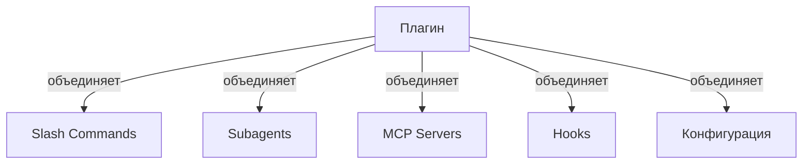
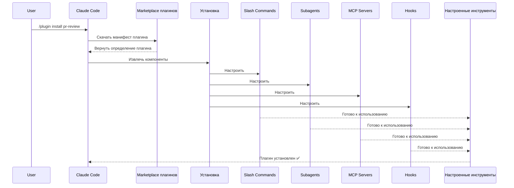
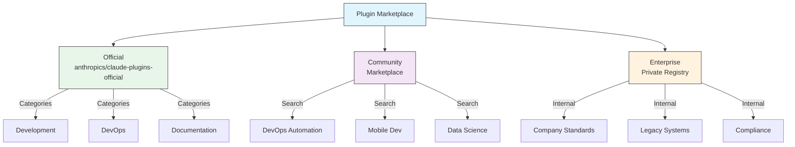
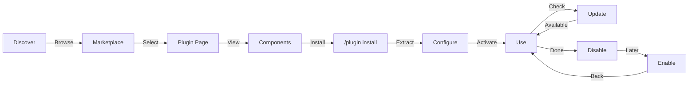
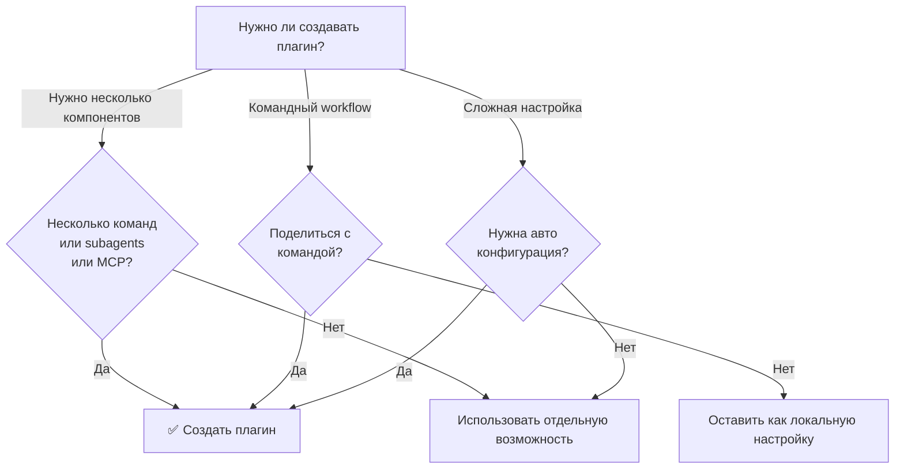

<picture>
  <source media="(prefers-color-scheme: dark)" srcset="../resources/logos/claude-howto-logo-dark.svg">
  
</picture>

# Плагины Claude Code

Эта папка содержит полные примеры плагинов, которые объединяют несколько возможностей Claude Code в цельные устанавливаемые пакеты.

<a id="overview"></a>
## Обзор

Плагины Claude Code — это наборы настроек (slash commands, subagents, MCP servers и hooks), которые устанавливаются одной командой. Это самый высокий уровень механизма расширения, объединяющий несколько возможностей в цельные, удобные для распространения пакеты.

## Архитектура плагина



## Процесс загрузки плагина



## Типы и распространение плагинов

| Тип | Область | Общий доступ | Авторитет | Примеры |
|------|-------|--------|-----------|----------|
| Official | Глобально | Все пользователи | Anthropic | PR Review, Security Guidance |
| Community | Публично | Все пользователи | Сообщество | DevOps, Data Science |
| Organization | Внутренне | Члены команды | Компания | Внутренние стандарты, инструменты |
| Personal | Индивидуально | Один пользователь | Разработчик | Личные workflows |

## Структура определения плагина

Манифест плагина использует JSON-формат в `.claude-plugin/plugin.json`:

```json
{
  "name": "my-first-plugin",
  "description": "Плагин-приветствие",
  "version": "1.0.0",
  "author": {
    "name": "Ваше имя"
  },
  "homepage": "https://example.com",
  "repository": "https://github.com/user/repo",
  "license": "MIT"
}
```

## Пример структуры плагина

```
my-plugin/
├── .claude-plugin/
│   └── plugin.json       # Манифест (name, description, version, author)
├── commands/             # Команды в виде Markdown-файлов
│   ├── task-1.md
│   ├── task-2.md
│   └── workflows/
├── agents/               # Пользовательские определения агентов
│   ├── specialist-1.md
│   ├── specialist-2.md
│   └── configs/
├── skills/               # Skills агента с файлами SKILL.md
│   ├── skill-1.md
│   └── skill-2.md
├── hooks/                # Обработчики событий в hooks.json
│   └── hooks.json
├── .mcp.json             # Конфигурации серверов MCP
├── .lsp.json             # Конфигурации серверов LSP
├── settings.json         # Настройки по умолчанию
├── templates/
│   └── issue-template.md
├── scripts/
│   ├── helper-1.sh
│   └── helper-2.py
├── docs/
│   ├── README.md
│   └── USAGE.md
└── tests/
    └── plugin.test.js
```

### Конфигурация LSP-сервера

Плагины могут включать поддержку Language Server Protocol (LSP) для интеллектуальных подсказок кода в реальном времени. LSP-серверы предоставляют diagnostics, навигацию по коду и информацию о символах во время работы.

**Расположение конфигурации**:
- Файл `.lsp.json` в корне плагина
- Встроенный ключ `lsp` в `plugin.json`

#### Описание полей

| Поле | Обязательно | Описание |
|-------|----------|-------------|
| `command` | Да | Бинарник LSP-сервера (должен быть в PATH) |
| `extensionToLanguage` | Да | Сопоставляет расширения файлов с language IDs |
| `args` | Нет | Аргументы командной строки для сервера |
| `transport` | Нет | Способ связи: `stdio` (по умолчанию) или `socket` |
| `env` | Нет | Переменные окружения для процесса сервера |
| `initializationOptions` | Нет | Параметры, отправляемые при инициализации LSP |
| `settings` | Нет | Конфигурация workspace, передаваемая серверу |
| `workspaceFolder` | Нет | Переопределение пути к папке workspace |
| `startupTimeout` | Нет | Максимальное время (мс) ожидания запуска сервера |
| `shutdownTimeout` | Нет | Максимальное время (мс) для корректного завершения |
| `restartOnCrash` | Нет | Автоматически перезапускать сервер при падении |
| `maxRestarts` | Нет | Максимальное число попыток перезапуска |

#### Примеры конфигурации

**Go (gopls)**:

```json
{
  "go": {
    "command": "gopls",
    "args": ["serve"],
    "extensionToLanguage": {
      ".go": "go"
    }
  }
}
```

**Python (pyright)**:

```json
{
  "python": {
    "command": "pyright-langserver",
    "args": ["--stdio"],
    "extensionToLanguage": {
      ".py": "python",
      ".pyi": "python"
    }
  }
}
```

**TypeScript**:

```json
{
  "typescript": {
    "command": "typescript-language-server",
    "args": ["--stdio"],
    "extensionToLanguage": {
      ".ts": "typescript",
      ".tsx": "typescriptreact",
      ".js": "javascript",
      ".jsx": "javascriptreact"
    }
  }
}
```

#### Доступные LSP-плагины

Официальный marketplace включает заранее настроенные LSP-плагины:

| Плагин | Язык | Бинарник сервера | Команда установки |
|--------|----------|---------------|----------------|
| `pyright-lsp` | Python | `pyright-langserver` | `pip install pyright` |
| `typescript-lsp` | TypeScript/JavaScript | `typescript-language-server` | `npm install -g typescript-language-server typescript` |
| `rust-lsp` | Rust | `rust-analyzer` | Установить через `rustup component add rust-analyzer` |

#### Возможности LSP

После настройки LSP-серверы предоставляют:

- **Мгновенные diagnostics** — ошибки и предупреждения появляются сразу после правок
- **Навигация по коду** — переход к определению, поиск ссылок и реализаций
- **Информация при наведении** — сигнатуры типов и документация при наведении
- **Список символов** — просмотр символов в текущем файле или рабочем пространстве

## Параметры плагина (v2.1.83+)

Плагины могут объявлять пользовательские параметры в манифесте через `userConfig`. Значения с `sensitive: true` хранятся в системном keychain, а не в текстовых файлах настроек:

```json
{
  "name": "my-plugin",
  "version": "1.0.0",
  "userConfig": {
    "apiKey": {
      "description": "API-ключ для сервиса",
      "sensitive": true
    },
    "region": {
      "description": "Регион развёртывания",
      "default": "us-east-1"
    }
  }
}
```

## Постоянные данные плагина (`${CLAUDE_PLUGIN_DATA}`) (v2.1.78+)

Плагины имеют доступ к постоянному каталогу состояния через переменную окружения `${CLAUDE_PLUGIN_DATA}`. Этот каталог уникален для каждого плагина и сохраняется между сессиями, поэтому подходит для кешей, баз данных и другого постоянного состояния:

```json
{
  "hooks": {
    "PostToolUse": [
      {
        "command": "node ${CLAUDE_PLUGIN_DATA}/track-usage.js"
      }
    ]
  }
}
```

Каталог создаётся автоматически при установке плагина. Файлы, сохранённые здесь, остаются до удаления плагина.

## Inline-плагин через settings (`source: 'settings'`) (v2.1.80+)

Плагины можно определять прямо в файлах настроек как записи marketplace с помощью поля `source: 'settings'`. Это позволяет встроить определение плагина напрямую, без отдельного repository или marketplace:

```json
{
  "pluginMarketplaces": [
    {
      "name": "inline-tools",
      "source": "settings",
      "plugins": [
        {
          "name": "quick-lint",
          "source": "./local-plugins/quick-lint"
        }
      ]
    }
  ]
}
```

## Настройки плагина

Плагины могут поставляться с файлом `settings.json`, чтобы задавать конфигурацию по умолчанию. Сейчас это поддерживает ключ `agent`, который задаёт основной агент потока для плагина:

```json
{
  "agent": "agents/specialist-1.md"
}
```

Когда плагин включает `settings.json`, его значения по умолчанию применяются при установке. Пользователи могут переопределить эти настройки в своей проектной или пользовательской конфигурации.

## Подход standalone против плагина

| Подход | Имена команд | Конфигурация | Лучше всего подходит для |
|----------|---------------|---|---|
| **Standalone** | `/hello` | Ручная настройка в CLAUDE.md | Личных, проектных сценариев |
| **Plugins** | `/plugin-name:hello` | Автоматически через plugin.json | Совместного использования, распространения, командного использования |

Используйте **standalone slash commands** для быстрых личных workflow. Используйте **плагины**, когда нужно объединить несколько возможностей, поделиться ими с командой или опубликовать их для распространения.

## Практические примеры

### Пример 1: плагин для PR Review

**Файл:** `.claude-plugin/plugin.json`

```json
{
  "name": "pr-review",
  "version": "1.0.0",
  "description": "Полный workflow ревью pull request с проверками безопасности, тестов и документации",
  "author": {
    "name": "Anthropic"
  },
  "repository": "https://github.com/anthropic/pr-review",
  "license": "MIT"
}
```

**Файл:** `commands/review-pr.md`

```markdown
---
name: Review PR
description: Начать комплексный PR review с проверками безопасности и тестов
---

# PR Review

Эта команда запускает полный review pull request, включая:

1. Анализ безопасности
2. Проверку покрытия тестами
3. Обновление документации
4. Проверку качества кода
5. Оценку влияния на производительность
```

**Файл:** `agents/security-reviewer.md`

```yaml
---
name: security-reviewer
description: Ревью кода с фокусом на безопасности
tools: read, grep, diff
---

# Security Reviewer

Специализируется на поиске уязвимостей безопасности:
- Проблемы аутентификации и авторизации
- Утечки данных
- Инъекционные атаки
- Безопасная конфигурация
```

**Установка:**

```bash
/plugin install pr-review

# Результат:
# ✅ 3 slash commands installed
# ✅ 3 subagents configured
# ✅ 2 MCP servers connected
# ✅ 4 hooks registered
# ✅ Ready to use!
```

### Пример 2: DevOps-плагин

**Компоненты:**

```
devops-automation/
├── commands/
│   ├── deploy.md
│   ├── rollback.md
│   ├── status.md
│   └── incident.md
├── agents/
│   ├── deployment-specialist.md
│   ├── incident-commander.md
│   └── alert-analyzer.md
├── mcp/
│   ├── github-config.json
│   ├── kubernetes-config.json
│   └── prometheus-config.json
├── hooks/
│   ├── pre-deploy.js
│   ├── post-deploy.js
│   └── on-error.js
└── scripts/
    ├── deploy.sh
    ├── rollback.sh
    └── health-check.sh
```

### Пример 3: плагин для документации

**Встроенные компоненты:**

```
documentation/
├── commands/
│   ├── generate-api-docs.md
│   ├── generate-readme.md
│   ├── sync-docs.md
│   └── validate-docs.md
├── agents/
│   ├── api-documenter.md
│   ├── code-commentator.md
│   └── example-generator.md
├── mcp/
│   ├── github-docs-config.json
│   └── slack-announce-config.json
└── templates/
    ├── api-endpoint.md
    ├── function-docs.md
    └── adr-template.md
```

## Plugin Marketplace

Официальный каталог plugin под управлением Anthropic - это `anthropics/claude-plugins-official`. Enterprise admins также могут создавать private plugin marketplaces для внутреннего распространения.



### Конфигурация marketplace

Enterprise и advanced users могут управлять поведением marketplace через settings:

| Setting | Description |
|---------|-------------|
| `extraKnownMarketplaces` | Add additional marketplace sources beyond the defaults |
| `strictKnownMarketplaces` | Control which marketplaces users are allowed to add |
| `deniedPlugins` | Admin-managed blocklist to prevent specific plugins from being installed |

### Дополнительные возможности marketplace

- **Default git timeout**: Increased from 30s to 120s for large plugin repositories
- **Custom npm registries**: Plugins can specify custom npm registry URLs for dependency resolution
- **Version pinning**: Lock plugins to specific versions for reproducible environments

### Схема определения marketplace

Plugin marketplaces определяются в `.claude-plugin/marketplace.json`:

```json
{
  "name": "my-team-plugins",
  "owner": "my-org",
  "plugins": [
    {
      "name": "code-standards",
      "source": "./plugins/code-standards",
      "description": "Enforce team coding standards",
      "version": "1.2.0",
      "author": "platform-team"
    },
    {
      "name": "deploy-helper",
      "source": {
        "source": "github",
        "repo": "my-org/deploy-helper",
        "ref": "v2.0.0"
      },
      "description": "Deployment automation workflows"
    }
  ]
}
```

| Field | Required | Description |
|-------|----------|-------------|
| `name` | Yes | Marketplace name in kebab-case |
| `owner` | Yes | Organization or user who maintains the marketplace |
| `plugins` | Yes | Array of plugin entries |
| `plugins[].name` | Yes | Plugin name (kebab-case) |
| `plugins[].source` | Yes | Plugin source (path string or source object) |
| `plugins[].description` | No | Brief plugin description |
| `plugins[].version` | No | Semantic version string |
| `plugins[].author` | No | Plugin author name |

### Типы источников plugin

Plugins могут поступать из нескольких источников:

| Source | Syntax | Example |
|--------|--------|---------|
| **Relative path** | String path | `"./plugins/my-plugin"` |
| **GitHub** | `{ "source": "github", "repo": "owner/repo" }` | `{ "source": "github", "repo": "acme/lint-plugin", "ref": "v1.0" }` |
| **Git URL** | `{ "source": "url", "url": "..." }` | `{ "source": "url", "url": "https://git.internal/plugin.git" }` |
| **Git subdirectory** | `{ "source": "git-subdir", "url": "...", "path": "..." }` | `{ "source": "git-subdir", "url": "https://github.com/org/monorepo.git", "path": "packages/plugin" }` |
| **npm** | `{ "source": "npm", "package": "..." }` | `{ "source": "npm", "package": "@acme/claude-plugin", "version": "^2.0" }` |
| **pip** | `{ "source": "pip", "package": "..." }` | `{ "source": "pip", "package": "claude-data-plugin", "version": ">=1.0" }` |

Источники GitHub и git поддерживают необязательные поля `ref` (branch/tag) и `sha` (commit hash) для фиксации версии.

### Способы распространения

**GitHub (рекомендуется)**:
```bash
# Users add your marketplace
/plugin marketplace add owner/repo-name
```

**Другие git-сервисы** (нужен полный URL):
```bash
/plugin marketplace add https://gitlab.com/org/marketplace-repo.git
```

**Private repositories**: поддерживаются через git credential helpers или токены окружения. У пользователей должен быть доступ на чтение к repository.

**Отправка в official marketplace**: отправляйте plugins в curated marketplace от Anthropic для более широкого распространения.

### Строгий режим

Определяет, как marketplace definitions взаимодействуют с локальными файлами `plugin.json`:

| Setting | Behavior |
|---------|----------|
| `strict: true` (default) | Local `plugin.json` is authoritative; marketplace entry supplements it |
| `strict: false` | Marketplace entry is the entire plugin definition |

**Ограничения организации** с `strictKnownMarketplaces`:

| Value | Effect |
|-------|--------|
| Not set | No restrictions — users can add any marketplace |
| Empty array `[]` | Lockdown — no marketplaces allowed |
| Array of patterns | Allowlist — only matching marketplaces can be added |

```json
{
  "strictKnownMarketplaces": [
    "my-org/*",
    "github.com/trusted-vendor/*"
  ]
}
```

> **Предупреждение**: в strict mode с `strictKnownMarketplaces` пользователи могут устанавливать plugins только из allowlist-ленных marketplaces. Это полезно для enterprise-сред, где нужен контролируемый вывод plugins.

## Установка и жизненный цикл plugin



## Сравнение возможностей plugin

| Feature | Slash Command | Skill | Subagent | Plugin |
|---------|---------------|-------|----------|--------|
| **Installation** | Ручное копирование | Ручное копирование | Ручная настройка | Одна команда |
| **Setup Time** | 5 минут | 10 минут | 15 минут | 2 минуты |
| **Bundling** | Один файл | Один файл | Один файл | Несколько |
| **Versioning** | Вручную | Вручную | Вручную | Автоматически |
| **Team Sharing** | Копирование файла | Копирование файла | Копирование файла | Install ID |
| **Updates** | Вручную | Вручную | Вручную | Доступны автоматически |
| **Dependencies** | Нет | Нет | Нет | Может включать |
| **Marketplace** | Нет | Нет | Нет | Да |
| **Distribution** | Repository | Repository | Repository | Marketplace |

## CLI-команды plugin

Все операции с plugin доступны как CLI-команды:

```bash
claude plugin install <name>@<marketplace>   # Install from a marketplace
claude plugin uninstall <name>               # Remove a plugin
claude plugin list                           # List installed plugins
claude plugin enable <name>                  # Enable a disabled plugin
claude plugin disable <name>                 # Disable a plugin
claude plugin validate                       # Validate plugin structure
```

## Способы установки

### Из marketplace
```bash
/plugin install plugin-name
# or from CLI:
claude plugin install plugin-name@marketplace-name
```

### Включить / отключить (с автоматически определяемой областью)
```bash
/plugin enable plugin-name
/plugin disable plugin-name
```

### Локальный plugin (для разработки)
```bash
# CLI flag for local testing (repeatable for multiple plugins)
claude --plugin-dir ./path/to/plugin
claude --plugin-dir ./plugin-a --plugin-dir ./plugin-b
```

### Из Git repository
```bash
/plugin install github:username/repo
```

## Когда создавать plugin



### Сценарии использования plugin

| Сценарий использования | Рекомендация | Почему |
|----------|-----------------|-----|
| **Team Onboarding** | ✅ Use Plugin | Мгновенная настройка, все конфигурации |
| **Framework Setup** | ✅ Use Plugin | Bundles framework-specific commands |
| **Enterprise Standards** | ✅ Use Plugin | Central distribution, version control |
| **Quick Task Automation** | ❌ Use Command | Слишком громоздко |
| **Single Domain Expertise** | ❌ Use Skill | Слишком тяжело, лучше skill |
| **Specialized Analysis** | ❌ Use Subagent | Создайте вручную или используйте skill |
| **Live Data Access** | ❌ Use MCP | Отдельно, не упаковывать |

## Тестирование plugin

Перед публикацией протестируйте plugin локально с помощью CLI-флага `--plugin-dir` (можно повторять для нескольких plugins):

```bash
claude --plugin-dir ./my-plugin
claude --plugin-dir ./my-plugin --plugin-dir ./another-plugin
```

Это запускает Claude Code с загруженным plugin и позволяет:
- Проверить, что все slash commands доступны
- Убедиться, что subagents и agents работают корректно
- Подтвердить корректное подключение MCP servers
- Проверить выполнение hooks
- Проверить конфигурации LSP server
- Найти возможные ошибки конфигурации

## Hot-reload

Plugins поддерживают hot-reload во время разработки. Когда вы изменяете файлы plugin, Claude Code может автоматически обнаруживать изменения. Также можно принудительно перезагрузить их:

```bash
/reload-plugins
```

Это заново считывает все plugin manifests, commands, agents, skills, hooks и MCP/LSP configurations без перезапуска сессии.

## Managed settings для plugin

Administrators могут управлять поведением plugin во всей организации с помощью managed settings:

| Setting | Description |
|---------|-------------|
| `enabledPlugins` | Allowlist plugins, включённых по умолчанию |
| `deniedPlugins` | Blocklist plugins, которые нельзя установить |
| `extraKnownMarketplaces` | Добавить дополнительные источники marketplace помимо стандартных |
| `strictKnownMarketplaces` | Ограничить, какие marketplace пользователи могут добавлять |
| `allowedChannelPlugins` | Управлять тем, какие plugins разрешены в каждом release channel |

Эти настройки можно применять на уровне организации через managed configuration files, и они имеют приоритет над пользовательскими настройками.

## Безопасность plugin

Subagents plugin работают в ограниченном sandbox. Следующие keys frontmatter **не разрешены** в определениях plugin subagent:

- `hooks` -- subagents не могут регистрировать event handlers
- `mcpServers` -- subagents не могут настраивать MCP servers
- `permissionMode` -- subagents не могут переопределять permission model

Это гарантирует, что plugins не смогут повышать привилегии или изменять host environment за пределами заявленной области.

## Публикация plugin

**Шаги публикации:**

1. Create plugin structure with all components
2. Write `.claude-plugin/plugin.json` manifest
3. Create `README.md` with documentation
4. Test locally with `claude --plugin-dir ./my-plugin`
5. Submit to plugin marketplace
6. Get reviewed and approved
7. Published on marketplace
8. Users can install with one command

**Пример submission:**

```markdown
# PR Review Plugin

## Description
Полный workflow ревью pull request с проверками безопасности, тестов и документации.

## What's Included
- 3 slash commands for different review types
- 3 specialized subagents
- GitHub and CodeQL MCP integration
- Automated security scanning hooks

## Installation
```bash
/plugin install pr-review
```

## Features
✅ Security analysis
✅ Test coverage checking
✅ Documentation verification
✅ Code quality assessment
✅ Performance impact analysis

## Usage
```bash
/review-pr
/check-security
/check-tests
```

## Requirements
- Claude Code 1.0+
- GitHub access
- CodeQL (optional)
```

## Plugin vs ручная конфигурация

**Ручная настройка (2+ часа):**
- Install slash commands one by one
- Create subagents individually
- Configure MCPs separately
- Set up hooks manually
- Document everything
- Share with team (hope they configure correctly)

**С plugin (2 минуты):**
```bash
/plugin install pr-review
# ✅ Everything installed and configured
# ✅ Ready to use immediately
# ✅ Team can reproduce exact setup
```

## Лучшие практики

### Что делать ✅
- Используйте понятные, описательные names plugin
- Добавляйте исчерпывающий README
- Правильно version-ируйте plugin (semver)
- Тестируйте все components вместе
- Чётко документируйте requirements
- Приводите примеры использования
- Добавляйте обработку ошибок
- Правильно тегируйте для discovery
- Сохраняйте backward compatibility
- Держите plugins сфокусированными и цельными
- Добавляйте полные tests
- Документируйте все dependencies

### Чего не делать ❌
- Не объединяйте несвязанные возможности
- Не хардкодьте credentials
- Не пропускайте testing
- Не забывайте документацию
- Не создавайте дублирующие plugins
- Не игнорируйте versioning
- Не усложняйте dependencies компонентов
- Не забывайте корректно обрабатывать ошибки

## Installation Instructions

### Installing from Marketplace

1. **Browse available plugins:**
   ```bash
   /plugin list
   ```

2. **View plugin details:**
   ```bash
   /plugin info plugin-name
   ```

3. **Install a plugin:**
   ```bash
   /plugin install plugin-name
   ```

### Installing from Local Path

```bash
/plugin install ./path/to/plugin-directory
```

### Installing from GitHub

```bash
/plugin install github:username/repo
```

### Listing Installed Plugins

```bash
/plugin list --installed
```

### Updating a Plugin

```bash
/plugin update plugin-name
```

### Disabling/Enabling a Plugin

```bash
# Temporarily disable
/plugin disable plugin-name

# Re-enable
/plugin enable plugin-name
```

### Uninstalling a Plugin

```bash
/plugin uninstall plugin-name
```

## Связанные возможности

С plugins хорошо работают следующие возможности Claude Code:

- **[Slash Commands](../01-slash-commands/)** - отдельные команды, упакованные в plugins
- **[Memory](../02-memory/)** - постоянный контекст для plugins
- **[Skills](../03-skills/)** - предметная экспертиза, которую можно упаковать в plugins
- **[Subagents](../04-subagents/)** - специализированные agents, включённые как компоненты plugin
- **[MCP Servers](../05-mcp/)** - интеграции Model Context Protocol, упакованные в plugins
- **[Hooks](../06-hooks/)** - обработчики событий, запускающие workflows plugin

## Complete Example Workflow

### PR Review Plugin Full Workflow

```
1. User: /review-pr

2. Plugin executes:
   ├── pre-review.js hook validates git repo
   ├── GitHub MCP fetches PR data
   ├── security-reviewer subagent analyzes security
   ├── test-checker subagent verifies coverage
   └── performance-analyzer subagent checks performance

3. Results synthesized and presented:
   ✅ Security: No critical issues
   ⚠️  Testing: Coverage 65% (recommend 80%+)
   ✅ Performance: No significant impact
   📝 12 recommendations provided
```

## Troubleshooting

### Plugin Won't Install
- Check Claude Code version compatibility: `/version`
- Verify `plugin.json` syntax with a JSON validator
- Check internet connection (for remote plugins)
- Review permissions: `ls -la plugin/`

### Components Not Loading
- Verify paths in `plugin.json` match actual directory structure
- Check file permissions: `chmod +x scripts/`
- Review component file syntax
- Check logs: `/plugin debug plugin-name`

### MCP Connection Failed
- Verify environment variables are set correctly
- Check MCP server installation and health
- Test MCP connection independently with `/mcp test`
- Review MCP configuration in `mcp/` directory

### Commands Not Available After Install
- Ensure plugin was installed successfully: `/plugin list --installed`
- Check if plugin is enabled: `/plugin status plugin-name`
- Restart Claude Code: `exit` and reopen
- Check for naming conflicts with existing commands

### Hook Execution Issues
- Verify hook files have correct permissions
- Check hook syntax and event names
- Review hook logs for error details
- Test hooks manually if possible

## Additional Resources

- [Official Plugins Documentation](https://code.claude.com/docs/en/plugins)
- [Discover Plugins](https://code.claude.com/docs/en/discover-plugins)
- [Plugin Marketplaces](https://code.claude.com/docs/en/plugin-marketplaces)
- [Plugins Reference](https://code.claude.com/docs/en/plugins-reference)
- [MCP Server Reference](https://modelcontextprotocol.io/)
- [Subagent Configuration Guide](../04-subagents/README.md)
- [Hook System Reference](../06-hooks/README.md)
