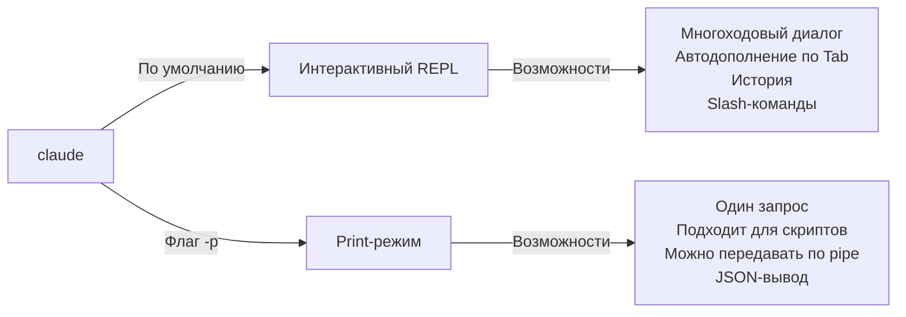

<picture>
  <source media="(prefers-color-scheme: dark)" srcset="../resources/logos/claude-howto-logo-dark.svg">
  
</picture>

# Справочник CLI

## Обзор

Claude Code CLI (интерфейс командной строки) — это основной способ взаимодействия с Claude Code. Он даёт мощные возможности для запуска запросов, управления сессиями, настройки моделей и интеграции Claude в рабочие процессы разработки.

## Архитектура

```mermaid
graph TD
    A["Терминал пользователя"] -->|claude [options] [query]| B["Claude Code CLI"]
    B -->|Интерактивный режим| C["REPL-режим"]
    B -->|--print| D["Print-режим (SDK)"]
    B -->|--resume| E["Возобновление сессии"]
    C -->|Диалог| F["Claude API"]
    D -->|Один запрос| F
    E -->|Загрузить контекст| F
    F -->|Ответ| G["Вывод"]
    G -->|text/json/stream-json| H["Терминал/pipe"]
```

## Команды CLI

| Команда | Описание | Пример |
|---------|-------------|---------|
| `claude` | Запустить интерактивный REPL | `claude` |
| `claude "query"` | Запустить REPL с начальным промптом | `claude "explain this project"` |
| `claude -p "query"` | Print-режим: выполнить запрос и выйти | `claude -p "explain this function"` |
| `cat file \| claude -p "query"` | Обработать данные из конвейера | `cat logs.txt \| claude -p "explain"` |
| `claude -c` | Продолжить последнюю беседу | `claude -c` |
| `claude -c -p "query"` | Продолжить в print-режиме | `claude -c -p "check for type errors"` |
| `claude -r "<session>" "query"` | Возобновить сессию по ID или имени | `claude -r "auth-refactor" "finish this PR"` |
| `claude update` | Обновить до последней версии | `claude update` |
| `claude mcp` | Настроить MCP-серверы | См. [документацию по MCP](../05-mcp/) |
| `claude mcp serve` | Запустить Claude Code как MCP-сервер | `claude mcp serve` |
| `claude agents` | Показать все настроенные subagents | `claude agents` |
| `claude auto-mode defaults` | Вывести правила режима auto в JSON | `claude auto-mode defaults` |
| `claude remote-control` | Запустить сервер Remote Control | `claude remote-control` |
| `claude plugin` | Управлять плагинами (install, enable, disable) | `claude plugin install my-plugin` |
| `claude auth login` | Войти (поддерживает `--email`, `--sso`) | `claude auth login --email user@example.com` |
| `claude auth logout` | Выйти из текущего аккаунта | `claude auth logout` |
| `claude auth status` | Проверить статус авторизации (код выхода 0, если вход выполнен, 1, если нет) | `claude auth status` |

## Основные флаги

| Флаг | Описание | Пример |
|------|-------------|---------|
| `-p, --print` | Вывести ответ без интерактивного режима | `claude -p "query"` |
| `-c, --continue` | Загрузить последнюю беседу | `claude --continue` |
| `-r, --resume` | Возобновить конкретную сессию по ID или имени | `claude --resume auth-refactor` |
| `-v, --version` | Показать номер версии | `claude -v` |
| `-w, --worktree` | Запустить в изолированном git worktree | `claude -w` |
| `-n, --name` | Отображаемое имя сессии | `claude -n "auth-refactor"` |
| `--from-pr <number>` | Возобновить сессии, привязанные к GitHub PR | `claude --from-pr 42` |
| `--remote "task"` | Создать веб-сессию на claude.ai | `claude --remote "implement API"` |
| `--remote-control, --rc` | Интерактивная сессия с Remote Control | `claude --rc` |
| `--teleport` | Возобновить веб-сессию локально | `claude --teleport` |
| `--teammate-mode` | Режим отображения команды агентов | `claude --teammate-mode tmux` |
| `--bare` | Минимальный режим (без hooks, skills, plugins, MCP, auto memory, CLAUDE.md) | `claude --bare` |
| `--enable-auto-mode` | Включить режим автоматических разрешений | `claude --enable-auto-mode` |
| `--channels` | Подписаться на плагины каналов MCP | `claude --channels discord,telegram` |
| `--chrome` / `--no-chrome` | Включить/выключить интеграцию с браузером Chrome | `claude --chrome` |
| `--effort` | Установить уровень effort | `claude --effort high` |
| `--init` / `--init-only` | Запустить hooks инициализации | `claude --init` |
| `--maintenance` | Запустить hooks обслуживания и выйти | `claude --maintenance` |
| `--disable-slash-commands` | Отключить все skills и slash-команды | `claude --disable-slash-commands` |
| `--no-session-persistence` | Отключить сохранение сессии (print-режим) | `claude -p --no-session-persistence "query"` |

### Интерактивный и Print-режим



**Интерактивный режим** (по умолчанию):
```bash
# Запустить интерактивную сессию
claude

# Запустить с начальным запросом
claude "объясни поток аутентификации"
```

**Print-режим** (неинтерактивный):
```bash
# Один запрос, затем выход
claude -p "что делает эта функция?"

# Обработать содержимое файла
cat error.log | claude -p "объясни эту ошибку"

# Связать с другими инструментами
claude -p "выведи список todo" | grep "URGENT"
```

## Модель и конфигурация

| Флаг | Описание | Пример |
|------|-------------|---------|
| `--model` | Установить модель (sonnet, opus, haiku или полное имя) | `claude --model opus` |
| `--fallback-model` | Автоматический fallback модели при перегрузке | `claude -p --fallback-model sonnet "query"` |
| `--agent` | Указать агента для сессии | `claude --agent my-custom-agent` |
| `--agents` | Определить пользовательских subagents через JSON | См. [Конфигурация агентов](#agents-configuration) |
| `--effort` | Установить уровень effort (low, medium, high, max) | `claude --effort high` |

### Примеры выбора модели

```bash
# Использовать Opus 4.6 для сложных задач
claude --model opus "спроектируй стратегию кэширования"

# Использовать Haiku 4.5 для быстрых задач
claude --model haiku -p "отформатируй этот JSON"

# Полное имя модели
claude --model claude-sonnet-4-6-20250929 "проверь этот код"

# С резервной моделью для надёжности
claude -p --model opus --fallback-model sonnet "проанализируй архитектуру"

# Использовать opusplan (Opus планирует, Sonnet выполняет)
claude --model opusplan "спроектируй и реализуй слой кэширования"
```

## Настройка системного промпта

| Флаг | Описание | Пример |
|------|-------------|---------|
| `--system-prompt` | Заменить весь промпт по умолчанию | `claude --system-prompt "You are a Python expert"` |
| `--system-prompt-file` | Загрузить промпт из файла (print-режим) | `claude -p --system-prompt-file ./prompt.txt "query"` |
| `--append-system-prompt` | Добавить к промпту по умолчанию | `claude --append-system-prompt "Always use TypeScript"` |

### Примеры системного промпта

```bash
# Полностью кастомная роль
claude --system-prompt "Вы старший инженер по безопасности. Сосредоточьтесь на уязвимостях."

# Добавить конкретные инструкции
claude --append-system-prompt "Всегда добавляй unit-тесты вместе с примерами кода"

# Загрузить сложный промпт из файла
claude -p --system-prompt-file ./prompts/code-reviewer.txt "проверь main.py"
```

### Сравнение флагов системного промпта

| Флаг | Поведение | Интерактивный | Print |
|------|----------|-------------|-------|
| `--system-prompt` | Полностью заменяет системный промпт по умолчанию | ✅ | ✅ |
| `--system-prompt-file` | Заменяет системный промпт содержимым файла | ❌ | ✅ |
| `--append-system-prompt` | Добавляет к системному промпту по умолчанию | ✅ | ✅ |

**Используйте `--system-prompt-file` только в print-режиме. Для интерактивного режима используйте `--system-prompt` или `--append-system-prompt`.**

## Управление инструментами и разрешениями

| Флаг | Описание | Пример |
|------|-------------|---------|
| `--tools` | Ограничить доступные встроенные инструменты | `claude -p --tools "Bash,Edit,Read" "query"` |
| `--allowedTools` | Инструменты, которые выполняются без запроса | `"Bash(git log:*)" "Read"` |
| `--disallowedTools` | Инструменты, исключённые из контекста | `"Bash(rm:*)" "Edit"` |
| `--dangerously-skip-permissions` | Пропустить все запросы на разрешение | `claude --dangerously-skip-permissions` |
| `--permission-mode` | Начать в указанном режиме разрешений | `claude --permission-mode auto` |
| `--permission-prompt-tool` | MCP-инструмент для обработки разрешений | `claude -p --permission-prompt-tool mcp_auth "query"` |
| `--enable-auto-mode` | Включить режим автоматических разрешений | `claude --enable-auto-mode` |

### Примеры разрешений

```bash
# Режим только чтения для code review
claude --permission-mode plan "проверь этот кодовый базис"

# Ограничить только безопасными инструментами
claude --tools "Read,Grep,Glob" -p "найди все комментарии TODO"

# Разрешить конкретные git-команды без запросов
claude --allowedTools "Bash(git status:*)" "Bash(git log:*)"

# Заблокировать опасные операции
claude --disallowedTools "Bash(rm -rf:*)" "Bash(git push --force:*)"
```

## Вывод и формат

| Флаг | Описание | Параметры | Пример |
|------|-------------|---------|---------|
| `--output-format` | Указать формат вывода (print-режим) | `text`, `json`, `stream-json` | `claude -p --output-format json "query"` |
| `--input-format` | Указать формат ввода (print-режим) | `text`, `stream-json` | `claude -p --input-format stream-json` |
| `--verbose` | Включить подробное логирование | | `claude --verbose` |
| `--include-partial-messages` | Включить потоковые события | Требуется `stream-json` | `claude -p --output-format stream-json --include-partial-messages "query"` |
| `--json-schema` | Получить валидированный JSON по схеме | | `claude -p --json-schema '{"type":"object"}' "query"` |
| `--max-budget-usd` | Максимальная стоимость для print-режима | | `claude -p --max-budget-usd 5.00 "query"` |

### Примеры формата вывода

```bash
# Обычный текст (по умолчанию)
claude -p "объясни этот код"

# JSON для программного использования
claude -p --output-format json "выведи все функции из main.py"

# Потоковый JSON для обработки в реальном времени
claude -p --output-format stream-json "сгенерируй длинный отчёт"

# Структурированный вывод с проверкой по схеме
claude -p --json-schema '{"type":"object","properties":{"bugs":{"type":"array"}}}' \
  "найди баги в этом коде и верни результат в JSON"
```

## Рабочее пространство и каталоги

| Флаг | Описание | Пример |
|------|-------------|---------|
| `--add-dir` | Добавить дополнительные рабочие каталоги | `claude --add-dir ../apps ../lib` |
| `--setting-sources` | Источники настроек через запятую | `claude --setting-sources user,project` |
| `--settings` | Загружать настройки из файла или JSON | `claude --settings ./settings.json` |
| `--plugin-dir` | Загружать плагины из каталога (можно повторять) | `claude --plugin-dir ./my-plugin` |

### Пример с несколькими каталогами

```bash
# Работать сразу с несколькими каталогами проекта
claude --add-dir ../frontend ../backend ../shared "найди все API endpoint"

# Загрузить пользовательские настройки
claude --settings '{"model":"opus","verbose":true}' "сложная задача"
```

## Конфигурация MCP

| Флаг | Описание | Пример |
|------|-------------|---------|
| `--mcp-config` | Загрузить MCP-серверы из JSON | `claude --mcp-config ./mcp.json` |
| `--strict-mcp-config` | Использовать только указанный MCP config | `claude --strict-mcp-config --mcp-config ./mcp.json` |
| `--channels` | Подписаться на MCP channel plugins | `claude --channels discord,telegram` |

### Примеры MCP

```bash
# Загрузить MCP-сервер GitHub
claude --mcp-config ./github-mcp.json "list open PRs"

# Строгий режим - только указанные серверы
claude --strict-mcp-config --mcp-config ./production-mcp.json "deploy to staging"
```

## Управление сессиями

| Флаг | Описание | Пример |
|------|-------------|---------|
| `--session-id` | Использовать конкретный session ID (UUID) | `claude --session-id "550e8400-..."` |
| `--fork-session` | Создавать новую сессию при возобновлении | `claude --resume abc123 --fork-session` |

### Примеры сессий

```bash
# Продолжить последний разговор
claude -c

# Возобновить именованную сессию
claude -r "feature-auth" "continue implementing login"

# Разветвить сессию для экспериментов
claude --resume feature-auth --fork-session "try alternative approach"

# Использовать конкретный session ID
claude --session-id "550e8400-e29b-41d4-a716-446655440000" "continue"
```

### Разветвление сессии

Создайте ответвление от существующей сессии для экспериментов:

```bash
# Разветвить сессию, чтобы попробовать другой подход
claude --resume abc123 --fork-session "try alternative implementation"

# Разветвить с пользовательским сообщением
claude -r "feature-auth" --fork-session "test with different architecture"
```

**Сценарии использования:**
- Пробовать альтернативные реализации без потери оригинальной сессии
- Экспериментировать с разными подходами параллельно
- Создавать ветки от успешной работы для вариаций
- Тестировать breaking changes без влияния на основную сессию

Оригинальная сессия остаётся неизменной, а ответвление становится новой независимой сессией.

## Дополнительные возможности

| Флаг | Описание | Пример |
|------|-------------|---------|
| `--chrome` | Включить интеграцию с браузером Chrome | `claude --chrome` |
| `--no-chrome` | Выключить интеграцию с браузером Chrome | `claude --no-chrome` |
| `--ide` | Автоматически подключаться к IDE, если доступно | `claude --ide` |
| `--max-turns` | Ограничить agentic turns (non-interactive) | `claude -p --max-turns 3 "query"` |
| `--debug` | Включить режим отладки с фильтрацией | `claude --debug "api,mcp"` |
| `--enable-lsp-logging` | Включить verbose LSP logging | `claude --enable-lsp-logging` |
| `--betas` | Бета-заголовки для API-запросов | `claude --betas interleaved-thinking` |
| `--plugin-dir` | Загружать плагины из каталога (можно повторять) | `claude --plugin-dir ./my-plugin` |
| `--enable-auto-mode` | Включить режим автоматических разрешений | `claude --enable-auto-mode` |
| `--effort` | Установить уровень thinking effort | `claude --effort high` |
| `--bare` | Минимальный режим (пропуск hooks, skills, plugins, MCP, auto memory, CLAUDE.md) | `claude --bare` |
| `--channels` | Подписаться на MCP channel plugins | `claude --channels discord` |
| `--fork-session` | Создавать новый session ID при возобновлении | `claude --resume abc --fork-session` |
| `--max-budget-usd` | Максимальные траты (print-режим) | `claude -p --max-budget-usd 5.00 "query"` |
| `--json-schema` | Валидированный JSON-вывод | `claude -p --json-schema '{"type":"object"}' "q"` |

### Примеры дополнительных возможностей

```bash
# Ограничить автономные действия
claude -p --max-turns 5 "refactor this module"

# Отладить API-вызовы
claude --debug "api" "test query"

# Включить интеграцию с IDE
claude --ide "help me with this file"
```

<a id="agents-configuration"></a>

## Конфигурация агентов

Флаг `--agents` принимает JSON-объект, который задаёт пользовательские subagents для сессии.

### Формат JSON для агентов

```json
{
  "agent-name": {
    "description": "Required: когда вызывать этого агента",
    "prompt": "Required: системный промпт для агента",
    "tools": ["Optional", "array", "of", "tools"],
    "model": "optional: sonnet|opus|haiku"
  }
}
```

**Обязательные поля:**
- `description` - Описание на естественном языке, когда использовать этого агента
- `prompt` - Системный промпт, который определяет роль и поведение агента

**Необязательные поля:**
- `tools` - Массив доступных инструментов (если опущен, наследуются все)
  - Формат: `["Read", "Grep", "Glob", "Bash"]`
- `model` - Модель для использования: `sonnet`, `opus` или `haiku`

### Полный пример агентов

```json
{
  "code-reviewer": {
    "description": "Опытный reviewer кода. Используйте проактивно после изменений в коде.",
    "prompt": "Вы старший reviewer кода. Сосредоточьтесь на качестве кода, безопасности и лучших практиках.",
    "tools": ["Read", "Grep", "Glob", "Bash"],
    "model": "sonnet"
  },
  "debugger": {
    "description": "Специалист по отладке ошибок и падений тестов.",
    "prompt": "Вы эксперт по отладке. Анализируйте ошибки, определяйте первопричины и предлагайте исправления.",
    "tools": ["Read", "Edit", "Bash", "Grep"],
    "model": "opus"
  },
  "documenter": {
    "description": "Специалист по документации для создания гайдов.",
    "prompt": "Вы технический писатель. Создавайте ясную и подробную документацию.",
    "tools": ["Read", "Write"],
    "model": "haiku"
  }
}
```

### Примеры команд для агентов

```bash
# Задать пользовательских агентов прямо в команде
claude --agents '{
  "security-auditor": {
    "description": "Специалист по безопасности для анализа уязвимостей",
    "prompt": "Вы эксперт по безопасности. Находите уязвимости и предлагайте исправления.",
    "tools": ["Read", "Grep", "Glob"],
    "model": "opus"
  }
}' "audit this codebase for security issues"

# Загрузить агентов из файла
claude --agents "$(cat ~/.claude/agents.json)" "review the auth module"

# Совместить с другими флагами
claude -p --agents "$(cat agents.json)" --model sonnet "analyze performance"
```

### Приоритет агентов

Когда существует несколько определений агентов, они загружаются в таком порядке:
1. **Определённые через CLI** (`--agents`) - только для этой сессии
2. **Пользовательские** (`~/.claude/agents/`) - для всех проектов
3. **На уровне проекта** (`.claude/agents/`) - для текущего проекта

Агенты, определённые через CLI, переопределяют пользовательских и проектных агентов на время сессии.

---

## Сценарии с высокой ценностью

### 1. Интеграция CI/CD

Используйте Claude Code в CI/CD pipeline для автоматического code review, тестирования и документации.

**Пример GitHub Actions:**

```yaml
name: AI code review

on: [pull_request]

jobs:
  review:
    runs-on: ubuntu-latest
    steps:
      - uses: actions/checkout@v4

      - name: Установить Claude Code
        run: npm install -g @anthropic-ai/claude-code

      - name: Запустить code review
        env:
          ANTHROPIC_API_KEY: ${{ secrets.ANTHROPIC_API_KEY }}
        run: |
          claude -p --output-format json \
            --max-turns 1 \
            "Проверь изменения в этом PR на:
            - уязвимости безопасности
            - проблемы производительности
            - качество кода
            Выведи JSON с массивом 'issues'" > review.json

      - name: Опубликовать комментарий review
        uses: actions/github-script@v7
        with:
          script: |
            const fs = require('fs');
            const review = JSON.parse(fs.readFileSync('review.json', 'utf8'));
            // Обработать и опубликовать комментарии ревью
```

**Пайплайн Jenkins:**

```groovy
pipeline {
    agent any
    stages {
        stage('AI Review') {
            steps {
                sh '''
                    claude -p --output-format json \
                      --max-turns 3 \
                      "проанализируй покрытие тестами и предложи недостающие тесты" \
                      > coverage-analysis.json
                '''
            }
        }
    }
}
```

### 2. Pipe-обработка скриптами

Обрабатывайте файлы, логи и данные через Claude для анализа.

**Анализ логов:**

```bash
# Анализировать логи ошибок
tail -1000 /var/log/app/error.log | claude -p "summarize these errors and suggest fixes"

# Найти закономерности в access log
cat access.log | claude -p "identify suspicious access patterns"

# Анализировать историю git
git log --oneline -50 | claude -p "summarize recent development activity"
```

**Обработка кода:**

```bash
# Проверить конкретный файл
cat src/auth.ts | claude -p "review this authentication code for security issues"

# Сгенерировать документацию
cat src/api/*.ts | claude -p "generate API documentation in markdown"

# Найти TODO и расставить приоритеты
grep -r "TODO" src/ | claude -p "prioritize these TODOs by importance"
```

### 3. Многосессионные рабочие процессы

Управляйте сложными проектами с несколькими диалоговыми потоками.

```bash
# Запустить сессию для feature-ветки
claude -r "feature-auth" "let's implement user authentication"

# Позже продолжить сессию
claude -r "feature-auth" "add password reset functionality"

# Разветвить, чтобы попробовать альтернативный подход
claude --resume feature-auth --fork-session "try OAuth instead"

# Переключаться между разными feature-сессиями
claude -r "feature-payments" "continue with Stripe integration"
```

### 4. Пользовательская конфигурация агентов

Создавайте специализированных агентов для рабочего процесса вашей команды.

```bash
# Сохранить конфигурацию агентов в файл
cat > ~/.claude/agents.json << 'EOF'
{
  "reviewer": {
    "description": "Code reviewer for PR reviews",
    "prompt": "Review code for quality, security, and maintainability.",
    "model": "opus"
  },
  "documenter": {
    "description": "Documentation specialist",
    "prompt": "Generate clear, comprehensive documentation.",
    "model": "sonnet"
  },
  "refactorer": {
    "description": "Code refactoring expert",
    "prompt": "Suggest and implement clean code refactoring.",
    "tools": ["Read", "Edit", "Glob"]
  }
}
EOF

# Использовать агентов в сессии
claude --agents "$(cat ~/.claude/agents.json)" "review the auth module"
```

### 5. Пакетная обработка

Обрабатывайте несколько запросов с одинаковыми настройками.

```bash
# Обработать несколько файлов
for file in src/*.ts; do
  echo "Обработка $file..."
  claude -p --model haiku "суммируй этот файл: $(cat $file)" >> summaries.md
done

# Пакетный code review
find src -name "*.py" -exec sh -c '
  echo "## $1" >> review.md
  cat "$1" | claude -p "краткий code review" >> review.md
' _ {} \;

# Сгенерировать тесты для всех модулей
for module in $(ls src/modules/); do
  claude -p "сгенерируй unit-тесты для src/modules/$module" > "tests/$module.test.ts"
done
```

### 6. Разработка с учётом безопасности

Используйте управление разрешениями для безопасной работы.

```bash
# Аудит безопасности только на чтение
claude --permission-mode plan \
  --tools "Read,Grep,Glob" \
  "audit this codebase for security vulnerabilities"

# Заблокировать опасные команды
claude --disallowedTools "Bash(rm:*)" "Bash(curl:*)" "Bash(wget:*)" \
  "help me clean up this project"

# Ограниченная автоматизация
claude -p --max-turns 2 \
  --allowedTools "Read" "Glob" \
  "find all hardcoded credentials"
```

### 7. Интеграция как JSON API

Используйте Claude как программируемый API для своих инструментов с помощью `jq`.

```bash
# Получить структурированный анализ
claude -p --output-format json \
  --json-schema '{"type":"object","properties":{"functions":{"type":"array"},"complexity":{"type":"string"}}}' \
  "analyze main.py and return function list with complexity rating"

# Интегрировать с jq для обработки
claude -p --output-format json "list all API endpoints" | jq '.endpoints[]'

# Использовать в скриптах
RESULT=$(claude -p --output-format json "is this code secure? answer with {secure: boolean, issues: []}" < code.py)
if echo "$RESULT" | jq -e '.secure == false' > /dev/null; then
  echo "Security issues found!"
  echo "$RESULT" | jq '.issues[]'
fi
```

### Примеры разбора jq

Разберите и обработайте JSON-вывод Claude с помощью `jq`:

```bash
# Извлечь конкретные поля
claude -p --output-format json "analyze this code" | jq '.result'

# Отфильтровать элементы массива
claude -p --output-format json "list issues" | jq -r '.issues[] | select(.severity=="high")'

# Извлечь несколько полей
claude -p --output-format json "describe the project" | jq -r '.{name, version, description}'

# Преобразовать в CSV
claude -p --output-format json "list functions" | jq -r '.functions[] | [.name, .lineCount] | @csv'

# Условная обработка
claude -p --output-format json "check security" | jq 'if .vulnerabilities | length > 0 then "UNSAFE" else "SAFE" end'

# Извлечь вложенные значения
claude -p --output-format json "analyze performance" | jq '.metrics.cpu.usage'

# Обработать весь массив
claude -p --output-format json "find todos" | jq '.todos | length'

# Преобразовать вывод
claude -p --output-format json "list improvements" | jq 'map({title: .title, priority: .priority})'
```

---

## Модели

Claude Code поддерживает несколько моделей с разными возможностями:

| Модель | ID | Контекстное окно | Примечания |
|-------|-----|----------------|-------|
| Opus 4.6 | `claude-opus-4-6` | 1M tokens | Самая мощная, поддерживает адаптивные уровни effort |
| Sonnet 4.6 | `claude-sonnet-4-6` | 1M tokens | Баланс скорости и возможностей |
| Haiku 4.5 | `claude-haiku-4-5` | 1M tokens | Самая быстрая, лучше всего подходит для быстрых задач |

### Выбор модели

```bash
# Использовать короткие имена
claude --model opus "complex architectural review"
claude --model sonnet "implement this feature"
claude --model haiku -p "format this JSON"

# Использовать alias opusplan (Opus планирует, Sonnet выполняет)
claude --model opusplan "design and implement the API"

# Переключить быстрый режим во время сессии
/fast
```

### Уровни effort (Opus 4.6)

Opus 4.6 поддерживает адаптивное reasoning через уровни effort:

```bash
# Установить уровень effort через флаг CLI
claude --effort high "complex review"

# Установить уровень effort через slash-команду
/effort high

# Установить уровень effort через переменную окружения
export CLAUDE_CODE_EFFORT_LEVEL=high   # low, medium, high, or max (Opus 4.6 only)
```

Ключевое слово `ultrathink` в prompt'ах включает глубокое reasoning. Уровень `max` доступен только в Opus 4.6.

---

## Ключевые переменные окружения

| Переменная | Описание |
|----------|-------------|
| `ANTHROPIC_API_KEY` | API-ключ для аутентификации |
| `ANTHROPIC_MODEL` | Переопределить модель по умолчанию |
| `ANTHROPIC_CUSTOM_MODEL_OPTION` | Пользовательская опция модели для API |
| `ANTHROPIC_DEFAULT_OPUS_MODEL` | Переопределить ID модели Opus по умолчанию |
| `ANTHROPIC_DEFAULT_SONNET_MODEL` | Переопределить ID модели Sonnet по умолчанию |
| `ANTHROPIC_DEFAULT_HAIKU_MODEL` | Переопределить ID модели Haiku по умолчанию |
| `MAX_THINKING_TOKENS` | Установить бюджет токенов для extended thinking |
| `CLAUDE_CODE_EFFORT_LEVEL` | Установить уровень effort (`low`/`medium`/`high`/`max`) |
| `CLAUDE_CODE_SIMPLE` | Минимальный режим, задаётся флагом `--bare` |
| `CLAUDE_CODE_DISABLE_AUTO_MEMORY` | Отключить автоматические обновления CLAUDE.md |
| `CLAUDE_CODE_DISABLE_BACKGROUND_TASKS` | Отключить выполнение фоновых задач |
| `CLAUDE_CODE_DISABLE_CRON` | Отключить запланированные/cron-задачи |
| `CLAUDE_CODE_DISABLE_GIT_INSTRUCTIONS` | Отключить git-инструкции |
| `CLAUDE_CODE_DISABLE_TERMINAL_TITLE` | Отключить обновление заголовка терминала |
| `CLAUDE_CODE_DISABLE_1M_CONTEXT` | Отключить контекстное окно на 1M токенов |
| `CLAUDE_CODE_DISABLE_NONSTREAMING_FALLBACK` | Отключить fallback без стриминга |
| `CLAUDE_CODE_ENABLE_TASKS` | Включить список задач |
| `CLAUDE_CODE_TASK_LIST_ID` | Именованный каталог задач, общий для всех сессий |
| `CLAUDE_CODE_ENABLE_PROMPT_SUGGESTION` | Включить/выключить подсказки запросов (`true`/`false`) |
| `CLAUDE_CODE_EXPERIMENTAL_AGENT_TEAMS` | Включить экспериментальные команды агентов |
| `CLAUDE_CODE_NEW_INIT` | Использовать новый поток инициализации |
| `CLAUDE_CODE_SUBAGENT_MODEL` | Модель для выполнения subagent |
| `CLAUDE_CODE_PLUGIN_SEED_DIR` | Каталог для seed-файлов плагинов |
| `CLAUDE_CODE_SUBPROCESS_ENV_SCRUB` | Переменные окружения для очистки в subprocess |
| `CLAUDE_AUTOCOMPACT_PCT_OVERRIDE` | Переопределить процент auto-compaction |
| `CLAUDE_STREAM_IDLE_TIMEOUT_MS` | Таймаут простоя потока в миллисекундах |
| `SLASH_COMMAND_TOOL_CHAR_BUDGET` | Бюджет символов для инструментов slash-команд |
| `ENABLE_TOOL_SEARCH` | Включить поиск инструментов |
| `MAX_MCP_OUTPUT_TOKENS` | Максимум токенов для вывода MCP-инструмента |

---

## Краткая справка

### Самые частые команды

```bash
# Интерактивная сессия
claude

# Быстрый вопрос
claude -p "how do I..."

# Продолжить разговор
claude -c

# Обработать файл
cat file.py | claude -p "review this"

# JSON-вывод для скриптов
claude -p --output-format json "query"
```

### Комбинации флагов

| Сценарий | Команда |
|----------|---------|
| Быстрый code review | `cat file | claude -p "review"` |
| Структурированный вывод | `claude -p --output-format json "query"` |
| Безопасное исследование | `claude --permission-mode plan` |
| Автономно и безопасно | `claude --enable-auto-mode --permission-mode auto` |
| Интеграция CI/CD | `claude -p --max-turns 3 --output-format json` |
| Возобновить работу | `claude -r "session-name"` |
| Пользовательская модель | `claude --model opus "complex task"` |
| Минимальный режим | `claude --bare "quick query"` |
| Запуск с ограничением бюджета | `claude -p --max-budget-usd 2.00 "analyze code"` |

---

## Устранение неполадок

### Команда не найдена

**Проблема:** `claude: command not found`

**Решения:**
- Установите Claude Code: `npm install -g @anthropic-ai/claude-code`
- Проверьте, что `PATH` включает каталог глобальных bin-файлов npm
- Попробуйте запустить через полный путь: `npx claude`

### Проблемы с API-ключом

**Проблема:** аутентификация не удалась

**Решения:**
- Установите API-ключ: `export ANTHROPIC_API_KEY=your-key`
- Проверьте, что ключ действителен и на нём достаточно credits
- Убедитесь, что права ключа подходят для запрошенной модели

### Сессия не найдена

**Проблема:** невозможно возобновить сессию

**Решения:**
- Посмотрите доступные сессии, чтобы найти правильное имя/ID
- Сессии могут истекать после периода неактивности
- Используйте `-c` для продолжения самой последней сессии

### Проблемы с форматом вывода

**Проблема:** JSON-вывод некорректен

**Решения:**
- Используйте `--json-schema`, чтобы зафиксировать структуру
- Добавьте явные JSON-инструкции в prompt
- Используйте `--output-format json` вместо простого запроса JSON в prompt

### Доступ запрещён

**Проблема:** выполнение инструмента заблокировано

**Решения:**
- Проверьте настройку `--permission-mode`
- Посмотрите флаги `--allowedTools` и `--disallowedTools`
- Используйте `--dangerously-skip-permissions` для автоматизации (с осторожностью)

---

## Дополнительные материалы

- **[Официальный справочник CLI](https://code.claude.com/docs/en/cli-reference)** - Полная справка по командам
- **[Документация по headless-режиму](https://code.claude.com/docs/en/headless)** - Автоматическое выполнение
- **[Slash-команды](../01-slash-commands/)** - Пользовательские ярлыки внутри Claude
- **[Гайд по памяти](../02-memory/)** - Постоянный контекст через CLAUDE.md
- **[Протокол MCP](../05-mcp/)** - Интеграции с внешними инструментами
- **[Дополнительные возможности](../09-advanced-features/)** - planning mode, extended thinking
- **[Гайд по subagents](../04-subagents/)** - Делегированное выполнение задач

---

*Часть серии гайдов [Claude How To](../)*
