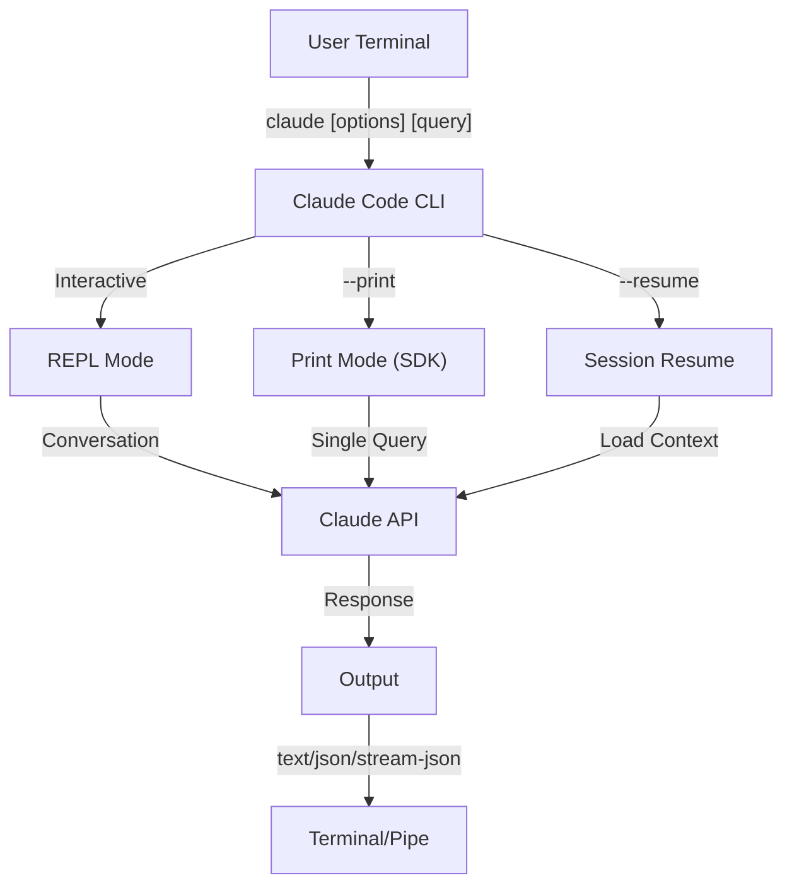
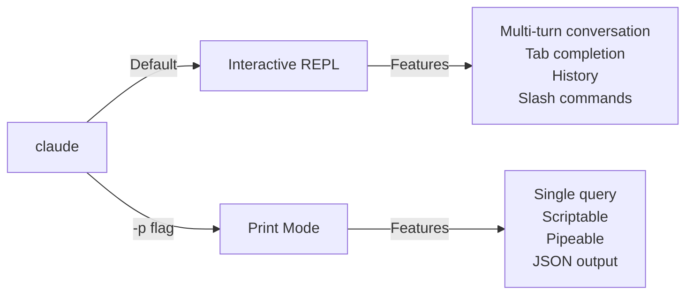

<picture>
  <source media="(prefers-color-scheme: dark)" srcset="../resources/logos/claude-howto-logo-dark.svg">
  
</picture>

# CLI Reference

## Обзор

Claude Code CLI (Command Line Interface) — это основной способ взаимодействия с Claude Code. Он даёт мощные возможности для запуска запросов, управления сессиями, настройки моделей и интеграции Claude в рабочие процессы разработки.

## Архитектура



## CLI Commands

| Command | Description | Example |
|---------|-------------|---------|
| `claude` | Запустить интерактивный REPL | `claude` |
| `claude "query"` | Запустить REPL с начальным prompt | `claude "explain this project"` |
| `claude -p "query"` | Print mode - выполнить запрос и выйти | `claude -p "explain this function"` |
| `cat file \| claude -p "query"` | Обработать данные из pipe | `cat logs.txt \| claude -p "explain"` |
| `claude -c` | Продолжить последнюю беседу | `claude -c` |
| `claude -c -p "query"` | Продолжить в print mode | `claude -c -p "check for type errors"` |
| `claude -r "<session>" "query"` | Возобновить сессию по ID или имени | `claude -r "auth-refactor" "finish this PR"` |
| `claude update` | Обновить до последней версии | `claude update` |
| `claude mcp` | Настроить MCP servers | См. [MCP documentation](../05-mcp/) |
| `claude mcp serve` | Запустить Claude Code как MCP server | `claude mcp serve` |
| `claude agents` | Показать все настроенные subagents | `claude agents` |
| `claude auto-mode defaults` | Вывести правила auto mode в JSON | `claude auto-mode defaults` |
| `claude remote-control` | Запустить Remote Control server | `claude remote-control` |
| `claude plugin` | Управлять plugins (install, enable, disable) | `claude plugin install my-plugin` |
| `claude auth login` | Войти (поддерживает `--email`, `--sso`) | `claude auth login --email user@example.com` |
| `claude auth logout` | Выйти из текущего аккаунта | `claude auth logout` |
| `claude auth status` | Проверить статус авторизации (exit 0 если вошли, 1 если нет) | `claude auth status` |

## Core Flags

| Flag | Description | Example |
|------|-------------|---------|
| `-p, --print` | Вывести ответ без интерактивного режима | `claude -p "query"` |
| `-c, --continue` | Загрузить последнюю беседу | `claude --continue` |
| `-r, --resume` | Возобновить конкретную сессию по ID или имени | `claude --resume auth-refactor` |
| `-v, --version` | Показать номер версии | `claude -v` |
| `-w, --worktree` | Запустить в изолированном git worktree | `claude -w` |
| `-n, --name` | Отображаемое имя сессии | `claude -n "auth-refactor"` |
| `--from-pr <number>` | Возобновить сессии, привязанные к GitHub PR | `claude --from-pr 42` |
| `--remote "task"` | Создать web session на claude.ai | `claude --remote "implement API"` |
| `--remote-control, --rc` | Интерактивная сессия с Remote Control | `claude --rc` |
| `--teleport` | Возобновить web session локально | `claude --teleport` |
| `--teammate-mode` | Режим отображения agent team | `claude --teammate-mode tmux` |
| `--bare` | Минимальный режим (без hooks, skills, plugins, MCP, auto memory, CLAUDE.md) | `claude --bare` |
| `--enable-auto-mode` | Включить auto permission mode | `claude --enable-auto-mode` |
| `--channels` | Подписаться на MCP channel plugins | `claude --channels discord,telegram` |
| `--chrome` / `--no-chrome` | Включить/выключить интеграцию с Chrome browser | `claude --chrome` |
| `--effort` | Установить уровень thinking effort | `claude --effort high` |
| `--init` / `--init-only` | Запустить initialization hooks | `claude --init` |
| `--maintenance` | Запустить maintenance hooks и выйти | `claude --maintenance` |
| `--disable-slash-commands` | Отключить все skills и slash-команды | `claude --disable-slash-commands` |
| `--no-session-persistence` | Отключить сохранение сессии (print mode) | `claude -p --no-session-persistence "query"` |

### Interactive vs Print Mode



**Interactive Mode** (по умолчанию):
```bash
# Start interactive session
claude

# Start with initial prompt
claude "explain the authentication flow"
```

**Print Mode** (non-interactive):
```bash
# Single query, then exit
claude -p "what does this function do?"

# Process file content
cat error.log | claude -p "explain this error"

# Chain with other tools
claude -p "list todos" | grep "URGENT"
```

## Model & Configuration

| Flag | Description | Example |
|------|-------------|---------|
| `--model` | Установить модель (sonnet, opus, haiku, или full name) | `claude --model opus` |
| `--fallback-model` | Автоматический fallback модели при перегрузке | `claude -p --fallback-model sonnet "query"` |
| `--agent` | Указать agent для сессии | `claude --agent my-custom-agent` |
| `--agents` | Определить custom subagents через JSON | См. [Agents Configuration](#agents-configuration) |
| `--effort` | Установить уровень effort (low, medium, high, max) | `claude --effort high` |

### Model Selection Examples

```bash
# Use Opus 4.6 for complex tasks
claude --model opus "design a caching strategy"

# Use Haiku 4.5 for quick tasks
claude --model haiku -p "format this JSON"

# Full model name
claude --model claude-sonnet-4-6-20250929 "review this code"

# With fallback for reliability
claude -p --model opus --fallback-model sonnet "analyze architecture"

# Use opusplan (Opus plans, Sonnet executes)
claude --model opusplan "design and implement the caching layer"
```

## System Prompt Customization

| Flag | Description | Example |
|------|-------------|---------|
| `--system-prompt` | Заменить весь default prompt | `claude --system-prompt "You are a Python expert"` |
| `--system-prompt-file` | Загрузить prompt из файла (print mode) | `claude -p --system-prompt-file ./prompt.txt "query"` |
| `--append-system-prompt` | Добавить к default prompt | `claude --append-system-prompt "Always use TypeScript"` |

### System Prompt Examples

```bash
# Complete custom persona
claude --system-prompt "You are a senior security engineer. Focus on vulnerabilities."

# Append specific instructions
claude --append-system-prompt "Always include unit tests with code examples"

# Load complex prompt from file
claude -p --system-prompt-file ./prompts/code-reviewer.txt "review main.py"
```

### System Prompt Flags Comparison

| Flag | Behavior | Interactive | Print |
|------|----------|-------------|-------|
| `--system-prompt` | Replaces entire default system prompt | ✅ | ✅ |
| `--system-prompt-file` | Replaces with prompt from file | ❌ | ✅ |
| `--append-system-prompt` | Appends to default system prompt | ✅ | ✅ |

**Use `--system-prompt-file` only in print mode. For interactive mode, use `--system-prompt` or `--append-system-prompt`.**

## Tool & Permission Management

| Flag | Description | Example |
|------|-------------|---------|
| `--tools` | Ограничить доступные built-in tools | `claude -p --tools "Bash,Edit,Read" "query"` |
| `--allowedTools` | Инструменты, которые выполняются без запроса | `"Bash(git log:*)" "Read"` |
| `--disallowedTools` | Инструменты, убранные из контекста | `"Bash(rm:*)" "Edit"` |
| `--dangerously-skip-permissions` | Пропустить все permission prompts | `claude --dangerously-skip-permissions` |
| `--permission-mode` | Начать в указанном режиме разрешений | `claude --permission-mode auto` |
| `--permission-prompt-tool` | MCP tool для обработки permissions | `claude -p --permission-prompt-tool mcp_auth "query"` |
| `--enable-auto-mode` | Включить auto permission mode | `claude --enable-auto-mode` |

### Permission Examples

```bash
# Read-only mode for code review
claude --permission-mode plan "review this codebase"

# Restrict to safe tools only
claude --tools "Read,Grep,Glob" -p "find all TODO comments"

# Allow specific git commands without prompts
claude --allowedTools "Bash(git status:*)" "Bash(git log:*)"

# Block dangerous operations
claude --disallowedTools "Bash(rm -rf:*)" "Bash(git push --force:*)"
```

## Output & Format

| Flag | Description | Options | Example |
|------|-------------|---------|---------|
| `--output-format` | Указать формат вывода (print mode) | `text`, `json`, `stream-json` | `claude -p --output-format json "query"` |
| `--input-format` | Указать формат ввода (print mode) | `text`, `stream-json` | `claude -p --input-format stream-json` |
| `--verbose` | Включить verbose logging | | `claude --verbose` |
| `--include-partial-messages` | Включить streaming events | Requires `stream-json` | `claude -p --output-format stream-json --include-partial-messages "query"` |
| `--json-schema` | Получить validated JSON по schema | | `claude -p --json-schema '{"type":"object"}' "query"` |
| `--max-budget-usd` | Максимальная стоимость для print mode | | `claude -p --max-budget-usd 5.00 "query"` |

### Output Format Examples

```bash
# Plain text (default)
claude -p "explain this code"

# JSON for programmatic use
claude -p --output-format json "list all functions in main.py"

# Streaming JSON for real-time processing
claude -p --output-format stream-json "generate a long report"

# Structured output with schema validation
claude -p --json-schema '{"type":"object","properties":{"bugs":{"type":"array"}}}' \
  "find bugs in this code and return as JSON"
```

## Workspace & Directory

| Flag | Description | Example |
|------|-------------|---------|
| `--add-dir` | Добавить дополнительные working directories | `claude --add-dir ../apps ../lib` |
| `--setting-sources` | Comma-separated setting sources | `claude --setting-sources user,project` |
| `--settings` | Загружать settings из файла или JSON | `claude --settings ./settings.json` |
| `--plugin-dir` | Загружать plugins из каталога (repeatable) | `claude --plugin-dir ./my-plugin` |

### Multi-Directory Example

```bash
# Work across multiple project directories
claude --add-dir ../frontend ../backend ../shared "find all API endpoints"

# Load custom settings
claude --settings '{"model":"opus","verbose":true}' "complex task"
```

## MCP Configuration

| Flag | Description | Example |
|------|-------------|---------|
| `--mcp-config` | Загрузить MCP servers из JSON | `claude --mcp-config ./mcp.json` |
| `--strict-mcp-config` | Использовать только указанный MCP config | `claude --strict-mcp-config --mcp-config ./mcp.json` |
| `--channels` | Подписаться на MCP channel plugins | `claude --channels discord,telegram` |

### MCP Examples

```bash
# Load GitHub MCP server
claude --mcp-config ./github-mcp.json "list open PRs"

# Strict mode - only specified servers
claude --strict-mcp-config --mcp-config ./production-mcp.json "deploy to staging"
```

## Session Management

| Flag | Description | Example |
|------|-------------|---------|
| `--session-id` | Использовать конкретный session ID (UUID) | `claude --session-id "550e8400-..."` |
| `--fork-session` | Создавать новую сессию при resume | `claude --resume abc123 --fork-session` |

### Session Examples

```bash
# Continue last conversation
claude -c

# Resume named session
claude -r "feature-auth" "continue implementing login"

# Fork session for experimentation
claude --resume feature-auth --fork-session "try alternative approach"

# Use specific session ID
claude --session-id "550e8400-e29b-41d4-a716-446655440000" "continue"
```

### Session Fork

Создайте ветку от существующей сессии для экспериментов:

```bash
# Fork a session to try a different approach
claude --resume abc123 --fork-session "try alternative implementation"

# Fork with a custom message
claude -r "feature-auth" --fork-session "test with different architecture"
```

**Use Cases:**
- Пробовать альтернативные реализации без потери оригинальной сессии
- Экспериментировать с разными подходами параллельно
- Создавать ветки от успешной работы для вариаций
- Тестировать breaking changes без влияния на основную сессию

Оригинальная сессия остаётся неизменной, а fork становится новой независимой сессией.

## Advanced Features

| Flag | Description | Example |
|------|-------------|---------|
| `--chrome` | Включить интеграцию с Chrome browser | `claude --chrome` |
| `--no-chrome` | Выключить интеграцию с Chrome browser | `claude --no-chrome` |
| `--ide` | Автоматически подключаться к IDE, если доступно | `claude --ide` |
| `--max-turns` | Ограничить agentic turns (non-interactive) | `claude -p --max-turns 3 "query"` |
| `--debug` | Включить debug mode с фильтрацией | `claude --debug "api,mcp"` |
| `--enable-lsp-logging` | Включить verbose LSP logging | `claude --enable-lsp-logging` |
| `--betas` | Beta headers для API requests | `claude --betas interleaved-thinking` |
| `--plugin-dir` | Загружать plugins из каталога (repeatable) | `claude --plugin-dir ./my-plugin` |
| `--enable-auto-mode` | Включить auto permission mode | `claude --enable-auto-mode` |
| `--effort` | Установить thinking effort level | `claude --effort high` |
| `--bare` | Минимальный режим (skip hooks, skills, plugins, MCP, auto memory, CLAUDE.md) | `claude --bare` |
| `--channels` | Подписаться на MCP channel plugins | `claude --channels discord` |
| `--fork-session` | Создавать новый session ID при resume | `claude --resume abc --fork-session` |
| `--max-budget-usd` | Максимальные траты (print mode) | `claude -p --max-budget-usd 5.00 "query"` |
| `--json-schema` | Validated JSON output | `claude -p --json-schema '{"type":"object"}' "q"` |

### Advanced Examples

```bash
# Limit autonomous actions
claude -p --max-turns 5 "refactor this module"

# Debug API calls
claude --debug "api" "test query"

# Enable IDE integration
claude --ide "help me with this file"
```

## Agents Configuration

Флаг `--agents` принимает JSON-объект, который задаёт custom subagents для сессии.

### Agents JSON Format

```json
{
  "agent-name": {
    "description": "Required: when to invoke this agent",
    "prompt": "Required: system prompt for the agent",
    "tools": ["Optional", "array", "of", "tools"],
    "model": "optional: sonnet|opus|haiku"
  }
}
```

**Required Fields:**
- `description` - Natural language description of when to use this agent
- `prompt` - System prompt that defines the agent's role and behavior

**Optional Fields:**
- `tools` - Array of available tools (inherits all if omitted)
  - Format: `["Read", "Grep", "Glob", "Bash"]`
- `model` - Model to use: `sonnet`, `opus`, or `haiku`

### Complete Agents Example

```json
{
  "code-reviewer": {
    "description": "Expert code reviewer. Use proactively after code changes.",
    "prompt": "You are a senior code reviewer. Focus on code quality, security, and best practices.",
    "tools": ["Read", "Grep", "Glob", "Bash"],
    "model": "sonnet"
  },
  "debugger": {
    "description": "Debugging specialist for errors and test failures.",
    "prompt": "You are an expert debugger. Analyze errors, identify root causes, and provide fixes.",
    "tools": ["Read", "Edit", "Bash", "Grep"],
    "model": "opus"
  },
  "documenter": {
    "description": "Documentation specialist for generating guides.",
    "prompt": "You are a technical writer. Create clear, comprehensive documentation.",
    "tools": ["Read", "Write"],
    "model": "haiku"
  }
}
```

### Agents Command Examples

```bash
# Define custom agents inline
claude --agents '{
  "security-auditor": {
    "description": "Security specialist for vulnerability analysis",
    "prompt": "You are a security expert. Find vulnerabilities and suggest fixes.",
    "tools": ["Read", "Grep", "Glob"],
    "model": "opus"
  }
}' "audit this codebase for security issues"

# Load agents from file
claude --agents "$(cat ~/.claude/agents.json)" "review the auth module"

# Combine with other flags
claude -p --agents "$(cat agents.json)" --model sonnet "analyze performance"
```

### Agent Priority

Когда существует несколько определений agents, они загружаются в таком порядке:
1. **CLI-defined** (`--agents` flag) - Session-specific
2. **User-level** (`~/.claude/agents/`) - All projects
3. **Project-level** (`.claude/agents/`) - Current project

CLI-defined agents override both user and project agents for the session.

---

## High-Value Use Cases

### 1. CI/CD Integration

Используйте Claude Code в CI/CD pipelines для автоматического code review, тестирования и документации.

**GitHub Actions Example:**

```yaml
name: AI Code Review

on: [pull_request]

jobs:
  review:
    runs-on: ubuntu-latest
    steps:
      - uses: actions/checkout@v4

      - name: Install Claude Code
        run: npm install -g @anthropic-ai/claude-code

      - name: Run Code Review
        env:
          ANTHROPIC_API_KEY: ${{ secrets.ANTHROPIC_API_KEY }}
        run: |
          claude -p --output-format json \
            --max-turns 1 \
            "Review the changes in this PR for:
            - Security vulnerabilities
            - Performance issues
            - Code quality
            Output as JSON with 'issues' array" > review.json

      - name: Post Review Comment
        uses: actions/github-script@v7
        with:
          script: |
            const fs = require('fs');
            const review = JSON.parse(fs.readFileSync('review.json', 'utf8'));
            // Process and post review comments
```

**Jenkins Pipeline:**

```groovy
pipeline {
    agent any
    stages {
        stage('AI Review') {
            steps {
                sh '''
                    claude -p --output-format json \
                      --max-turns 3 \
                      "Analyze test coverage and suggest missing tests" \
                      > coverage-analysis.json
                '''
            }
        }
    }
}
```

### 2. Script Piping

Обрабатывайте файлы, логи и данные через Claude для анализа.

**Log Analysis:**

```bash
# Analyze error logs
tail -1000 /var/log/app/error.log | claude -p "summarize these errors and suggest fixes"

# Find patterns in access logs
cat access.log | claude -p "identify suspicious access patterns"

# Analyze git history
git log --oneline -50 | claude -p "summarize recent development activity"
```

**Code Processing:**

```bash
# Review a specific file
cat src/auth.ts | claude -p "review this authentication code for security issues"

# Generate documentation
cat src/api/*.ts | claude -p "generate API documentation in markdown"

# Find TODOs and prioritize
grep -r "TODO" src/ | claude -p "prioritize these TODOs by importance"
```

### 3. Multi-Session Workflows

Управляйте сложными проектами с несколькими conversation threads.

```bash
# Start a feature branch session
claude -r "feature-auth" "let's implement user authentication"

# Later, continue the session
claude -r "feature-auth" "add password reset functionality"

# Fork to try an alternative approach
claude --resume feature-auth --fork-session "try OAuth instead"

# Switch between different feature sessions
claude -r "feature-payments" "continue with Stripe integration"
```

### 4. Custom Agent Configuration

Создавайте специализированных agents для workflow вашей команды.

```bash
# Save agents config to file
cat > ~/.claude/agents.json << 'EOF'
{
  "reviewer": {
    "description": "Code reviewer for PR reviews",
    "prompt": "Review code for quality, security, and maintainability.",
    "model": "opus"
  },
  "documenter": {
    "description": "Documentation specialist",
    "prompt": "Generate clear, comprehensive documentation.",
    "model": "sonnet"
  },
  "refactorer": {
    "description": "Code refactoring expert",
    "prompt": "Suggest and implement clean code refactoring.",
    "tools": ["Read", "Edit", "Glob"]
  }
}
EOF

# Use agents in session
claude --agents "$(cat ~/.claude/agents.json)" "review the auth module"
```

### 5. Batch Processing

Обрабатывайте несколько запросов с одинаковыми настройками.

```bash
# Process multiple files
for file in src/*.ts; do
  echo "Processing $file..."
  claude -p --model haiku "summarize this file: $(cat $file)" >> summaries.md
done

# Batch code review
find src -name "*.py" -exec sh -c '
  echo "## $1" >> review.md
  cat "$1" | claude -p "brief code review" >> review.md
' _ {} \;

# Generate tests for all modules
for module in $(ls src/modules/); do
  claude -p "generate unit tests for src/modules/$module" > "tests/$module.test.ts"
done
```

### 6. Security-Conscious Development

Используйте permission controls для безопасной работы.

```bash
# Read-only security audit
claude --permission-mode plan \
  --tools "Read,Grep,Glob" \
  "audit this codebase for security vulnerabilities"

# Block dangerous commands
claude --disallowedTools "Bash(rm:*)" "Bash(curl:*)" "Bash(wget:*)" \
  "help me clean up this project"

# Restricted automation
claude -p --max-turns 2 \
  --allowedTools "Read" "Glob" \
  "find all hardcoded credentials"
```

### 7. JSON API Integration

Используйте Claude как программируемый API для своих инструментов с помощью `jq`.

```bash
# Get structured analysis
claude -p --output-format json \
  --json-schema '{"type":"object","properties":{"functions":{"type":"array"},"complexity":{"type":"string"}}}' \
  "analyze main.py and return function list with complexity rating"

# Integrate with jq for processing
claude -p --output-format json "list all API endpoints" | jq '.endpoints[]'

# Use in scripts
RESULT=$(claude -p --output-format json "is this code secure? answer with {secure: boolean, issues: []}" < code.py)
if echo "$RESULT" | jq -e '.secure == false' > /dev/null; then
  echo "Security issues found!"
  echo "$RESULT" | jq '.issues[]'
fi
```

### jq Parsing Examples

Parse and process Claude's JSON output using `jq`:

```bash
# Extract specific fields
claude -p --output-format json "analyze this code" | jq '.result'

# Filter array elements
claude -p --output-format json "list issues" | jq -r '.issues[] | select(.severity=="high")'

# Extract multiple fields
claude -p --output-format json "describe the project" | jq -r '.{name, version, description}'

# Convert to CSV
claude -p --output-format json "list functions" | jq -r '.functions[] | [.name, .lineCount] | @csv'

# Conditional processing
claude -p --output-format json "check security" | jq 'if .vulnerabilities | length > 0 then "UNSAFE" else "SAFE" end'

# Extract nested values
claude -p --output-format json "analyze performance" | jq '.metrics.cpu.usage'

# Process entire array
claude -p --output-format json "find todos" | jq '.todos | length'

# Transform output
claude -p --output-format json "list improvements" | jq 'map({title: .title, priority: .priority})'
```

---

## Models

Claude Code поддерживает несколько моделей с разными возможностями:

| Model | ID | Context Window | Notes |
|-------|-----|----------------|-------|
| Opus 4.6 | `claude-opus-4-6` | 1M tokens | Most capable, adaptive effort levels |
| Sonnet 4.6 | `claude-sonnet-4-6` | 1M tokens | Balanced speed and capability |
| Haiku 4.5 | `claude-haiku-4-5` | 1M tokens | Fastest, best for quick tasks |

### Model Selection

```bash
# Use short names
claude --model opus "complex architectural review"
claude --model sonnet "implement this feature"
claude --model haiku -p "format this JSON"

# Use opusplan alias (Opus plans, Sonnet executes)
claude --model opusplan "design and implement the API"

# Toggle fast mode during session
/fast
```

### Effort Levels (Opus 4.6)

Opus 4.6 supports adaptive reasoning with effort levels:

```bash
# Set effort level via CLI flag
claude --effort high "complex review"

# Set effort level via slash command
/effort high

# Set effort level via environment variable
export CLAUDE_CODE_EFFORT_LEVEL=high   # low, medium, high, or max (Opus 4.6 only)
```

Ключевое слово "ultrathink" в prompt'ах включает глубокое reasoning. Уровень `max` доступен только в Opus 4.6.

---

## Key Environment Variables

| Variable | Description |
|----------|-------------|
| `ANTHROPIC_API_KEY` | API key for authentication |
| `ANTHROPIC_MODEL` | Override default model |
| `ANTHROPIC_CUSTOM_MODEL_OPTION` | Custom model option for API |
| `ANTHROPIC_DEFAULT_OPUS_MODEL` | Override default Opus model ID |
| `ANTHROPIC_DEFAULT_SONNET_MODEL` | Override default Sonnet model ID |
| `ANTHROPIC_DEFAULT_HAIKU_MODEL` | Override default Haiku model ID |
| `MAX_THINKING_TOKENS` | Set extended thinking token budget |
| `CLAUDE_CODE_EFFORT_LEVEL` | Set effort level (`low`/`medium`/`high`/`max`) |
| `CLAUDE_CODE_SIMPLE` | Minimal mode, set by `--bare` flag |
| `CLAUDE_CODE_DISABLE_AUTO_MEMORY` | Disable automatic CLAUDE.md updates |
| `CLAUDE_CODE_DISABLE_BACKGROUND_TASKS` | Disable background task execution |
| `CLAUDE_CODE_DISABLE_CRON` | Disable scheduled/cron tasks |
| `CLAUDE_CODE_DISABLE_GIT_INSTRUCTIONS` | Disable git-related instructions |
| `CLAUDE_CODE_DISABLE_TERMINAL_TITLE` | Disable terminal title updates |
| `CLAUDE_CODE_DISABLE_1M_CONTEXT` | Disable 1M token context window |
| `CLAUDE_CODE_DISABLE_NONSTREAMING_FALLBACK` | Disable non-streaming fallback |
| `CLAUDE_CODE_ENABLE_TASKS` | Enable task list feature |
| `CLAUDE_CODE_TASK_LIST_ID` | Named task directory shared across sessions |
| `CLAUDE_CODE_ENABLE_PROMPT_SUGGESTION` | Toggle prompt suggestions (`true`/`false`) |
| `CLAUDE_CODE_EXPERIMENTAL_AGENT_TEAMS` | Enable experimental agent teams |
| `CLAUDE_CODE_NEW_INIT` | Use new initialization flow |
| `CLAUDE_CODE_SUBAGENT_MODEL` | Model for subagent execution |
| `CLAUDE_CODE_PLUGIN_SEED_DIR` | Directory for plugin seed files |
| `CLAUDE_CODE_SUBPROCESS_ENV_SCRUB` | Env vars to scrub from subprocesses |
| `CLAUDE_AUTOCOMPACT_PCT_OVERRIDE` | Override auto-compaction percentage |
| `CLAUDE_STREAM_IDLE_TIMEOUT_MS` | Stream idle timeout in milliseconds |
| `SLASH_COMMAND_TOOL_CHAR_BUDGET` | Character budget for slash command tools |
| `ENABLE_TOOL_SEARCH` | Enable tool search capability |
| `MAX_MCP_OUTPUT_TOKENS` | Maximum tokens for MCP tool output |

---

## Quick Reference

### Most Common Commands

```bash
# Interactive session
claude

# Quick question
claude -p "how do I..."

# Continue conversation
claude -c

# Process a file
cat file.py | claude -p "review this"

# JSON output for scripts
claude -p --output-format json "query"
```

### Flag Combinations

| Use Case | Command |
|----------|---------|
| Quick code review | `cat file | claude -p "review"` |
| Structured output | `claude -p --output-format json "query"` |
| Safe exploration | `claude --permission-mode plan` |
| Autonomous with safety | `claude --enable-auto-mode --permission-mode auto` |
| CI/CD integration | `claude -p --max-turns 3 --output-format json` |
| Resume work | `claude -r "session-name"` |
| Custom model | `claude --model opus "complex task"` |
| Minimal mode | `claude --bare "quick query"` |
| Budget-capped run | `claude -p --max-budget-usd 2.00 "analyze code"` |

---

## Troubleshooting

### Command Not Found

**Problem:** `claude: command not found`

**Solutions:**
- Установите Claude Code: `npm install -g @anthropic-ai/claude-code`
- Проверьте, что PATH включает npm global bin directory
- Попробуйте запустить через полный путь: `npx claude`

### API Key Issues

**Problem:** Authentication failed

**Solutions:**
- Установите API key: `export ANTHROPIC_API_KEY=your-key`
- Проверьте, что ключ действителен и на нём достаточно credits
- Убедитесь, что права ключа подходят для запрошенной модели

### Session Not Found

**Problem:** Cannot resume session

**Solutions:**
- Посмотрите доступные sessions, чтобы найти правильное имя/ID
- Sessions могут истекать после периода неактивности
- Используйте `-c` для продолжения самой последней session

### Output Format Issues

**Problem:** JSON output is malformed

**Solutions:**
- Используйте `--json-schema`, чтобы зафиксировать структуру
- Добавьте явные JSON-инструкции в prompt
- Используйте `--output-format json` (а не просто просите JSON в prompt)

### Permission Denied

**Problem:** Tool execution blocked

**Solutions:**
- Проверьте настройку `--permission-mode`
- Посмотрите флаги `--allowedTools` и `--disallowedTools`
- Используйте `--dangerously-skip-permissions` для automation (с осторожностью)

---

## Additional Resources

- **[Official CLI Reference](https://code.claude.com/docs/en/cli-reference)** - Полная справка по командам
- **[Headless Mode Documentation](https://code.claude.com/docs/en/headless)** - Автоматическое выполнение
- **[Slash Commands](../01-slash-commands/)** - Пользовательские ярлыки внутри Claude
- **[Memory Guide](../02-memory/)** - Постоянный контекст через CLAUDE.md
- **[MCP Protocol](../05-mcp/)** - Интеграции с внешними инструментами
- **[Advanced Features](../09-advanced-features/)** - planning mode, extended thinking
- **[Subagents Guide](../04-subagents/)** - Делегированное выполнение задач

---

*Часть серии [Claude How To](../) guide series*
