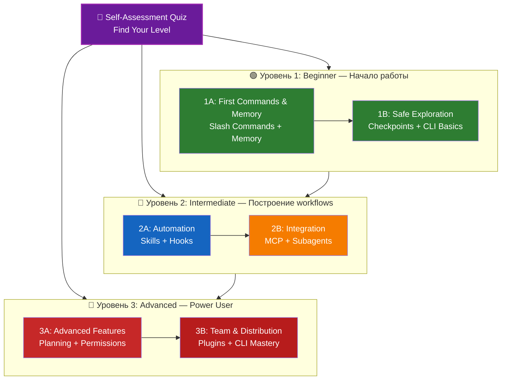

<picture>
  <source media="(prefers-color-scheme: dark)" srcset="resources/logos/claude-howto-logo-dark.svg">
  
</picture>

# 📚 Учебная дорожная карта Claude Code

**Только начинаете с Claude Code?** Это руководство поможет освоить возможности Claude Code в комфортном темпе. Неважно, новичок вы или опытный разработчик: начните с квиза самооценки ниже, чтобы выбрать подходящий маршрут.

---

## 🧭 Определите свой уровень

Не все начинают с одной точки. Пройдите короткую самооценку, чтобы найти подходящий старт.

**Отвечайте честно:**

- [ ] Я умею запускать Claude Code и вести с ним диалог (`claude`)
- [ ] Я создавал или редактировал файл CLAUDE.md
- [ ] Я использовал минимум 3 встроенные slash-команды (например, /help, /compact, /model)
- [ ] Я создавал собственную slash-команду или skill (SKILL.md)
- [ ] Я настраивал MCP-сервер (например, GitHub, база данных)
- [ ] Я настраивал hooks в ~/.claude/settings.json
- [ ] Я создавал или использовал собственные subagents (.claude/agents/)
- [ ] Я использовал режим печати (`claude -p`) для скриптов или CI/CD

**Ваш уровень:**

| Отметки | Уровень | Начать с | Время на прохождение |
|--------|-------|----------|------------------|
| 0-2 | **Уровень 1: Beginner** — Начало работы | [Milestone 1A](#milestone-1a-first-commands--memory) | ~3 часа |
| 3-5 | **Уровень 2: Intermediate** — Построение workflows | [Milestone 2A](#milestone-2a-automation-skills--hooks) | ~5 часов |
| 6-8 | **Уровень 3: Advanced** — Power User и Team Lead | [Milestone 3A](#milestone-3a-advanced-features) | ~5 часов |

> **Совет**: если сомневаетесь, начните на уровень ниже. Лучше быстро повторить знакомый материал, чем пропустить базовые концепции.

> **Интерактивная версия**: запустите `/self-assessment` в Claude Code, чтобы пройти управляемый интерактивный квиз, который оценит вашу подготовку по всем 10 областям и соберёт персональный маршрут обучения.

---

## 🎯 Философия обучения

Папки в этом репозитории пронумерованы в **рекомендуемом порядке обучения** на основе трёх принципов:

1. **Зависимости** — сначала базовые концепции
2. **Сложность** — сначала более простые возможности, затем продвинутые
3. **Частота использования** — самые распространённые возможности изучаются раньше

Такой подход помогает выстроить прочный фундамент и при этом сразу получать практическую пользу.

---

## 🗺️ Your Learning Path



**Color Legend:**
- 💜 Purple: Self-Assessment Quiz
- 🟢 Green: путь уровня 1 — Beginner
- 🔵 Blue / 🟡 Gold: путь уровня 2 — Intermediate
- 🔴 Red: путь уровня 3 — Advanced

---

## 📊 Complete Roadmap Table

| Шаг | Возможность | Сложность | Время | Уровень | Зависимости | Зачем изучать | Ключевые преимущества |
|------|---------|-----------|------|-------|--------------|----------------|--------------|
| **1** | [Slash Commands](01-slash-commands/) | ⭐ Beginner | 30 мин | Level 1 | Нет | Быстрый прирост продуктивности (55+ встроенных + 5 bundled skills) | Мгновенная автоматизация, стандарты команды |
| **2** | [Memory](02-memory/) | ⭐⭐ Beginner+ | 45 мин | Level 1 | Нет | Необходима для всех возможностей | Постоянный контекст, предпочтения |
| **3** | [Checkpoints](08-checkpoints/) | ⭐⭐ Intermediate | 45 мин | Level 1 | Управление сессией | Безопасные эксперименты | Эксперименты, восстановление |
| **4** | [CLI Basics](10-cli/) | ⭐⭐ Beginner+ | 30 мин | Level 1 | Нет | Базовое использование CLI | Интерактивный и print mode |
| **5** | [Skills](03-skills/) | ⭐⭐ Intermediate | 1 час | Level 2 | Slash Commands | Автоматическая экспертиза | Переиспользуемые возможности, consistency |
| **6** | [Hooks](06-hooks/) | ⭐⭐ Intermediate | 1 час | Level 2 | Tools, Commands | Автоматизация workflows (25 событий, 4 типа) | Валидация, quality gates |
| **7** | [MCP](05-mcp/) | ⭐⭐⭐ Intermediate+ | 1 час | Level 2 | Конфигурация | Доступ к живым данным | Интеграция в реальном времени, APIs |
| **8** | [Subagents](04-subagents/) | ⭐⭐⭐ Intermediate+ | 1.5 часа | Level 2 | Memory, Commands | Обработка сложных задач (6 встроенных, включая Bash) | Делегирование, специализированная экспертиза |
| **9** | [Advanced Features](09-advanced-features/) | ⭐⭐⭐⭐⭐ Advanced | 2-3 часа | Level 3 | Все предыдущие | Инструменты power user | Planning, Auto Mode, Channels, Voice Dictation, permissions |
| **10** | [Plugins](07-plugins/) | ⭐⭐⭐⭐ Advanced | 2 часа | Level 3 | Все предыдущие | Полные решения | Онбординг команды, распространение |
| **11** | [CLI Mastery](10-cli/) | ⭐⭐⭐ Advanced | 1 час | Level 3 | Рекомендуется: все | Мастерское использование командной строки | Скриптинг, CI/CD, automation |

**Total Learning Time**: ~11-13 hours (or jump to your level and save time)

---

## 🟢 Уровень 1: Beginner — Начало работы

**Для**: пользователей с 0-2 проверками квиза
**Время**: ~3 часа
**Фокус**: немедленная продуктивность, понимание основ
**Результат**: уверенный ежедневный пользователь, готовый к уровню 2

### Milestone 1A: Первые команды и Memory

**Темы**: Slash Commands + Memory
**Время**: 1-2 часа
**Сложность**: ⭐ Beginner
**Цель**: быстрый рост продуктивности за счёт пользовательских команд и постоянного контекста

#### Что вы получите
✅ Create custom slash commands for repetitive tasks
✅ Set up project memory for team standards
✅ Configure personal preferences
✅ Understand how Claude loads context automatically

#### Практические упражнения

```bash
# Exercise 1: Install your first slash command
mkdir -p .claude/commands
cp 01-slash-commands/optimize.md .claude/commands/

# Exercise 2: Create project memory
cp 02-memory/project-CLAUDE.md ./CLAUDE.md

# Exercise 3: Try it out
# In Claude Code, type: /optimize
```

#### Критерии успеха
- [ ] Successfully invoke `/optimize` command
- [ ] Claude remembers your project standards from CLAUDE.md
- [ ] You understand when to use slash commands vs. memory

#### Следующие шаги
Once comfortable, read:
- [01-slash-commands/README.md](01-slash-commands/README.md)
- [02-memory/README.md](02-memory/README.md)

> **Check your understanding**: Run `/lesson-quiz slash-commands` or `/lesson-quiz memory` in Claude Code to test what you've learned.

---

### Milestone 1B: Безопасное исследование

**Темы**: Checkpoints + CLI Basics
**Время**: 1 час
**Сложность**: ⭐⭐ Beginner+
**Цель**: научиться безопасно экспериментировать и использовать базовые CLI-команды

#### Что вы получите
✅ Create and restore checkpoints for safe experimentation
✅ Understand interactive vs. print mode
✅ Use basic CLI flags and options
✅ Process files via piping

#### Практические упражнения

```bash
# Exercise 1: Try checkpoint workflow
# In Claude Code:
# Make some experimental changes, then press Esc+Esc or use /rewind
# Select the checkpoint before your experiment
# Choose "Restore code and conversation" to go back

# Exercise 2: Interactive vs Print mode
claude "explain this project"           # Interactive mode
claude -p "explain this function"       # Print mode (non-interactive)

# Exercise 3: Process file content via piping
cat error.log | claude -p "explain this error"
```

#### Критерии успеха
- [ ] Created and reverted to a checkpoint
- [ ] Used both interactive and print mode
- [ ] Piped a file to Claude for analysis
- [ ] Understand when to use checkpoints for safe experimentation

#### Следующие шаги
- Read: [08-checkpoints/README.md](08-checkpoints/README.md)
- Read: [10-cli/README.md](10-cli/README.md)
- **Готовы к уровню 2!** Переходите к [Milestone 2A](#milestone-2a-automation-skills--hooks)

> **Check your understanding**: Run `/lesson-quiz checkpoints` or `/lesson-quiz cli` to verify you're ready for Level 2.

---

## 🔵 Уровень 2: Intermediate — Построение workflows

**Для**: пользователей с 3-5 проверками квиза
**Время**: ~5 часов
**Фокус**: автоматизация, интеграция, делегирование задач
**Результат**: автоматизированные workflows, внешние интеграции, готовность к уровню 3

### Проверка предварительных условий

Перед началом уровня 2 убедитесь, что вы уверенно владеете этими концепциями уровня 1:

- [ ] Умеете создавать и использовать slash-команды ([01-slash-commands/](01-slash-commands/))
- [ ] Настроили project memory через CLAUDE.md ([02-memory/](02-memory/))
- [ ] Умеете создавать и восстанавливать checkpoints ([08-checkpoints/](08-checkpoints/))
- [ ] Умеете использовать `claude` и `claude -p` из командной строки ([10-cli/](10-cli/))

> **Есть пробелы?** Перед продолжением просмотрите связанные туториалы выше.

---

### Milestone 2A: Автоматизация (Skills + Hooks)

**Темы**: Skills + Hooks
**Время**: 2-3 часа
**Сложность**: ⭐⭐ Intermediate
**Цель**: автоматизировать частые workflows и проверки качества

#### Что вы получите
✅ Auto-invoke specialized capabilities with YAML frontmatter (including `effort` and `shell` fields)
✅ Set up event-driven automation across 25 hook events
✅ Use all 4 hook types (command, http, prompt, agent)
✅ Enforce code quality standards
✅ Create custom hooks for your workflow

#### Практические упражнения

```bash
# Exercise 1: Install a skill
cp -r 03-skills/code-review ~/.claude/skills/

# Exercise 2: Set up hooks
mkdir -p ~/.claude/hooks
cp 06-hooks/pre-tool-check.sh ~/.claude/hooks/
chmod +x ~/.claude/hooks/pre-tool-check.sh

# Exercise 3: Configure hooks in settings
# Add to ~/.claude/settings.json:
{
  "hooks": {
    "PreToolUse": [
      {
        "matcher": "Bash",
        "hooks": [
          {
            "type": "command",
            "command": "~/.claude/hooks/pre-tool-check.sh"
          }
        ]
      }
    ]
  }
}
```

#### Критерии успеха
- [ ] Code review skill automatically invoked when relevant
- [ ] PreToolUse hook runs before tool execution
- [ ] You understand skill auto-invocation vs. hook event triggers

#### Следующие шаги
- Create your own custom skill
- Set up additional hooks for your workflow
- Read: [03-skills/README.md](03-skills/README.md)
- Read: [06-hooks/README.md](06-hooks/README.md)

> **Check your understanding**: Run `/lesson-quiz skills` or `/lesson-quiz hooks` to test your knowledge before moving on.

---

### Milestone 2B: Интеграция (MCP + Subagents)

**Темы**: MCP + Subagents
**Время**: 2-3 часа
**Сложность**: ⭐⭐⭐ Intermediate+
**Цель**: интегрировать внешние сервисы и делегировать сложные задачи

#### Что вы получите
✅ Access live data from GitHub, databases, etc.
✅ Delegate work to specialized AI agents
✅ Understand when to use MCP vs. subagents
✅ Build integrated workflows

#### Практические упражнения

```bash
# Exercise 1: Set up GitHub MCP
export GITHUB_TOKEN="your_github_token"
claude mcp add github -- npx -y @modelcontextprotocol/server-github

# Exercise 2: Test MCP integration
# In Claude Code: /mcp__github__list_prs

# Exercise 3: Install subagents
mkdir -p .claude/agents
cp 04-subagents/*.md .claude/agents/
```

#### Integration Exercise
Try this complete workflow:
1. Use MCP to fetch a GitHub PR
2. Let Claude delegate review to code-reviewer subagent
3. Use hooks to run tests automatically

#### Критерии успеха
- [ ] Successfully query GitHub data via MCP
- [ ] Claude delegates complex tasks to subagents
- [ ] You understand the difference between MCP and subagents
- [ ] Combined MCP + subagents + hooks in a workflow

#### Следующие шаги
- Set up additional MCP servers (database, Slack, etc.)
- Create custom subagents for your domain
- Read: [05-mcp/README.md](05-mcp/README.md)
- Read: [04-subagents/README.md](04-subagents/README.md)
- **Готовы к уровню 3!** Переходите к [Milestone 3A](#milestone-3a-advanced-features)

> **Check your understanding**: Run `/lesson-quiz mcp` or `/lesson-quiz subagents` to verify you're ready for Level 3.

---

## 🔴 Уровень 3: Advanced — Power User и Team Lead

**Для**: пользователей с 6-8 проверками квиза
**Время**: ~5 часов
**Фокус**: командные инструменты, CI/CD, enterprise-функции, разработка плагинов
**Результат**: power user, который может настраивать командные workflows и CI/CD

### Проверка предварительных условий

Перед началом уровня 3 убедитесь, что вы уверенно владеете этими концепциями уровня 2:

- [ ] Умеете создавать и использовать skills с авто-запуском ([03-skills/](03-skills/))
- [ ] Настроили hooks для автоматизации по событиям ([06-hooks/](06-hooks/))
- [ ] Умеете настраивать серверы MCP для внешних данных ([05-mcp/](05-mcp/))
- [ ] Знаете, как использовать subagents для делегирования задач ([04-subagents/](04-subagents/))

> **Есть пробелы?** Перед продолжением просмотрите связанные туториалы выше.

---

### Milestone 3A: Продвинутые возможности

**Темы**: продвинутые возможности (Planning, Permissions, Extended Thinking, Auto Mode, Channels, Voice Dictation, Remote/Desktop/Web)
**Время**: 2-3 часа
**Сложность**: ⭐⭐⭐⭐⭐ Advanced
**Цель**: освоить продвинутые workflows и инструменты power user

#### Что вы получите
✅ Planning mode for complex features
✅ Fine-grained permission control with 6 modes (default, acceptEdits, plan, auto, dontAsk, bypassPermissions)
✅ Extended thinking via Alt+T / Option+T toggle
✅ Background task management
✅ Auto Memory for learned preferences
✅ Auto Mode with background safety classifier
✅ Channels for structured multi-session workflows
✅ Voice Dictation for hands-free interaction
✅ Remote control, desktop app, and web sessions
✅ Agent Teams for multi-agent collaboration

#### Практические упражнения

```bash
# Exercise 1: Use planning mode
/plan Implement user authentication system

# Exercise 2: Try permission modes (6 available: default, acceptEdits, plan, auto, dontAsk, bypassPermissions)
claude --permission-mode plan "analyze this codebase"
claude --permission-mode acceptEdits "refactor the auth module"
claude --permission-mode auto "implement the feature"

# Exercise 3: Enable extended thinking
# Press Alt+T (Option+T on macOS) during a session to toggle

# Exercise 4: Advanced checkpoint workflow
# 1. Create checkpoint "Clean state"
# 2. Use planning mode to design a feature
# 3. Implement with subagent delegation
# 4. Run tests in background
# 5. If tests fail, rewind to checkpoint
# 6. Try alternative approach

# Exercise 5: Try auto mode (background safety classifier)
claude --permission-mode auto "implement user settings page"

# Exercise 6: Enable agent teams
export CLAUDE_AGENT_TEAMS=1
# Ask Claude: "Implement feature X using a team approach"

# Exercise 7: Scheduled tasks
/loop 5m /check-status
# Or use CronCreate for persistent scheduled tasks

# Exercise 8: Channels for multi-session workflows
# Use channels to organize work across sessions

# Exercise 9: Voice Dictation
# Use voice input for hands-free interaction with Claude Code
```

#### Критерии успеха
- [ ] Used planning mode for a complex feature
- [ ] Configured permission modes (plan, acceptEdits, auto, dontAsk)
- [ ] Toggled extended thinking with Alt+T / Option+T
- [ ] Used auto mode with background safety classifier
- [ ] Used background tasks for long operations
- [ ] Explored Channels for multi-session workflows
- [ ] Tried Voice Dictation for hands-free input
- [ ] Understand Remote Control, Desktop App, and Web sessions
- [ ] Enabled and used Agent Teams for collaborative tasks
- [ ] Used `/loop` for recurring tasks or scheduled monitoring

#### Следующие шаги
- Read: [09-advanced-features/README.md](09-advanced-features/README.md)

> **Check your understanding**: Run `/lesson-quiz advanced` to test your mastery of power user features.

---

### Milestone 3B: Команда и распространение (Plugins + CLI Mastery)

**Темы**: Plugins + CLI Mastery + CI/CD
**Время**: 2-3 часа
**Сложность**: ⭐⭐⭐⭐ Advanced
**Цель**: создавать командные инструменты, делать плагины и освоить CI/CD-интеграцию

#### Что вы получите
✅ Install and create complete bundled plugins
✅ Master CLI for scripting and automation
✅ Set up CI/CD integration with `claude -p`
✅ JSON output for automated pipelines
✅ Session management and batch processing

#### Практические упражнения

```bash
# Exercise 1: Install a complete plugin
# In Claude Code: /plugin install pr-review

# Exercise 2: Print mode for CI/CD
claude -p "Run all tests and generate report"

# Exercise 3: JSON output for scripts
claude -p --output-format json "list all functions"

# Exercise 4: Session management and resumption
claude -r "feature-auth" "continue implementation"

# Exercise 5: CI/CD integration with constraints
claude -p --max-turns 3 --output-format json "review code"

# Exercise 6: Batch processing
for file in *.md; do
  claude -p --output-format json "summarize this: $(cat $file)" > ${file%.md}.summary.json
done
```

#### CI/CD Integration Exercise
Create a simple CI/CD script:
1. Use `claude -p` to review changed files
2. Output results as JSON
3. Process with `jq` for specific issues
4. Integrate into GitHub Actions workflow

#### Критерии успеха
- [ ] Installed and used a plugin
- [ ] Built or modified a plugin for your team
- [ ] Used print mode (`claude -p`) in CI/CD
- [ ] Generated JSON output for scripting
- [ ] Resumed a previous session successfully
- [ ] Created a batch processing script
- [ ] Integrated Claude into a CI/CD workflow

#### Real-World Use Cases for CLI
- **Code Review Automation**: Run code reviews in CI/CD pipelines
- **Log Analysis**: Analyze error logs and system outputs
- **Documentation Generation**: Batch generate documentation
- **Testing Insights**: Analyze test failures
- **Performance Analysis**: Review performance metrics
- **Data Processing**: Transform and analyze data files

#### Следующие шаги
- Read: [07-plugins/README.md](07-plugins/README.md)
- Read: [10-cli/README.md](10-cli/README.md)
- Create team-wide CLI shortcuts and plugins
- Set up batch processing scripts

> **Check your understanding**: Run `/lesson-quiz plugins` or `/lesson-quiz cli` to confirm your mastery.

---

## 🧪 Проверьте знания

В этом репозитории есть два интерактивных skill, которые можно использовать в Claude Code в любое время, чтобы оценить своё понимание:

| Skill | Команда | Назначение |
|-------|---------|---------|
| **Self-Assessment** | `/self-assessment` | Оценить общую квалификацию по всем 10 возможностям. Выберите режим Quick (2 мин) или Deep (5 мин), чтобы получить персональный профиль и учебный путь. |
| **Lesson Quiz** | `/lesson-quiz [lesson]` | Проверить понимание конкретного урока с помощью 10 вопросов. Используйте до урока (pre-test), во время (progress check) или после (mastery verification). |

**Examples:**
```
/self-assessment                  # Find your overall level
/lesson-quiz hooks                # Quiz on Lesson 06: Hooks
/lesson-quiz 03                   # Quiz on Lesson 03: Skills
/lesson-quiz advanced-features    # Quiz on Lesson 09
```

---

## ⚡ Quick Start Paths

### If You Only Have 15 Minutes
**Goal**: Get your first win

1. Copy one slash command: `cp 01-slash-commands/optimize.md .claude/commands/`
2. Try it in Claude Code: `/optimize`
3. Read: [01-slash-commands/README.md](01-slash-commands/README.md)

**Outcome**: You'll have a working slash command and understand the basics

---

### If You Have 1 Hour
**Goal**: Set up essential productivity tools

1. **Slash commands** (15 min): Copy and test `/optimize` and `/pr`
2. **Project memory** (15 min): Create CLAUDE.md with your project standards
3. **Install a skill** (15 min): Set up code-review skill
4. **Try them together** (15 min): See how they work in harmony

**Outcome**: Basic productivity boost with commands, memory, and auto-skills

---

### If You Have a Weekend
**Goal**: Become proficient with most features

**Saturday Morning** (3 hours):
- Complete Milestone 1A: Slash Commands + Memory
- Complete Milestone 1B: Checkpoints + CLI Basics

**Субботний вечер** (3 часа):
- Завершите Milestone 2A: Skills + Hooks
- Завершите Milestone 2B: MCP + Subagents

**Воскресенье** (4 часа):
- Завершите Milestone 3A: Advanced Features
- Завершите Milestone 3B: Plugins + CLI Mastery + CI/CD
- Соберите собственный плагин для команды

**Результат**: вы станете опытным пользователем Claude Code, готовым обучать других и автоматизировать сложные workflows

---

## 💡 Советы по обучению

### ✅ Делайте

- **Пройдите квиз сначала**, чтобы найти стартовую точку
- **Выполняйте практические упражнения** для каждого milestone
- **Начинайте с простого** и постепенно добавляйте сложность
- **Проверяйте каждую функцию** перед переходом к следующей
- **Делайте заметки** о том, что работает в вашем workflow
- **Возвращайтесь к ранним концепциям**, когда изучаете продвинутые темы
- **Экспериментируйте безопасно**, используя checkpoints
- **Делитесь знаниями** с командой

### ❌ Не делайте

- **Пропускайте проверку prerequisites**, когда переходите на более высокий уровень
- **Пытайтесь выучить всё сразу** — это перегружает
- **Копируйте конфигурации, не понимая их** — потом будет трудно debug-ить
- **Забывайте тестировать** — всегда проверяйте, что функции работают
- **Спешите проходить milestone** — лучше потратьте время на понимание
- **Игнорируйте документацию** — в каждом README есть полезные детали
- **Работайте в изоляции** — обсуждайте с коллегами

---

## 🎓 Стили обучения

### Визуалы
- Изучайте Mermaid-диаграммы в каждом README
- Следите за потоком выполнения команд
- Рисуйте собственные диаграммы workflow
- Пользуйтесь визуальным маршрутом обучения выше

### Практики
- Выполняйте каждое практическое упражнение
- Экспериментируйте с вариациями
- Ломайте и чините — используйте checkpoints!
- Создавайте собственные примеры

### Читатели
- Внимательно читайте каждый README
- Изучайте примеры кода
- Смотрите сравнительные таблицы
- Читайте статьи, ссылки на которые есть в ресурсах

### Общительные
- Проводите сессии парного программирования
- Объясняйте концепции коллегам
- Участвуйте в обсуждениях сообщества Claude Code
- Делитесь собственными конфигурациями

---

## 📈 Progress Tracking

Используйте эти чеклисты, чтобы отслеживать прогресс по уровням. Запускайте `/self-assessment` в любой момент, чтобы получить обновлённый профиль навыков, или `/lesson-quiz [lesson]` после каждого урока, чтобы проверить понимание.

### 🟢 Level 1: Beginner
- [ ] Completed [01-slash-commands](01-slash-commands/)
- [ ] Completed [02-memory](02-memory/)
- [ ] Created first custom slash command
- [ ] Set up project memory
- [ ] **Milestone 1A achieved**
- [ ] Completed [08-checkpoints](08-checkpoints/)
- [ ] Completed [10-cli](10-cli/) basics
- [ ] Created and reverted to a checkpoint
- [ ] Used interactive and print mode
- [ ] **Milestone 1B achieved**

### 🔵 Level 2: Intermediate
- [ ] Completed [03-skills](03-skills/)
- [ ] Completed [06-hooks](06-hooks/)
- [ ] Installed first skill
- [ ] Set up PreToolUse hook
- [ ] **Milestone 2A achieved**
- [ ] Completed [05-mcp](05-mcp/)
- [ ] Completed [04-subagents](04-subagents/)
- [ ] Connected GitHub MCP
- [ ] Created custom subagent
- [ ] Combined integrations in a workflow
- [ ] **Milestone 2B achieved**

### 🔴 Level 3: Advanced
- [ ] Completed [09-advanced-features](09-advanced-features/)
- [ ] Used planning mode successfully
- [ ] Configured permission modes (6 modes including auto)
- [ ] Used auto mode with safety classifier
- [ ] Used extended thinking toggle
- [ ] Explored Channels and Voice Dictation
- [ ] **Milestone 3A achieved**
- [ ] Completed [07-plugins](07-plugins/)
- [ ] Completed [10-cli](10-cli/) advanced usage
- [ ] Set up print mode (`claude -p`) CI/CD
- [ ] Created JSON output for automation
- [ ] Integrated Claude into CI/CD pipeline
- [ ] Created team plugin
- [ ] **Milestone 3B achieved**

---

## 🆘 Частые трудности

### Проблема 1: "Слишком много концепций сразу"
**Решение**: сосредоточьтесь на одном milestone за раз. Выполняйте все упражнения до перехода дальше.

### Проблема 2: "Не понимаю, какую функцию когда использовать"
**Решение**: сверяйтесь с [матрицей сценариев использования](README.md#use-case-matrix) в основном README.

### Проблема 3: "Конфигурация не работает"
**Решение**: проверьте раздел [Troubleshooting](README.md#troubleshooting) и расположение файлов.

### Проблема 4: "Концепции кажутся похожими"
**Решение**: посмотрите таблицу [сравнения возможностей](README.md#feature-comparison), чтобы понять различия.

### Проблема 5: "Трудно всё запомнить"
**Решение**: создайте собственную шпаргалку. Используйте checkpoints для безопасных экспериментов.

### Проблема 6: "Я опытный, но не понимаю, с чего начать"
**Решение**: пройдите [квиз самооценки](#-find-your-level) выше. Перейдите сразу на свой уровень и используйте проверку prerequisites, чтобы найти пробелы.

---

## 🎯 Что дальше после завершения?

После прохождения всех milestone:

1. **Создавайте командную документацию** — опишите настройку Claude Code для вашей команды
2. **Собирайте собственные плагины** — упаковывайте workflows команды
3. **Изучите Remote Control** — управляйте сессиями Claude Code программно из внешних инструментов
4. **Попробуйте Web Sessions** — используйте Claude Code через браузерные интерфейсы для удалённой работы
5. **Используйте Desktop App** — получайте доступ к возможностям Claude Code через нативное настольное приложение
6. **Используйте Auto Mode** — позвольте Claude работать автономно с фоновым классификатором безопасности
7. **Используйте Auto Memory** — пусть Claude автоматически учится вашим предпочтениям со временем
8. **Настройте Agent Teams** — координируйте нескольких агентов на сложных многоаспектных задачах
9. **Используйте Channels** — организуйте работу через структурированные multi-session workflows
10. **Попробуйте Voice Dictation** — используйте голосовой ввод без рук для работы с Claude Code
11. **Используйте Scheduled Tasks** — автоматизируйте повторяющиеся проверки с `/loop` и cron tools
12. **Делитесь примерами** — вносите вклад в сообщество
13. **Наставляйте других** — помогайте коллегам учиться
14. **Оптимизируйте workflows** — постоянно улучшайте процессы по мере использования
15. **Оставайтесь в курсе** — следите за релизами и новыми возможностями Claude Code

---

## 📚 Additional Resources

### Official Documentation
- [Claude Code Documentation](https://code.claude.com/docs/en/overview)
- [Anthropic Documentation](https://docs.anthropic.com)
- [MCP Protocol Specification](https://modelcontextprotocol.io)

### Blog Posts
- [Discovering Claude Code Slash Commands](https://medium.com/@luongnv89/discovering-claude-code-slash-commands-cdc17f0dfb29)

### Community
- [Anthropic Cookbook](https://github.com/anthropics/anthropic-cookbook)
- [MCP Servers Repository](https://github.com/modelcontextprotocol/servers)

---

## 💬 Feedback & Support

- **Found an issue?** Create an issue in the repository
- **Have a suggestion?** Submit a pull request
- **Need help?** Check the documentation or ask the community

---

**Last Updated**: March 2026
**Maintained by**: Claude How-To Contributors
**License**: Educational purposes, free to use and adapt

---

[← Back to Main README](README.md)
