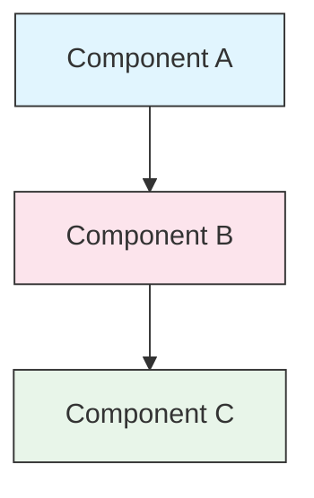

<picture>
  <source media="(prefers-color-scheme: dark)" srcset="resources/logos/claude-howto-logo-dark.svg">
  
</picture>

# Руководство по стилю

> Соглашения и правила форматирования для участия в Claude How To. Следуйте этому руководству, чтобы контент оставался единым, профессиональным и удобным для поддержки.

---

## Содержание

- [Именование файлов и папок](#file-and-folder-naming)
- [Структура документа](#document-structure)
- [Заголовки](#headings)
- [Форматирование текста](#text-formatting)
- [Списки](#lists)
- [Таблицы](#tables)
- [Блоки кода](#code-blocks)
- [Ссылки и перекрёстные ссылки](#links-and-cross-references)
- [Диаграммы](#diagrams)
- [Использование emoji](#emoji-usage)
- [YAML frontmatter](#yaml-frontmatter)
- [Изображения и медиа](#images-and-media)
- [Тон и голос](#tone-and-voice)
- [Сообщения коммитов](#commit-messages)
- [Чеклист для авторов](#checklist-for-authors)

---

## Именование файлов и папок

### Папки уроков

Папки уроков используют **двузначный числовой префикс**, за которым следует дескриптор в **kebab-case**:

```
01-slash-commands/
02-memory/
03-skills/
04-subagents/
05-mcp/
```

Число отражает порядок учебного маршрута от новичка к продвинутому уровню.

### Имена файлов

| Тип | Соглашение | Примеры |
|------|-----------|----------|
| **README урока** | `README.md` | `01-slash-commands/README.md` |
| **Файл функции** | `.md` в kebab-case | `code-reviewer.md`, `generate-api-docs.md` |
| **Shell-скрипт** | `.sh` в kebab-case | `format-code.sh`, `validate-input.sh` |
| **Файл конфигурации** | Стандартные имена | `.mcp.json`, `settings.json` |
| **Файл памяти** | Префикс области | `project-CLAUDE.md`, `personal-CLAUDE.md` |
| **Документы верхнего уровня** | `.md` в UPPER_CASE | `CATALOG.md`, `QUICK_REFERENCE.md`, `CONTRIBUTING.md` |
| **Изображения** | kebab-case | `pr-slash-command.png`, `claude-howto-logo.svg` |

### Правила

- Используйте **lowercase** для всех имён файлов и папок, кроме верхнеуровневых документов вроде `README.md`, `CATALOG.md`
- Используйте **дефисы** (`-`) как разделители слов, никогда не используйте подчёркивания или пробелы
- Делайте имена описательными, но короткими

---

## Структура документа

### Корневой README

Корневой `README.md` следует такому порядку:

1. Logo (`<picture>` element with dark/light variants)
2. H1 title
3. Introductory blockquote (one-line value proposition)
4. Section "Why This Guide?" with comparison table
5. Horizontal rule (`---`)
6. Table of Contents
7. Каталог возможностей
8. Быстрая навигация
9. Учебный путь
10. Разделы возможностей
11. Начало работы
12. Лучшие практики / Устранение неполадок
13. Вклад / Лицензия

### README урока

Каждый `README.md` урока следует такому порядку:

1. H1 title (например, `# Slash Commands`)
2. Краткий обзорный абзац
3. Краткая справочная таблица (необязательно)
4. Диаграмма архитектуры (Mermaid)
5. Подробные разделы (H2)
6. Практические примеры (нумерованные, 4-6 примеров)
7. Best practices (таблицы Do's and Don'ts)
8. Устранение неполадок
9. Связанные гайды / официальная документация
10. Footer с метаданными документа

### Файл функции/примера

Отдельные файлы функций, например `optimize.md` или `pr.md`:

1. YAML frontmatter (если применимо)
2. H1 title
3. Purpose / description
4. Инструкции по использованию
5. Примеры кода
6. Советы по кастомизации

### Разделители секций

Используйте горизонтальные линии (`---`) для отделения крупных областей документа:

```markdown
---

## New Major Section
```

Ставьте их после вводной цитаты и между логически различными частями документа.

---

## Заголовки

### Иерархия

| Уровень | Использование | Пример |
|-------|-----|---------|
| `#` H1 | Заголовок страницы (один на документ) | `# Slash Commands` |
| `##` H2 | Крупные разделы | `## Best Practices` |
| `###` H3 | Подразделы | `### Adding a Skill` |
| `####` H4 | Подподразделы (редко) | `#### Configuration Options` |

### Правила

- **Один H1 на документ** — только заголовок страницы
- **Не пропускайте уровни** — не переходите с H2 сразу на H4
- **Делайте заголовки короткими** — 2-5 слов
- **Используйте sentence case** — с заглавной только первое слово и имена собственные (исключение: названия функций остаются как есть)
- **Добавляйте emoji-префиксы только в корневом README** у заголовков секций (см. [Использование emoji](#emoji-usage))

---

## Форматирование текста

### Выделение

| Стиль | Когда использовать | Пример |
|-------|------------|---------|
| **Bold** (`**text**`) | Ключевые термины, подписи в таблицах, важные концепции | `**Installation**:` |
| *Italic* (`*text*`) | Первое упоминание технического термина, названия книг/документов | `*frontmatter*` |
| `Code` (`` `text` ``) | Имена файлов, команды, значения конфигурации, ссылки на код | `` `CLAUDE.md` `` |

### Блок-цитаты для заметок

Используйте blockquote с жирным префиксом для важных заметок:

```markdown
> **Note**: Custom slash commands have been merged into skills since v2.0.

> **Important**: Never commit API keys or credentials.

> **Tip**: Combine memory with skills for maximum effectiveness.
```

Поддерживаемые типы заметок: **Note**, **Important**, **Tip**, **Warning**.

### Абзацы

- Держите абзацы короткими (2-4 предложения)
- Делайте пустую строку между абзацами
- Сначала сообщайте ключевую мысль, потом давайте контекст
- Объясняйте не только "что", но и "почему"

---

## Списки

### Ненумерованные списки

Используйте дефисы (`-`) с отступом 2 пробела для вложенности:

```markdown
- First item
- Second item
  - Nested item
  - Another nested item
    - Deep nested (avoid going deeper than 3 levels)
- Third item
```

### Нумерованные списки

Используйте нумерованные списки для последовательных шагов, инструкций и ранжированных элементов:

```markdown
1. First step
2. Second step
   - Sub-point detail
   - Another sub-point
3. Third step
```

### Описательные списки

Используйте жирные подписи для key-value списков:

```markdown
- **Performance bottlenecks** - identify O(n^2) operations, inefficient loops
- **Memory leaks** - find unreleased resources, circular references
- **Algorithm improvements** - suggest better algorithms or data structures
```

### Правила

- Соблюдайте единообразный отступ (2 пробела на уровень)
- Добавляйте пустую строку до и после списка
- Делайте элементы списка параллельными по структуре
- Не уходите глубже 3 уровней вложенности

---

## Таблицы

### Стандартный формат

```markdown
| Column 1 | Column 2 | Column 3 |
|----------|----------|----------|
| Data     | Data     | Data     |
```

### Частые шаблоны таблиц

**Сравнение возможностей (3-4 колонки):**

```markdown
| Feature | Invocation | Persistence | Best For |
|---------|-----------|------------|----------|
| **Slash Commands** | Manual (`/cmd`) | Session only | Quick shortcuts |
| **Memory** | Auto-loaded | Cross-session | Long-term learning |
```

**Do's and Don'ts:**

```markdown
| Do | Don't |
|----|-------|
| Use descriptive names | Use vague names |
| Keep files focused | Overload a single file |
```

**Краткая справка:**

```markdown
| Aspect | Details |
|--------|---------|
| **Purpose** | Generate API documentation |
| **Scope** | Project-level |
| **Complexity** | Intermediate |
```

### Правила

- Делайте заголовки таблиц жирными, когда они выступают как подписи строк (первый столбец)
- По возможности выравнивайте вертикальные черты для читаемости исходника
- Делайте содержимое ячеек кратким; для деталей используйте ссылки
- Используйте `code formatting` для команд и путей внутри ячеек

---

## Блоки кода

### Языковые теги

Всегда указывайте языковой тег для подсветки синтаксиса:

| Language | Tag | Use For |
|----------|-----|---------|
| Shell | `bash` | CLI commands, scripts |
| Python | `python` | Python code |
| JavaScript | `javascript` | JS code |
| TypeScript | `typescript` | TS code |
| JSON | `json` | Configuration files |
| YAML | `yaml` | Frontmatter, config |
| Markdown | `markdown` | Markdown examples |
| SQL | `sql` | Database queries |
| Plain text | (no tag) | Expected output, directory trees |

### Соглашения

```bash
# Comment explaining what the command does
claude mcp add notion --transport http https://mcp.notion.com/mcp
```

- Добавляйте **строку-комментарий** перед неочевидными командами
- Делайте все примеры **готовыми к копированию и вставке**
- Показывайте **и простые, и продвинутые** варианты, когда это уместно
- Добавляйте **ожидаемый вывод**, если это помогает понять пример (используйте code block без тега)

### Блоки установки

Используйте такой шаблон для инструкций по установке:

```bash
# Copy files to your project
cp 01-slash-commands/*.md .claude/commands/
```

### Многошаговые workflow

```bash
# Step 1: Create the directory
mkdir -p .claude/commands

# Step 2: Copy the templates
cp 01-slash-commands/*.md .claude/commands/

# Step 3: Verify installation
ls .claude/commands/
```

---

## Ссылки и перекрёстные ссылки

### Внутренние ссылки (относительные)

Используйте относительные пути для всех внутренних ссылок:

```markdown
[Slash Commands](01-slash-commands/)
[Skills Guide](03-skills/)
[Memory Architecture](02-memory/#memory-architecture)
```

Из папки урока назад к корню или соседнему разделу:

```markdown
[Back to main guide](../README.md)
[Related: Skills](../03-skills/)
```

### Внешние ссылки (абсолютные)

Используйте полные URL с понятным текстом ссылки:

```markdown
[Anthropic's official documentation](https://code.claude.com/docs/en/overview)
```

- Никогда не используйте "click here" или "this link" как текст ссылки
- Используйте описательный текст, который понятен без контекста

### Якоря разделов

Ссылайтесь на разделы внутри того же документа с помощью якорей GitHub-стиля:

```markdown
[Feature Catalog](#-feature-catalog)
[Best Practices](#best-practices)
```

### Шаблон связанных гайдов

Заканчивайте уроки разделом related guides:

```markdown
## Related Guides

- [Slash Commands](../01-slash-commands/) - Quick shortcuts
- [Memory](../02-memory/) - Persistent context
- [Skills](../03-skills/) - Reusable capabilities
```

---

## Диаграммы

### Mermaid

Используйте Mermaid для всех диаграмм. Поддерживаемые типы:

- `graph TB` / `graph LR` — архитектура, иерархия, потоки
- `sequenceDiagram` — сценарии взаимодействия
- `timeline` — хронологические последовательности

### Соглашения по стилю

Используйте единые цвета через style blocks:



**Палитра цветов:**

| Color | Hex | Use For |
|-------|-----|---------|
| Light blue | `#e1f5fe` | Primary components, inputs |
| Light pink | `#fce4ec` | Processing, middleware |
| Light green | `#e8f5e9` | Outputs, results |
| Light yellow | `#fff9c4` | Configuration, optional |
| Light purple | `#f3e5f5` | User-facing, UI |

### Правила

- Используйте `["Label text"]` для подписей узлов (это позволяет использовать специальные символы)
- Используйте `<br/>` для переносов строк внутри подписей
- Делайте диаграммы простыми (максимум 10-12 узлов)
- Добавляйте краткое текстовое описание под диаграммой для доступности
- Используйте top-to-bottom (`TB`) для иерархий, left-to-right (`LR`) для workflow

---

## Использование emoji

### Где используются emoji

Emoji используются **экономно и осмысленно** — только в конкретных контекстах:

| Контекст | Emoji | Пример |
|---------|--------|---------|
| Заголовки секций корневого README | Иконки категорий | `## 📚 Learning Path` |
| Индикаторы уровня навыка | Цветные кружки | 🟢 Beginner, 🔵 Intermediate, 🔴 Advanced |
| Do's and Don'ts | Галочка / крест | ✅ Do this, ❌ Don't do this |
| Рейтинг сложности | Звёзды | ⭐⭐⭐ |

### Стандартный набор emoji

| Emoji | Meaning |
|-------|---------|
| 📚 | Learning, guides, documentation |
| ⚡ | Getting started, quick reference |
| 🎯 | Features, quick reference |
| 🎓 | Learning paths |
| 📊 | Statistics, comparisons |
| 🚀 | Installation, quick commands |
| 🟢 | Beginner level |
| 🔵 | Intermediate level |
| 🔴 | Advanced level |
| ✅ | Recommended practice |
| ❌ | Avoid / anti-pattern |
| ⭐ | Complexity rating unit |

### Правила

- **Никогда не используйте emoji в основном тексте** или абзацах
- **Используйте emoji только в заголовках** в корневом README (не в lesson READMEs)
- **Не добавляйте декоративные emoji** — каждое emoji должно нести смысл
- Держите использование emoji согласованным с таблицей выше

---

## YAML frontmatter

### Файлы функций (Skills, Commands, Agents)

```yaml
---
name: unique-identifier
description: What this feature does and when to use it
allowed-tools: Bash, Read, Grep
---
```

### Необязательные поля

```yaml
---
name: my-feature
description: Brief description
argument-hint: "[file-path] [options]"
allowed-tools: Bash, Read, Grep, Write, Edit
model: opus                        # opus, sonnet, or haiku
disable-model-invocation: true     # User-only invocation
user-invocable: false              # Hidden from user menu
context: fork                      # Run in isolated subagent
agent: Explore                     # Agent type for context: fork
---
```

### Правила

- Размещайте frontmatter в самом верху файла
- Используйте **kebab-case** для поля `name`
- Держите `description` в пределах одного предложения
- Включайте только нужные поля

---

## Изображения и медиа

### Шаблон логотипа

Все документы, которые начинаются с логотипа, используют элемент `<picture>` для поддержки светлой и тёмной темы:

```html
<picture>
  <source media="(prefers-color-scheme: dark)" srcset="resources/logos/claude-howto-logo-dark.svg">
  
</picture>
```

### Скриншоты

- Храните их в соответствующей папке урока, например `01-slash-commands/pr-slash-command.png`
- Используйте имена файлов в kebab-case
- Добавляйте понятный alt text
- Для диаграмм предпочитайте SVG, для скриншотов — PNG

### Правила

- Всегда указывайте alt text для изображений
- Следите за разумным размером файлов изображений (менее 500 KB для PNG)
- Используйте относительные пути для ссылок на изображения
- Храните изображения в той же директории, что и документ, который на них ссылается, либо в `assets/` для общих ресурсов

---

## Тон и голос

### Стиль письма

- **Professional but approachable** — техническая точность без перегруза жаргоном
- **Active voice** — "Create a file", а не "A file should be created"
- **Direct instructions** — "Run this command", а не "You might want to run this command"
- **Beginner-friendly** — считайте, что читатель новичок в Claude Code, но не в программировании

### Принципы контента

| Принцип | Пример |
|-----------|---------|
| **Show, don't tell** | Давайте работающие примеры, а не абстрактные описания |
| **Progressive complexity** | Начинайте просто, добавляйте глубину в более поздних разделах |
| **Explain the "why"** | "Use memory for... because..." а не только "Use memory for..." |
| **Copy-paste ready** | Каждый блок кода должен работать после вставки |
| **Real-world context** | Используйте практические сценарии, а не искусственные примеры |

### Словарь

- Используйте "Claude Code" (не "Claude CLI" и не "the tool")
- Используйте "skill" (а не "custom command" — это устаревший термин)
- Используйте "lesson" или "guide" для пронумерованных разделов
- Используйте "example" для отдельных файлов функций

---

## Сообщения коммитов

Следуйте [Conventional Commits](https://www.conventionalcommits.org/):

```
type(scope): description
```

### Типы

| Type | Use For |
|------|---------|
| `feat` | New feature, example, or guide |
| `fix` | Bug fix, correction, broken link |
| `docs` | Documentation improvements |
| `refactor` | Restructuring without changing behavior |
| `style` | Formatting changes only |
| `test` | Test additions or changes |
| `chore` | Build, dependencies, CI |

### Области

Используйте имя урока или область файла как scope:

```
feat(slash-commands): Add API documentation generator
docs(memory): Improve personal preferences example
fix(README): Correct table of contents link
docs(skills): Add comprehensive code review skill
```

---

## Нижний колонтитул с метаданными документа

README уроков заканчиваются блоком метаданных:

```markdown
---
**Last Updated**: March 2026
**Claude Code Version**: 2.1+
**Compatible Models**: Claude Sonnet 4.6, Claude Opus 4.6, Claude Haiku 4.5
```

- Используйте формат месяц + год, например "March 2026"
- Обновляйте версию при изменении функций
- Перечисляйте все совместимые модели

---

## Чеклист для авторов

Перед отправкой контента проверьте:

- [ ] Имена файлов и папок используют kebab-case
- [ ] Документ начинается с H1 title (один на файл)
- [ ] Иерархия заголовков корректна (без пропусков уровней)
- [ ] У всех блоков кода есть языковые теги
- [ ] Примеры кода готовы к копированию и вставке
- [ ] Внутренние ссылки используют относительные пути
- [ ] У внешних ссылок есть описательный anchor text
- [ ] Таблицы отформатированы правильно
- [ ] Emoji соответствуют стандартному набору, если используются
- [ ] Диаграммы Mermaid используют стандартную цветовую палитру
- [ ] Нет чувствительной информации (API keys, credentials)
- [ ] YAML frontmatter валиден, если он используется
- [ ] У изображений есть alt text
- [ ] Абзацы короткие и сфокусированные
- [ ] Раздел related guides ссылается на релевантные уроки
- [ ] Сообщение коммита соответствует формату Conventional Commits
